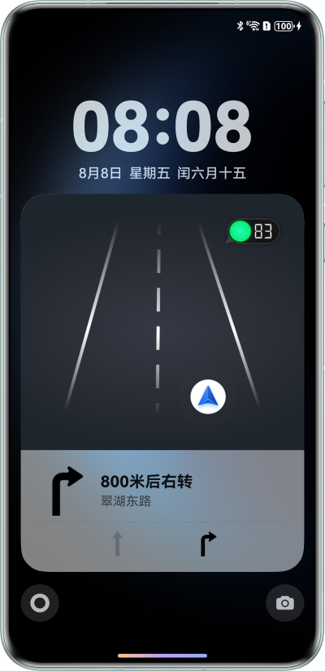
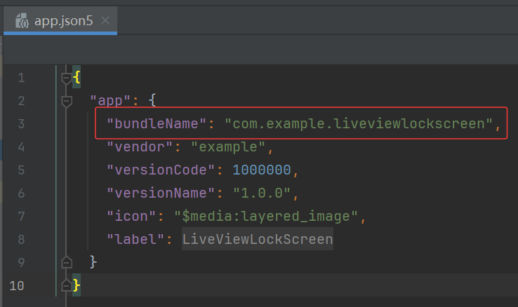

# 锁屏沉浸实况窗

## 简介

“Live View Kit”基于HarmonyOS实现了即时配送等多个场景下实况窗的创建、更新和结束功能。基于不同的场景，皆提供了定制的状态节点，帮助用户聚焦关键信息，提升用户体验。
锁屏沉浸实况窗则是应用进一步展示实时活动状态的通道，系统通过实况窗服务（Live View Kit），将重要信息展示在锁屏界面，让用户一览无余，无需进入应用就能获取活动最新状态，适用于实时性要求高、需要用户及时了解状态的场景。

## 相关概念

- 实况窗：实况窗是一种帮助用户聚焦正在进行的任务，方便快速查看和即时处理的通知形态。实况窗具有时效性、时段性、变化性的特点。

## 效果预览

锁屏界面：



## 使用说明

1. 打开应用后自动开启实况窗与沉浸实况窗，主页面无具体功能，仅做展示使用。

2. 上划退出到桌面后，点击位于页面导航栏左侧的胶囊态实况窗或下拉查看消息通知，可查看实况窗卡片页面。

3. 点击锁屏键锁屏后再次点击锁屏键激活屏幕，可查看锁屏沉浸实况窗。

4. 本Sample仅提供在本地创建、更新与结束实况窗的能力(不能后台更新，若要后台更新，请使用Push Kit)。若要使用Push Kit更新，可参考[推送实况窗消息服务](https://developer.huawei.com/consumer/cn/doc/harmonyos-guides/push-update-liveview)，用已有服务器调用对应的REST API。

## 工程目录

```
├─entry/src/main/ets                
│   ├───constant                           
│   │   └───Constant.ets                   // 常量
│   ├───entryability                       
│   │   └───EntryAbility.ets               // EntryAbility
│   ├───liveview                           
│   │   ├───LiveViewExtAbility.ets         // 实况窗
│   │   └───LockScreenPage.ets             // 锁屏页面
│   ├───model                              
│   │   └───RouteDataModel.ets             // 导航数据Model
│   ├───pages                              
│   │   └───Index.ets                      // 主页面
│   ├───utils                              
│   │   ├───BreakpointUtil.ets             // 断点工具类
│   │   ├───LiveView.ets                   // 实况窗类
│   │   └───LiveViewUtil.ets               // 实况窗工具类
│   ├───view                               
│   │   ├───RoadView.ets                   // 道路
│   │   ├───TrafficInfoView.ets            // 导航信息
│   │   └───TrafficView.ets                // 导航页面
│   └───viewmodel                         
│       └───RouteDataViewModel.ets         // 导航数据ViewModel
└───entry/src/main/resources               

```

## 具体实现

1. HomePage主页面在创建后，创建实况窗和创建定时任务，每间隔固定时间调用liveViewManager.updateLiveView()接口更新实况窗，并通过commonEventManager.publish()接口传递新的参数给沉浸实况窗页面，实现实况窗和沉浸实况窗更新。

## 相关权限

1. 若您需要使用本实例，请替换AppScope/app.json5文件内的bundleName为您的包名。
  

2. 若您自己的包名未申请实况窗与沉浸实况窗权益，请参考[Live View Kit（实况窗服务）开发准备](https://developer.huawei.com/consumer/cn/doc/harmonyos-guides/liveview-preparations)，先开通推送服务权益与实况窗权益。

3. ohos.permission.KEEP_BACKGROUND_RUNNING 获取应用后台运行权限。

## 约束与限制

1.本示例仅支持标准系统上运行，支持设备：华为手机;

2.HarmonyOS系统：HarmonyOS 5.0.0 Developer Release及以上;

3.DevEco Studio版本：DevEco Studio 5.0.0 Developer Release及以上;

4.HarmonyOS SDK版本：HarmonyOS 5.0.0 Developer Release SDK及以上。