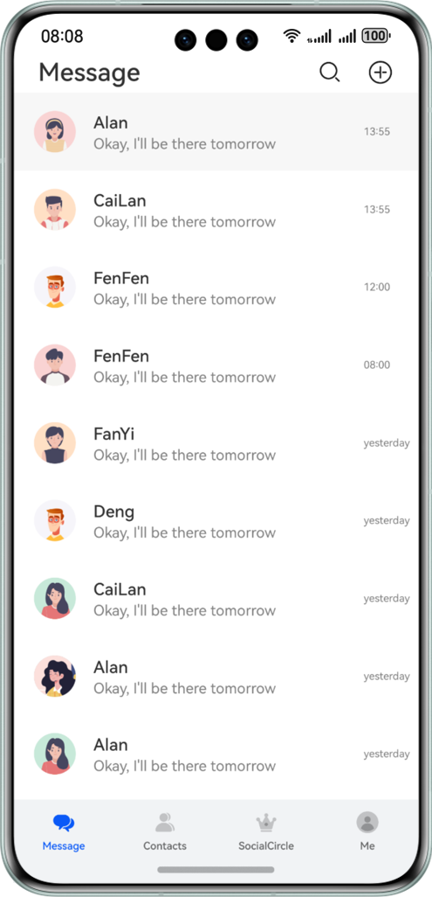
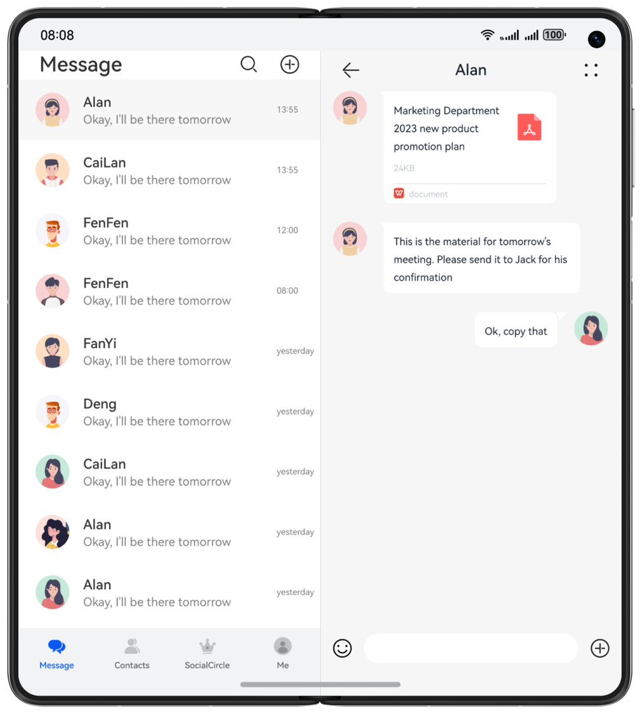
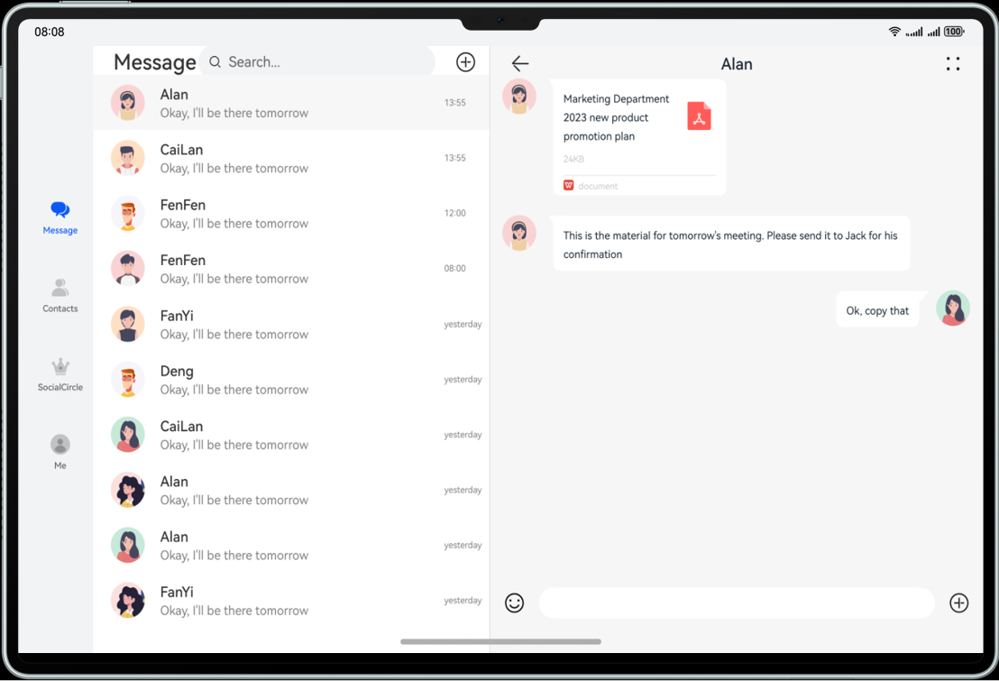

# Instant Messaging

### Introduction

Learn to implement an instant messaging app based on the adaptive layout and responsive layout, achieving one-time development for multi-device deployment.

#### Description

This codelab implements an instant messaging app based on the adaptive layout and responsive layout, achieving one-time development for multi-device deployment. It uses the three-layer project architecture for code reuse and tailors the pages to different device sizes such as mobile phones, foldable phones, and PC/2-in-1 devices.
The following figure shows the effect on the mobile phone:

The following figure shows the effect on the foldable phone in unfolded state:

The following figure shows the effect on the PC/2-in-1 device:

#### Concepts

- One-time development for multi-device deployment: It enables you to develop and release one set of project code for deployment on multiple devices as demanded. This feature enables you to efficiently develop applications that are compatible with multiple devices while providing distributed user experiences for cross-device transferring, migration, and collaboration.
- Adaptive layout: When the size of an external container changes, elements can automatically change based on the relative relationship to adapt to the external container. Relative relationships include the proportion, fixed aspect ratio, and display priority. Common adaptive layouts include linear, stacking, flexbox, and relative layouts. These capabilities enable the GUI to continuously change with the size of the external container.
- Responsive layout: When the size of an external container changes, elements can automatically change based on the breakpoints, grids, or specific features (such as the screen direction and window width and height) to adapt to the external container.
- Navigation: This component is the root container of pages, usually used in the split-view layout.

#### Permissions

N/A.

#### How to Use

- Install and open an app on a mobile phone, foldable phone, or tablet. The responsive layout and adaptive layout are used to display different effects on the app pages over different devices.
- Tap Message, Contacts, or Social Circle at the bottom to switch to the corresponding tab page. By default, the Message tab page is displayed.

#### Constraints

1. The sample app is supported only on Huawei phones running the standard system.
2. HarmonyOS: HarmonyOS 5.0.0 Release or later
3. DevEco Studio: DevEco Studio 5.0.0 Release or later
4. HarmonyOS SDK: HarmonyOS 5.0.0 Release SDK or later