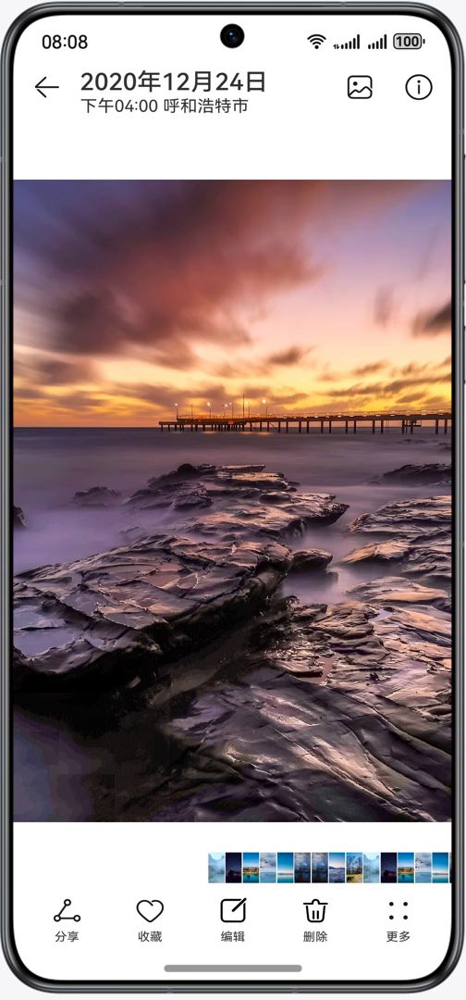
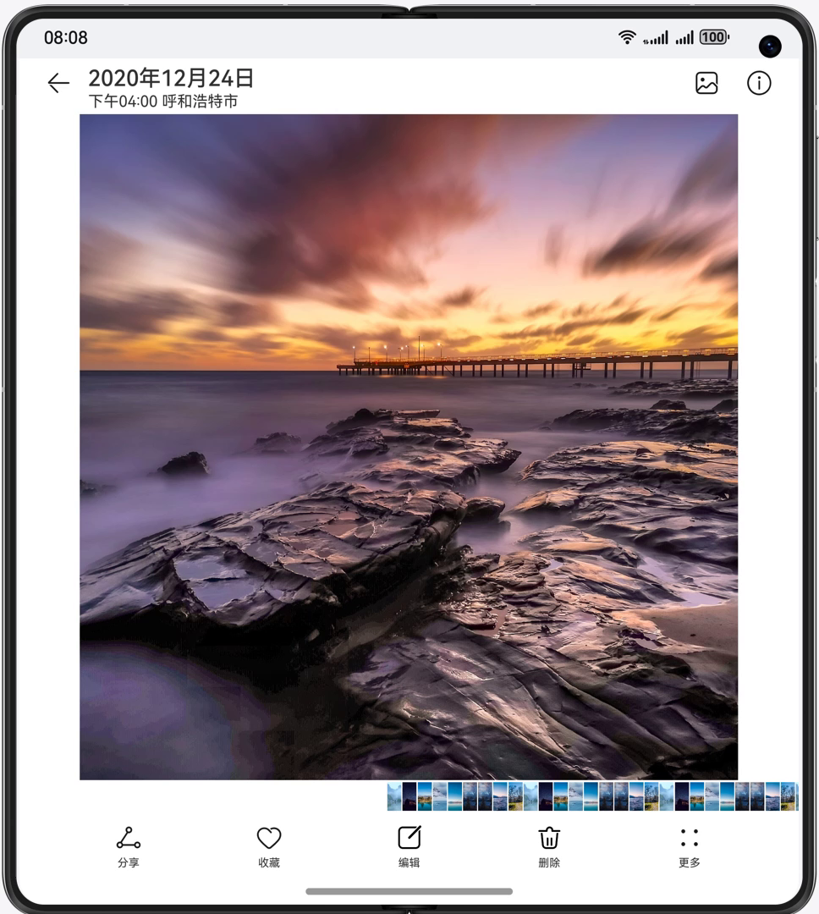
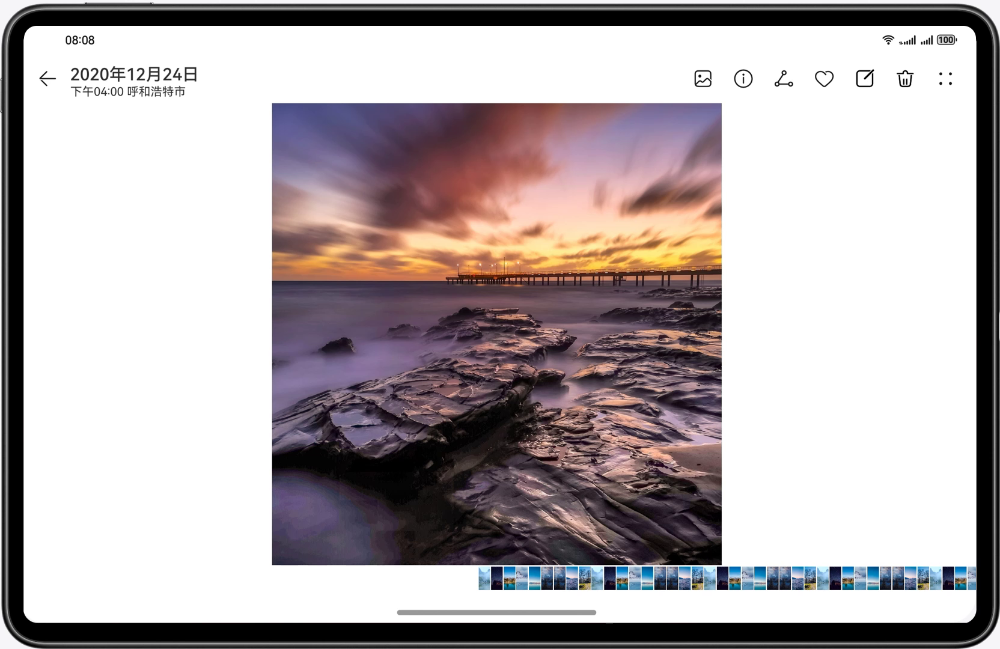

# 多设备图片美化界面

### 简介

基于自适应和响应式布局，实现一次开发，多端部署-图片美化。

#### 介绍

本篇Codelab基于自适应布局和响应式布局，实现一次开发，多端部署的即时通讯页面。通过“三层工程架构”实现代码复用，并根据手机、折叠屏以及PC/2in1不同的设备尺寸设计对应页面。
手机效果如图所示：

折叠屏展开态效果如图所示：

平板，PC/2in1效果如图所示：

#### 相关概念

- 一次开发，多端部署：一套代码工程，一次开发上架，多端按需部署。支撑开发者快速高效的开发支持多种终端设备形态的应用，实现对不同设备兼容的同时，提供跨设备的流转、迁移和协同的分布式体验。
- 组件区域变化事件：组件区域变化事件指组件显示的尺寸、位置等发生变化时触发的事件。
- 双指缩放：用于触发捏合手势，触发捏合手势的最少手指为2指，最大为5指，最小识别距离为5vp。

#### 相关权限

不涉及。

#### 使用说明

- 分别在手机、折叠屏、平板、PC/2in1安装并打开应用，不同设备的应用页面通过响应式布局和自适应布局呈现不同的效果。
- 点击编辑、相册图标将分别进入图片编辑页面，相册页面。

#### 约束与限制

1. 本示例仅支持标准系统上运行，支持设备：华为手机。
2. HarmonyOS系统：HarmonyOS 5.0.5 Release及以上。
3. DevEco Studio版本：DevEco Studio 5.0.5 Release及以上。
4. HarmonyOS SDK版本：HarmonyOS 5.0.5 Release SDK及以上。