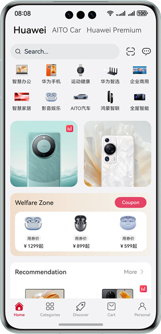
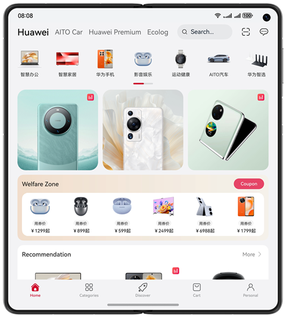
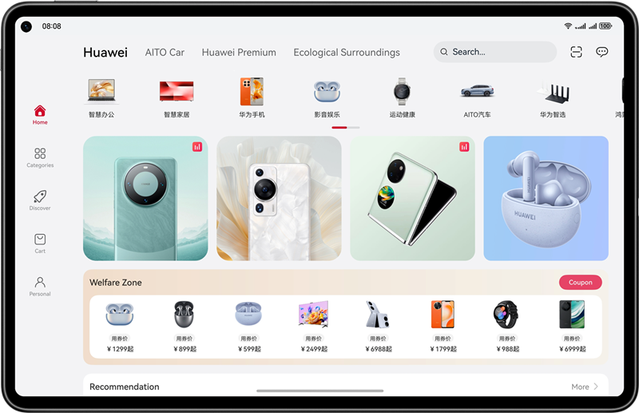

# Shopping Price Comparison

### Introduction

This codelab introduces how to implement shopping price comparison pages based on the adaptive and responsive layout, achieving one-time development for multi-device deployment. It uses the three-layer project architecture for code reuse and tailors the pages to different device sizes such as mobile phones, foldable phones, tablets, and PC/2-in-1 devices.

The figure shows the effect on the mobile phone:

The figure shows the effect on the foldable phone:

The figure shows the effect on the tablet and PC/2-in-1 device:

### Concepts

- One-time development for multi-device deployment: It enables you to develop and release one set of project code for deployment on multiple devices as demanded. This feature enables you to efficiently develop applications that are compatible with multiple devices while providing distributed user experiences for cross-device transferring, migration, and collaboration.
- Adaptive layout: When the size of an external container changes, elements can automatically change based on the relative relationship to adapt to the external container. Relative relationships include the proportion, fixed aspect ratio, and display priority.
- Responsive layout: When the size of an external container changes, elements can automatically change based on the breakpoints, grids, or specific features (such as the screen direction and window width and height) to adapt to the external container.
- GridRow: It is a container that is used in a grid layout, together with its child component **<GridCol>**.
- GridCol: It is a container that must be used as a child component of the **<GridRow>** container.
- PiP: In scenarios such as video playback, video conferencing, and video calls, this feature is used to display video content in picture-in-picture mode (PiP).

### Permissions

N/A.

### How to Use

1. Install and open an app on a mobile phone, foldable phone, or tablet. The responsive layout and adaptive layout are used to display different effects on the app pages over different devices.
2. Open the app and view the content on the home page.
3. Tap the Category button at the bottom to view the content on the category page.
4. Tap the shopping bag at the bottom to view the content on the shopping bag page.
5. Tap the product images on the category page to view the product details page.
6. Tap the Split-Screen button in the upper right corner to compare product information in split-screen mode.
7. Tap the Chat button at the bottom of the product details page to view the customer service page of the product details page.
8. Tap the Shopping Bag button at the bottom of the product details page to view the content on the shopping bag page.
9. Tap the Purchase button at the bottom of the product details page to view the payment page.
10. Tap the Livestreaming button on the product details page to view the content on the livestreaming room page. Tap the Close button in the upper right corner to watch the livestreaming in PiP mode.
11. Tap the recommended products on the livestreaming room page to view the product details page.
12. Tap the Shopping Bag button at the bottom of the livestreaming room page to view the content on the shopping bag page.
13. Tap Buy Now on the shopping bag page in the livestreaming room to view the content on the payment page related to livestreaming room.

### Constraints

1. The sample app is supported only on Huawei phones running the standard system.
2. HarmonyOS: HarmonyOS 5.0.0 Release or later.
3. DevEco Studio: DevEco Studio 5.0.0 Release or later.
4. HarmonyOS SDK: HarmonyOS 5.0.0 Release SDK or later.
