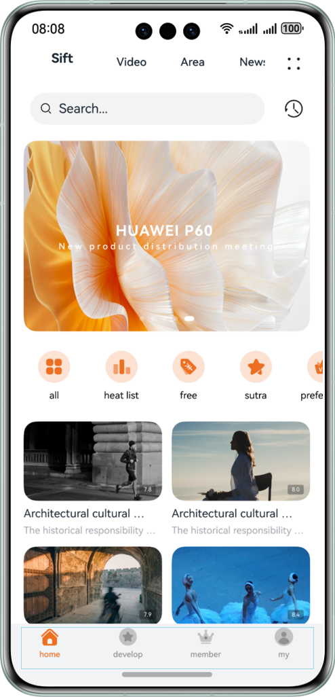
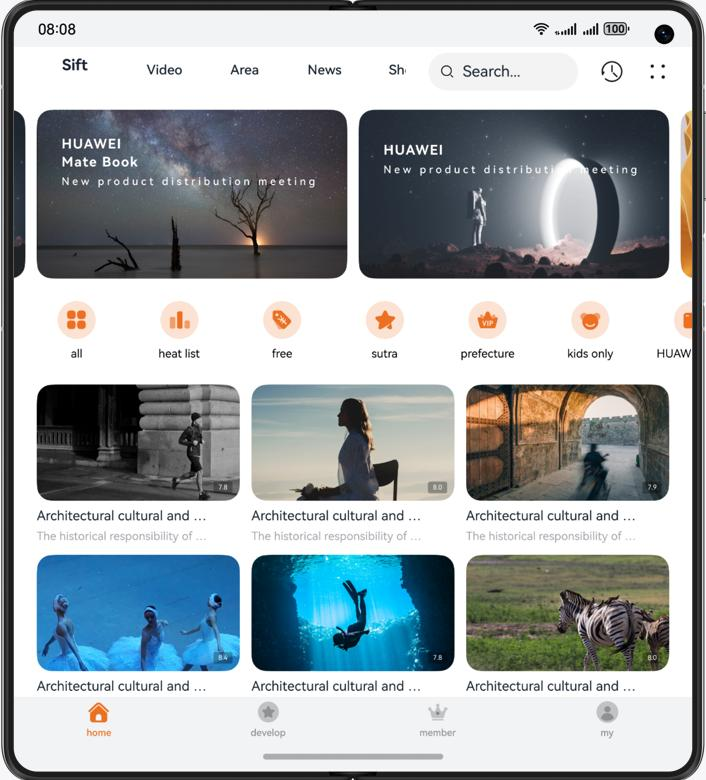
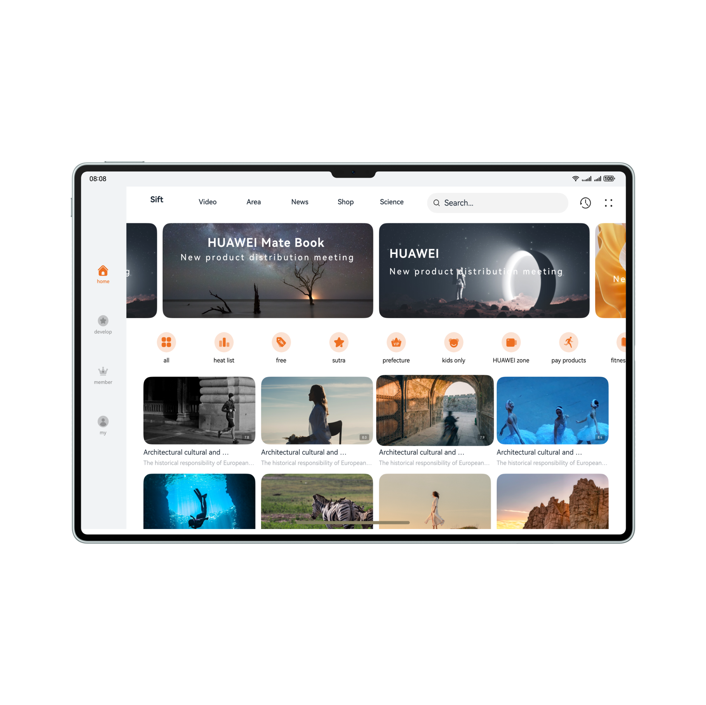

# Long Video

### Introduction

This codelab implements a short video app based on the adaptive layout and responsive layout, achieving one-time development for multi-device deployment. It uses the three-layer project architecture for code reuse and tailors the pages to different device sizes such as mobile phones, foldable phones, tablets, and PC/2-in-1 devices.

The figure shows the effect on the mobile phone:

The figure shows the effect on the foldable phone:

The figure shows the effect on the tablet and PC/2-in-1 device:

### Concepts

- One-time development for multi-device deployment: You only need to develop and release one set of project code and then deploy it on multiple devices as demanded. This feature enables you to efficiently develop applications that are compatible with multiple devices while providing distributed user experiences for cross-device transferring, migration, and collaboration.
- Adaptive layout: When the size of an external container changes, elements can automatically change based on the relative relationship to adapt to the external container. Relative relationships include the proportion, fixed aspect ratio, and display priority.
- Responsive layout: When the size of an external container changes, elements can automatically change based on the breakpoints, grids, or specific features (such as the screen direction and window width and height) to adapt to the external container.
- GridRow: A container that is used in a grid layout, together with its child component **GridCol**.
- GridCol: A container that must be used as a child component of the **GridRow** container.
- Using the AVPlayer for audio playback: The AVPlayer can be used to play raw media assets in an end-to-end manner.

### Permissions

N/A.

### How to Use

1. Install and open an app on a mobile phone, foldable phone, or tablet. The responsive layout and adaptive layout are used to display different effects on the app pages over different devices.
2. Swipe up or down the home page content and swipe left or right banners and icon lists.
3. Touch and hold the first image in the recommended video area to preview the video. Right-click the recommended video area and a menu is displayed. Hover the mouse pointer over the recommended video area to zoom in the image. Pinch two fingers to zoom in or out the video area on a PC/2-in-1 device or foldable phone.
4. Switch to the community tab on the top to view the immersive design of the home page. Switch to the video tab on the top to view the innovative layout of the banner images on a PC/2-in-1 device.
5. Click the search box on the top to display the search page. Enter "Hua" in the search box and the intelligent prompt page is displayed. Click "Huawei launch event" in the intelligent prompts. The search result page is displayed. Click the Play button in the search result. The video details page is displayed.
6. By default, the video is played on the video details page. Click the video to play or pause it, and click or drag the progress bar to seek to the playback position.
7. When you swipe up on a phone or foldable phone, the related list is hidden, the video is zoomed out proportionally, and the comment area is swiped. When you swipe up on a PC/2-in-1 device, the video is zoomed out proportionally and the introduction area is swiped. Click the full-screen button in the video area to access the full-screen playback page.
8. Play a video in full-screen mode and click the Play/Pause button to play or pause the video. Click the episode selection button. The episode selection toolbar is displayed.

### Constraints

1. The sample app is supported only on Huawei phones running the standard system.
2. HarmonyOS: HarmonyOS 5.0.0 Release or later
3. DevEco Studio: DevEco Studio 5.0.0 Release or later
4. HarmonyOS SDK: HarmonyOS 5.0.0 Release SDK or later
