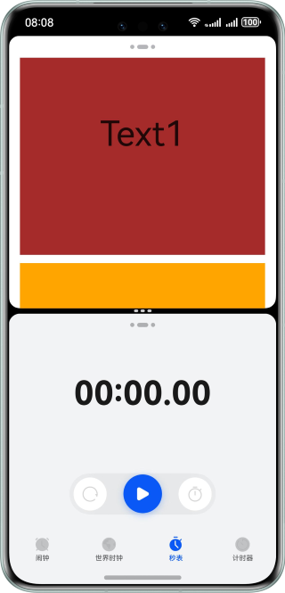
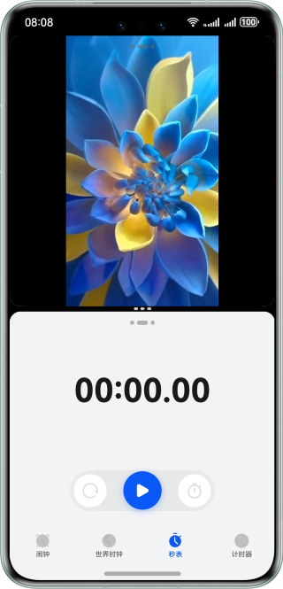
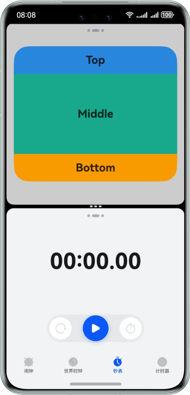
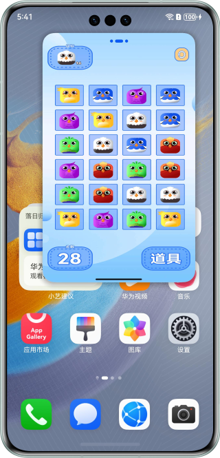

# 智慧多窗开发实践

### 介绍

本示例展示了智慧多窗（分屏/悬浮窗）开发过程中界面适配问题的解决方案。

### 效果预览

部分效果图如下

|                              页面被截断无法上下滑动<br/>问题优化                              |                            Video组件分屏状态下被截断<br/>问题优化                            |                              子组件超出父组件范围<br/>问题优化                               |                            悬浮窗顶部操作栏无法响应操作<br/>问题优化                             |
|:------------------------------------------------------------------------------:|:------------------------------------------------------------------------------:|:------------------------------------------------------------------------------:|:------------------------------------------------------------------------------:|
|  |  |  |  |

### 目录结构

```
├──entry/src/main/ets/
│  ├──common
│  │  ├──AVPlayerUtil.ets                 // 视频播放工具类
│  │  ├──Constants.ets                    // 常量封装类
│  │  └──Logger.ets                       // 日志打印工具类
│  ├──entryability
│  │  └──EntryAbility.ets                 // Ability的生命周期回调内容
│  ├──entrybackupability
│  │  └──EntryBackupAbility.ets           // 程序入口类
│  └──pages
│     ├──Index.ets                        // 应用入口页
│     ├──Question.ets                     // 通用问题场景入口菜单
│     ├──Question1Correct.ets             // 问题场景一优化后
│     ├──Question1Incorrect.ets           // 问题场景一优化前
│     ├──...                              // 此处省略其它问题场景描述
│     └──Question8Incorrect8.ets          // 问题场景八优化前
└──entry/src/main/resources               // 应用静态资源目录
```

### 相关权限

不涉及。

### 依赖

不涉及。

### 约束与限制

1.本示例仅支持标准系统上运行，支持设备：华为手机。

2.HarmonyOS系统：HarmonyOS NEXT Release及以上。

3.DevEco Studio版本：DevEco Studio NEXT Release及以上。

4.HarmonyOS SDK版本：HarmonyOS NEXT Release SDK及以上。


