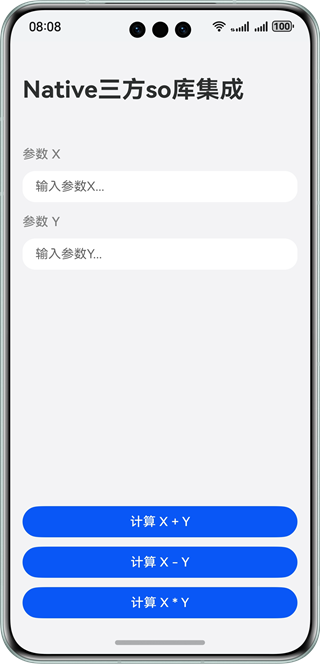

# 三方so库集成开发实践

### 介绍

针对团队实际开发过程中需要集成三方so库的场景，本示例提供了三种解决方案：

1. Native侧直接集成三方so库
2. Native侧通过dlopen的方式集成三方so库
3. ArkTS侧直接集成已经适配Native的三方so库

### 效果预览

| 应用主界面                                                        |
|--------------------------------------------------------------|
|  |

### 使用说明

进入应用主页面后，输入参数X和参数Y，点击下方的三个按钮可以通过不同方案调用三方so库进行计算：

1. 点击第一个按钮，在Native侧直接集成使用三方so库进行加法计算
2. 点击第二个按钮，在Native侧通过dlopen的方式集成使用三方so库进行减法运算
3. 点击第三个按钮，在ArkTS侧直接使用已经适配Native的三方so库进行乘法运算

### 工程目录

```
├──entry/libs                         // 三方so库文件
│  └──arm64-v8a                             
│     ├──libmultiply.so               // 乘法三方so库文件
│     ├──libnativeAdd.so              // 加法三方so库文件
│     └──libnativeSub.so              // 减法三方so库文件
├──entry/src/main/cpp                 // Native层
│  ├──add                             
│  │  └──add.h                        // 加法头文件
│  ├──types                           // Native层提供的接口
│  │  ├──libentry     
│  │  │   ├──index.d.ts               // Native侧提供的方法声明  
│  │  │   └──oh-package.json5                        
│  │  └──libmultiply      
│  │     ├──index.d.ts                // Native侧提供的方法声明
│  │     └──oh-package.json5                                   
│  ├──CMakeLists.txt                  // 编译入口
│  └──napi_init.cpp                   // NAPI接口实现
├──ets                                // UI层
│  ├──entryability                    // 应用入口
│  │  └──EntryAbility.ets            
│  ├──entrybackupability            
│  │  └──EntryBackupAbility.ets                  
│  ├──pages                           
│  │  └──Index.ets                    // 应用主页面
│  └──view            
│     └──ParamTextInputComponent.ets  // 页面参数文本输入
├──resources                          // 应用资源文件
└──Multiply/src/main/cpp              // 三方so库编译生成
   ├──add                             
   │  ├──add.h                        // 加法头文件
   │  └──add.cpp                      // 加法源文件
   ├──sub                             
   │  ├──sub.h                        // 减法头文件
   │  └──sub.cpp                      // 减法源文件
   ├──types                           // Native侧提供的接口                     
   │  └──libmultiply                  
   │     ├──index.d.ts                // Native侧提供的方法声明
   │     └──oh-package.json5                                   
   ├──CMakeLists.txt                  // 编译入口
   └──napi_init.cpp                   // NAPI接口实现
```

### 具体实现

新建Multiply模块用于生成C++编译的加法so库，C约定的链接模式编译的减法so库和适配Native的乘法so库，将生成的三方so库置于entry/lib对应的架构目录下：

* 方案1：修改CMakeList.txt，将so库加入到工程中编译引用后，将so库对应的头文件置于cpp目录下，在Native侧引入头文件使用。
* 方案2：修改CMakeList.txt，将so库加入到工程中编译引用后，通过ArkTS侧传递沙箱路径至Native侧，在Native侧使用dlopen的方式调用。
* 方案3：在src/main/cpp/types下新建目录并创建index.d.ts和oh-package.json5，在模块级oh-package.json5中声明对应的so库依赖后，在ArkTS侧使用import引用声明的依赖名称调用。

### 相关权限

不涉及

### 依赖

不涉及

### 约束与限制

1. 本示例仅支持标准系统上运行，支持设备：华为手机;

2. HarmonyOS系统：HarmonyOS NEXT Release及以上;

3. DevEco Studio版本：DevEco Studio NEXT Release及以上;

4. HarmonyOS SDK版本：HarmonyOS NEXT Release SDK及以上。    
