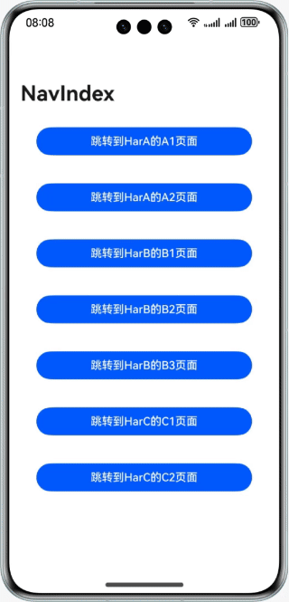
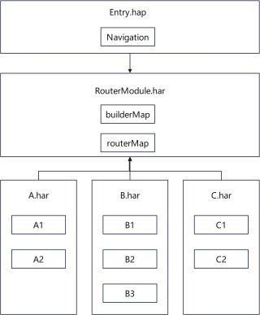

# 应用导航设计

### 介绍
通过设计单独的路由模块和动态加载方法，解决一个Navigation组件下多har/hsp间路由跳转依赖耦合问题。

### 效果预览


### 工程目录
工程的目录结构
```
├──entry                                          // 入口模块
│  ├──build-profile.json5                         // 编译配置文件，其中arkOptions需配置动态import依赖的包名
│  ├──oh-package.json5                            // 依赖配置，需依赖全部子业务模块和RouterModule模块
│  ├──src/main/ets
│  │  ├──entryability
│  │  │  └──EntryAbility.ets
│  │  └──pages
│  │     └──Index.ets                             // 首页
│  └──src/main/resources                          // 资源目录
├──harA                                           // 子业务模块
│  ├──Index.ets                                   // 入口文件，对外暴露模块方法
│  ├──oh-package.json5                            // 依赖配置，需依赖RouterModule模块
│  ├──src/main/ets/components/mainpage
│  │  ├──A1.ets                                 
│  │  └──A2.ets                                 
│  └──src/main/resources
├──harB                                           // 子业务模块
│  ├──Index.ets                                   // 入口文件，对外暴露模块方法
│  ├──oh-package.json5                            // 依赖配置，需依赖RouterModule模块
│  ├──src/main/ets/components/mainpage
│  │  ├──B1.ets
│  │  ├──B2.ets
│  │  └──B3.ets
│  └──src/main/resources
├──harC                                           // 子业务模块
│  ├──Index.ets                                   // 入口文件，对外暴露模块方法
│  ├──oh-package.json5                            // 依赖配置，需依赖RouterModule模块
│  ├──src/main/ets/components/mainpage
│  │  ├──C1.ets
│  │  └──C2.ets
│  └──src/main/resources
└──RouterModule                                   // 路由模块
   ├──Index.ets                                   // 入口文件，对外暴露路由的方法和常量
   ├──oh-package.json5
   ├──src/main/ets/constants                      // 路由信息常量
   │  └──RouterConstants.ets
   ├──src/main/ets/model                          // 路由信息模型
   │  └──RouterModel.ets
   ├──src/main/ets/utils                          // 对外提供的路由方法
   │  └──RouterModule.ets
   └──src/main/resources
```

### 具体实现
1. 将路由功能抽取成单独的模块并以har包形式存在，命名为RouterModule。
2. RouterModule内部对路由进行管理，对外暴露RouterModule对象供其他模块使用。
3. 将主入口模块作为其他业务模块的依赖注册中心，在入口模块中使用Navigation组件并依赖其他业务模块。
4. 业务模块仅依赖RouterModule，业务模块中的路由统一委托到RouterModule中管理，实现业务模块间的解耦。



### 相关权限
不涉及。
### 约束与限制

1. 本示例仅支持标准系统上运行，支持设备：华为手机。

2. HarmonyOS系统：HarmonyOS 5.0.5 Release及以上。

3. DevEco Studio版本：DevEco Studio 5.0.5 Release及以上。

4. HarmonyOS SDK版本：HarmonyOS 5.0.5 Release SDK及以上。