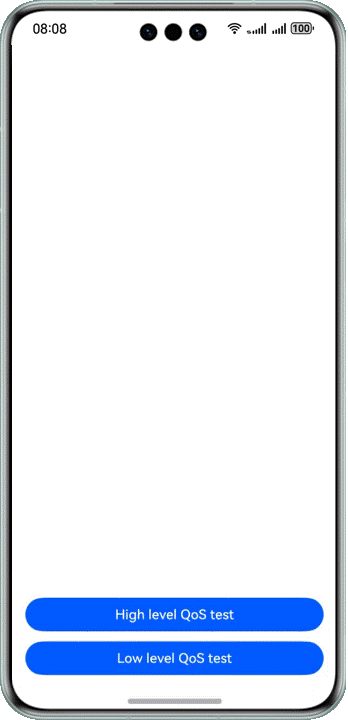

# 基于QoS设置线程优先级

### 介绍

本示例中主要介绍开发者如何使用Native QoS的接口来设置、查询以及重置线程的QoS等级，并在界面上显示不同QoS等级的线程完成相同计算任务的时间。功能主要包括点击不同的按钮分别创建高、低QoS等级的线程来完成同样的复杂计算任务。在计算完成后，弹窗显示当前创建线程完成任务执行所花费的时间。

### 效果预览



#### 使用说明

1. 安装编译生成的hap包，并打开应用。

2. 点击页面中间的“High level QoS test”按钮或者“Low level QoS test”按钮，页面将弹窗显示使用该QoS等级创建的线程完成计算任务所花费的时间。

### 工程目录

```
├──entry/src/main
│  └──cpp                           // C++代码区
│     ├──CMakeLists.txt             // CMake配置文件
│     ├──main.cpp                   // QoS调用相关逻辑实现
│     └──types
│        └──libentry
│           └──index.d.ts           // native侧暴露给ArkTS侧接口的声明            
├──ets                              // ets代码区
│  ├──entryability
│  │  └──EntryAbility.ts            // 程序入口类
│  └──pages                         // 页面文件
│     └──Index.ets                  // 主界面
└──entry/src/main/resources         // 应用资源目录
```

### 具体实现
通过在IDE中创建Native C++ 工程，在C++代码中定义对外接口为useHighQos和useLowQos，在ArkTS侧调用该接口可在系统中创建对应QoS等级的线程完成任务。

每次调用useHighQos或useLowQos时，会先在系统中启动若干线程模拟系统负载（如果之前已经启动了相关的线程，则不再重复启动）。系统负载模拟完成后，会单独启动一个新的、用于完成计算任务的线程，并根据ArkTS侧实际调用的接口，调用设置QoS等级的接口为线程设置不同的QoS等级。为了更加清楚地展示不同QoS等级之间的效果区别，本样例中将负载线程以及设置了QoS等级用于完成任务计算的线程都绑到同一个CPU核上。样例运行中，可以通过日志查看线程设置QoS等级的结果，如果设置成功则会查询该线程的QoS等级，并通过日志打印出来，以此判断是否符合预期。

新启动的线程会执行斐波那契数列某项数值的计算。当计算完成后，会重置该线程的QoS等级，然后返回整个计算完成的时间（单位毫秒）到ArkTS侧，并通过弹窗显示该时间。


源码参考：[cpp目录](entry/src/main/cpp/main.cpp)下的文件。

涉及到的相关接口：

| 接口名 | 描述 |
| -------- | -------- |
| OH_QoS_SetThreadQoS(QoS_Level level) | 设置当前任务的QoS等级 |
| OH_QoS_ResetThreadQoS() | 取消当前任务设置的QoS等级 |
| OH_QoS_GetThreadQoS(QoS_Level *level) | 获取当前任务的QoS等级 |


详细的接口说明请参考[NativeQoS](https://developer.huawei.com/consumer/cn/doc/harmonyos-guides-V5/qos-guidelines-V5)。

### 相关权限

不涉及。

### 依赖

不涉及。

### 约束与限制

1.本示例仅支持标准系统上运行，支持设备：华为手机。

2.HarmonyOS系统：HarmonyOS NEXT Release及以上。

3.DevEco Studio版本：DevEco Studio NEXT Release及以上。

4.HarmonyOS SDK版本：HarmonyOS NEXT Release SDK及以上。
