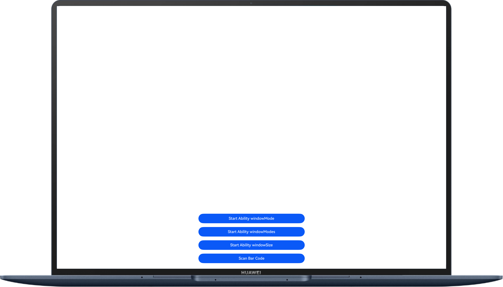

# PCProject

## 介绍

本示例为电脑最佳实践的同源代码工程。

## 效果预览



## 使用说明

1. 应用首页，点击“Start Ability windowMode”，全屏打开本应用。
2. 应用首页，点击“Start Ability windowModes”，全屏打开本应用。
3. 应用首页，点击“Start Ability windowSize”，通过StartOptions选项设置窗口的位置和大小，并打开该应用。
4. 应用首页，点击“Scan Bar Code”，验证该设备是否支持扫码功能。

## 工程目录

```
├──entry/src/main/ets                        // 代码区
│  ├──entryability
│  │  ├──EntryAbility.ets
│  │  └──SubEntryAbility.ets
│  ├──entrybackupability
│  │  └──EntryBackupAbility.ets
│  └──pages
│  │  └──Index.ets                           // 首页
└──entry/src/main/resources                  // 应用资源目录
```

## 相关权限

- 允许应用使用悬浮窗的能力：ohos.permission.SYSTEM_FLOAT_WINDOW

## 依赖

不涉及

## 约束与限制

1. 本示例仅支持标准系统上运行，支持设备：PC电脑。
2. HarmonyOS系统：HarmonyOS 5.0.5 Release及以上。
3. DevEco Studio版本：DevEco Studio 5.0.5 Release及以上。
4. HarmonyOS SDK版本：HarmonyOS 5.0.5 Release SDK及以上。

## 下载

如需单独下载本工程，执行如下命令：
```
git init
git config core.sparsecheckout true
echo PCProject/ > .git/info/sparse-checkout
git remote add origin https://gitee.com/harmonyos_samples/BestPracticeSnippets.git
git pull origin master
```