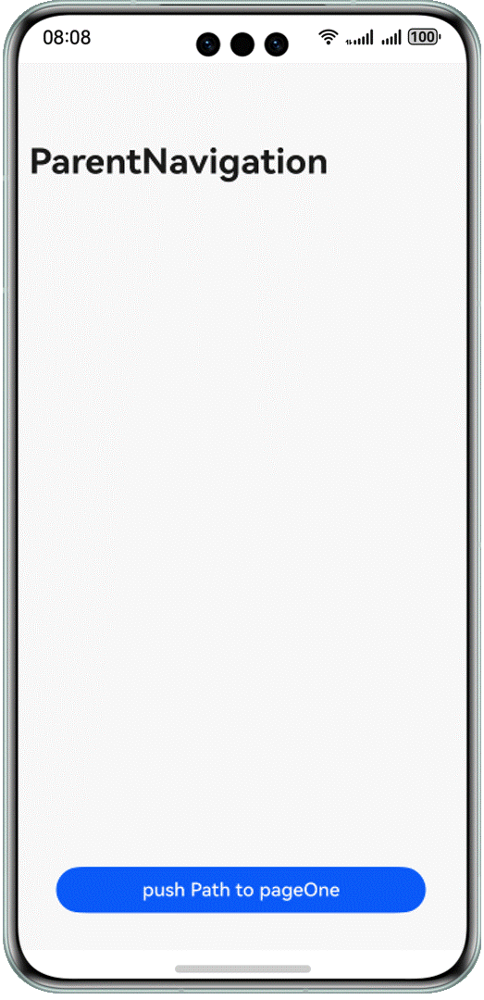

# Image白块解决指导

### 简介

本示例主要解决使用原生Image组件加载大的网络图片时，出现长时间Image白块的问题。

| 效果预览                                   |
|----------------------------------------|
|  |


### 使用说明
*注意*：工程运行需要修改代码，需将工程中图片的网络地址替换为真实url路径，修改地址详见[MainPage.ets](entry/src/main/ets/pages/MainPage.ets)，
[NetRequest.ets](entry/src/main/ets/utils/NetRequest.ets)。

1、父页面点击"push Path to pageOne"按钮，跳转子页面PageOne。

2、子页面展示网络图片，无明显的长时间白块现象。

### 工程目录
```
├──entry/src/main/ets
│  ├──entryability
│  │  └──EntryAbility.ets                   // 程序入口类
│  ├──entrybackupability
│  │  └──EntryBackupAbility.ets             // 应用数据备份恢复类
│  ├──pages
│  │  ├──MainPage.ets                       // 视图层-父页面
│  │  └──PageOne.ets                        // 视图层-子页面
│  └──utils
│     ├──Logger.ets                         // 日志工具类
│     └──NetRequest.ets                     // 网络请求类
└──entry/src/main/resources                 // 应用静态资源目录
```

### 具体实现

1. 在父组件aboutToAppear()中提前发起网络请求，当父页面点击按钮跳转子页面PageOne，此时触发pixMap请求读取应用沙箱中已缓存解码的网络图片并存储在localStorage中，非首次点击时，不再重复调用getPixMap()，避免每次点击都从沙箱里读取文件。
2. 在NetRequest.ets中定义网络请求httpRequest()，通过fs.access()检查文件是否存在，当文件存在时不再重复请求，并写入沙箱中。
3. 在子组件里：通过在子组件Image中传入被@StorageLink修饰的变量ImageData进行数据刷新，图片送显。
4. 从而通过提前预下载的方式，解决使用Image原生组件加载大的网络图片时，出现长时间Image白块的问题。

### 相关权限

网络权限：ohos.permission.INTERNET

### 依赖

不涉及。

### 约束与限制

1. 本示例仅支持标准系统上运行，支持设备：华为手机。
2. HarmonyOS系统：HarmonyOS 5.0.5 Release及以上。
3. DevEco Studio版本：DevEco Studio 5.0.5 Release及以上。
4. HarmonyOS SDK版本：HarmonyOS 5.0.5 Release SDK及以上。

### 下载

如需单独下载本工程，执行如下命令：
```
git clone --filter=blob:none --no-checkout https://gitee.com/harmonyos_samples/BestPracticeSnippets.git
cd BestPracticeSnippets
git sparse-checkout init --cone
git sparse-checkout set PreHttpRequestUseFiles
git checkout
```
