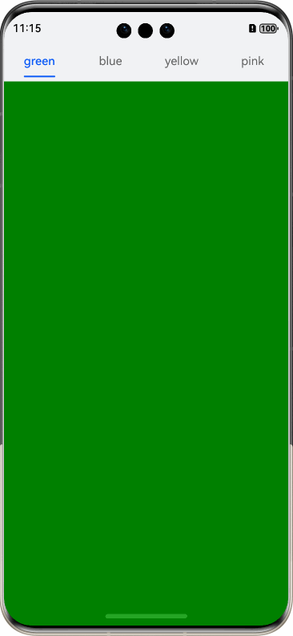

# 解决应用动效闪屏的方案

## 简介

本示例代码介绍了三种解决应用动效闪屏问题的有效方案。通过三组正反面场景的对比，详细说明了点击按钮、Tabs组件切换和ForEach下拉刷新等场景中可能出现的闪屏问题，并提供了相应的解决方案，确保应用动效的流畅性和稳定性。

## 效果预览

| 连续点击错误场景                                  | 连续点击正确场景                                  | Tabs页签切换错误场景                             | Tabs页签切换正确场景                             | ForEach下拉刷新错误场景                                     | ForEach下拉刷新正确场景                                     |
|-------------------------------------------|-------------------------------------------|------------------------------------------|------------------------------------------|-----------------------------------------------------|-----------------------------------------------------|
|  |  |  |  |  |  |

## 使用说明

1. 进入连续点击场景页面，连续点击按钮，等待动画停止后，额外点击一次，查看点击结果。
2. 进入Tabs页签切换场景页面，左右滑动Tabs内容，等待Tabs组件响应，查看滑动结果。
3. 进入列表刷新场景页面，下拉列表触发刷新数据事件，等待刷新结果。

## 工程目录

```
├──entry/src/main/ets
│   ├──entryability
│   │   └──EntryAbility.ets                   // Ability的生命周期回调内容
│   ├──entrybackupability
│   │   └──EntryBackupAbility.ets             // 应用数据备份恢复类
│   └──pages
│       ├──Index.ets                          // 视图层 - 父页面
│       ├──ClickError.ets                     // 视图层 - 连续点击错误场景页面
│       ├──ClickRight.ets                     // 视图层 - 连续点击正确场景页面
│       ├──PullToRefreshError.ets             // 视图层 - ForEach下拉刷新错误场景页面
│       ├──PullToRefreshRight.ets             // 视图层 - ForEach下拉刷新正确场景页面
│       ├──TabsError.ets                      // 视图层 - Tabs页签切换错误场景页面
│       └──TabsRight.ets                      // 视图层 - Tabs页签切换正确场景页面
└──entry/src/main/resources                   // 应用静态资源目录
```

## 具体实现

1. 连续点击场景：当点击时，计数器加1，进行动画逻辑。动画结束时，计数器减1。全部动画结束时，根据计数器判断最后执行缩放的大小。
2. Tabs切换场景：切换动画开始时触发下划线跟着页面一起滑动，同时宽度渐变（onAnimationStart方法）。切换动画结束时触发下划线动画停止（onAnimationEnd方法）。在页面跟手滑动过程中，逐帧触发下划线滑动距离、下划线宽度、下划线切换到不同页签等属性（getCurrentIndicatorInfo方法）。
3. 列表刷新场景：利用三方库 pulltorefresh 实现刷新功能。ForEach填充列表组件内容。当正确设置ForEach第三个参数时，刷新过程不会发生卡顿。

## 相关权限

不涉及。

## 依赖

不涉及。

## 约束与限制

1. 本示例仅支持标准系统上运行，支持设备：华为手机。

2. HarmonyOS系统：HarmonyOS 5.0.5 Release及以上。

3. DevEco Studio版本：DevEco Studio 5.0.5 Release及以上。

4. HarmonyOS SDK版本：HarmonyOS 5.0.5 Release SDK及以上。

## 下载

如需单独下载本工程，执行如下命令：
```
git init
git config core.sparsecheckout true
echo ScreenFlickerSolution/ > .git/info/sparse-checkout
git remote add origin https://gitee.com/harmonyos_samples/BestPracticeSnippets.git
git pull origin master
```