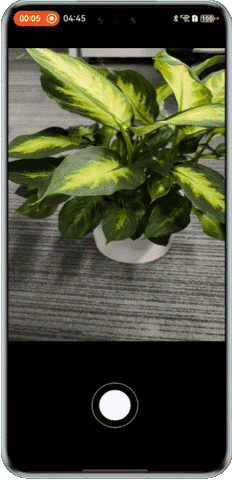

# 实现相机分段式拍照功能

### 介绍

分段式拍照是系统相机开发的重要功能之一，即相机拍照可输出低质量图，提升用户感知拍照速度，同时使用高质量图保证最后的成图质量达到系统相机的水平，既满足了后处理算法的需求，又不要阻塞前台的拍照速度，构筑相机性能竞争力，提升了用户的体验。

### 使用说明

1.点击单段式拍照按钮进入拍照页面，然后点击拍照，进入图片编辑页面，呈现高质量图。

2.点击分段式拍照按钮进入拍照页面，然后点击拍照，进入图片编辑页面，优先显示低质量图，其次显示高质量图。

### 效果图预览
| 单段式拍照                                  | 分段式拍照                                  |
|----------------------------------------|----------------------------------------|
|  |  |


### 工程目录
```
├──entry/src/main/ets
│  ├──common
│  │  ├───utils
│  │  │   ├───DateTimeUtil.ets              // 时间处理公共方法
│  │  │   ├───GlobalContext.ets             // 全局上下文
│  │  │   └───Logger.ets                    // 日志工具类
│  │  └──Constants.ets                      // 视图层-拍照页面
│  ├──entryability
│  │  └──EntryAbility.ets                   // Ability的生命周期回调内容
│  ├──mode
│  │  └──CameraService.ets                  // 模型层- 相机服务
│  ├──pages 
│  │  ├──EditPage.ets                       // 视图层-编辑页面
│  │  ├──IndexPage.ets                      // 视图层-首页
│  │  └──PhotoPage.ets                      // 视图层-拍照页面
│  └──views
│     └──ModeComponent.ets                  // 视图层-拍照组件     
└──entry/src/main/resources                 // 应用静态资源目录
```

### 具体实现

**单段式拍照：**

单段式拍照使用了on(type:'photoAvailable',callback:AsyncCallback<Photo>):void接口注册了全质量图的监听，默认不使能分段式拍照。具体操作步骤如下所示：

1. 相机媒体数据写入[XComponent组件](https://developer.huawei.com/consumer/cn/doc/harmonyos-references/ts-basic-components-xcomponent)中，用来显示图像效果。具体代码如下所示：

   ```typescript
   XComponent({
       id: 'componentId',
       type: 'surface',
       controller: this.mXComponentController
   })
    .onLoad(async () => {
      Logger.info(TAG, 'onLoad is called');
      this.surfaceId = this.mXComponentController.getXComponentSurfaceId();
      GlobalContext.get().setObject('cameraDeviceIndex', this.defaultCameraDeviceIndex);
      GlobalContext.get().setObject('xComponentSurfaceId', this.surfaceId);
      let surfaceRect: SurfaceRect = {
          surfaceWidth: Constants.X_COMPONENT_SURFACE_HEIGHT, surfaceHeight: Constants.X_COMPONENT_SURFACE_WIDTH
      };
      this.mXComponentController.setXComponentSurfaceRect(surfaceRect);
      Logger.info(TAG, `onLoad surfaceId: ${this.surfaceId}`);
      await CameraService.initCamera(this.surfaceId, this.defaultCameraDeviceIndex);
    })
   ```

2. initCamera函数完成一个相机生命周期初始化的过程。
- 首先通过[getCameraManager](https://developer.huawei.com/consumer/cn/doc/harmonyos-references/arkts-apis-camera-f#cameragetcameramanager)来获取CameraMananger相机管理器类。
- 调用[getSupportedCameras](https://developer.huawei.com/consumer/cn/doc/harmonyos-references/arkts-apis-camera-cameramanager#getsupportedcameras)和[getSupportedOutputCapability](https://developer.huawei.com/consumer/cn/doc/harmonyos-references/arkts-apis-camera-cameramanager#getsupportedoutputcapability11)方法来获取支持的camera设备以及设备能力集。
- 调用[createPreviewOutput](https://developer.huawei.com/consumer/cn/doc/harmonyos-references/arkts-apis-camera-cameramanager#createpreviewoutput)和[createPhotoOutput](https://developer.huawei.com/consumer/cn/doc/harmonyos-references/arkts-apis-camera-cameramanager#createphotooutput11)方法来创建预览输出和拍照输出对象。
- 使用CameraInput的open方法来打开相机输入，通过onCameraStatusChange函数来创建CameraManager注册回调。
- 最后调用sessionFlowFn函数创建并开启Session。

3. 确定拍照输出流。通过[CameraOutputCapability](https://developer.huawei.com/consumer/cn/doc/harmonyos-references/arkts-apis-camera-i#cameraoutputcapability)类中的photoProfiles属性，可获取当前设备支持的拍照输出流，通过cameraManager.createPhotoOutput方法创建拍照输出流。

4. 触发拍照。通过photoOutput类的[capture](https://developer.huawei.com/consumer/cn/doc/harmonyos-references/arkts-apis-camera-photooutput#capture)方法，执行拍照任务。

   ```typescript
   async takePicture(): Promise<void> {
     Logger.info(TAG, 'takePicture start');
     let cameraDeviceIndex = GlobalContext.get().getT<number>('cameraDeviceIndex');
     let photoSettings: camera.PhotoCaptureSetting = {
       quality: camera.QualityLevel.QUALITY_LEVEL_HIGH,
       mirror: cameraDeviceIndex ? true : false
     };
     await this.photoOutput?.capture(photoSettings);
     Logger.info(TAG, 'takePicture end');
   }
   ```

5. 设置拍照photoAvailable的回调来获取Photo对象，点击拍照按钮，触发此回调函数，调用getComponent方法根据图像的组件类型从图像中获取组件缓存ArrayBuffer，使用createImageSource方法来创建图片源实例，最后通过createPixelMap获取PixelMap对象。注意:如果已经注册了photoAssetAvailable回调，并且在Session开始之后又注册了photoAvailable回调，会导致流被重启。不建议开发者同时注册photoAvailable和photoAssetAvailable。

   ```typescript
   photoOutput.on('photoAvailable', (err: BusinessError, photo: camera.Photo) => {
     Logger.info(TAG, 'photoAvailable begin');
     if (err) {
       Logger.info(TAG, `photoAvailable err:${err.code}`);
       return;
     }
     let imageObj: image.Image = photo.main;
     imageObj.getComponent(image.ComponentType.JPEG, (err: BusinessError, component: image.Component) => {
       Logger.info(TAG, `getComponent start`);
       if (err) {
         Logger.info(TAG, `getComponent err:${err.code}`);
         return;
       }
       let buffer: ArrayBuffer = component.byteBuffer;
       let imageSource: image.ImageSource = image.createImageSource(buffer);
       imageSource.createPixelMap((err: BusinessError, pixelMap: image.PixelMap) => {
         if (err) {
           Logger.error(TAG, `createPixelMap err:${err.code}`);
           return;
          }
         this.handleImageInfo(pixelMap);
       })
     })
   })
   ```

   以上代码中执行handleImageInfo函数来对PixelMap进行全局存储并跳转到预览页面。具体代码如下所示：

   ```typescript
   handleSavePicture = (imageInfo: photoAccessHelper.PhotoAsset | image.PixelMap): void => {
     Logger.info(TAG, 'handleSavePicture');
     this.setImageInfo(imageInfo);
     AppStorage.set<boolean>('isOpenEditPage', true);
     Logger.info(TAG, 'setImageInfo end');
   }
   
   setImageInfo(imageInfo: photoAccessHelper.PhotoAsset | image.PixelMap): void {
     Logger.info(TAG, 'setImageInfo');
     GlobalContext.get().setObject('imageInfo', imageInfo);
   }
   ```

6. 进入到预览界面，通过GlobalContext.get().getT<image.PixelMap>('imageInfo')方法获取PixelMap信息，并通过Image组件进行渲染显示。

**分段式拍照：**

分段式拍照是应用下发拍照任务后，系统将分多阶段上报不同质量的图片。在第一阶段，系统快速上报低质量图，应用通过on(type:'photoAssetAvailable',callback:AsyncCallback<PhotoAsset>):void接口会收到一个PhotoAsset对象，通过该对象可调用媒体库接口，读取图片或落盘图片。在第二阶段，分段式子服务会根据系统压力以及定制化场景进行调度，将后处理好的原图回传给媒体库，替换低质量图。具体操作步骤如下所示：

由于分段是拍照和单段式拍照步骤1-步骤4相同，就不再进行赘述。

5. 设置拍照photoAssetAvailable的回调来获取photoAsset，点击拍照按钮，触发此回调函数，然后执行handlePhotoAssetCb函数来完成photoAsset全局的存储并跳转到预览页面。注意:如果已经注册了photoAssetAvailable回调，并且在Session开始之后又注册了photoAvailable回调，会导致流被重启。不建议开发者同时注册photoAvailable和photoAssetAvailable。

   ```typescript
   photoOutput.on('photoAssetAvailable', (err: BusinessError, photoAsset: photoAccessHelper.PhotoAsset) => {
     Logger.info(TAG, 'photoAssetAvailable begin');
     if (photoAsset === undefined) {
       Logger.error(TAG, 'photoAsset is undefined');
       return;
     }
     this.handlePhotoAssetCb(photoAsset);
   });
   ```

   以上代码中执行handleImageInfo函数来对photoAsset进行全局存储并跳转到预览页面。具体代码如下所示：

   ```typescript
   handleSavePicture = (imageInfo: photoAccessHelper.PhotoAsset | image.PixelMap): void => {
     Logger.info(TAG, 'handleSavePicture');
     this.setImageInfo(imageInfo);
     AppStorage.set<boolean>('isOpenEditPage', true);
     Logger.info(TAG, 'setImageInfo end');
   }
   
   setImageInfo(imageInfo: photoAccessHelper.PhotoAsset | image.PixelMap): void {
     Logger.info(TAG, 'setImageInfo');
     GlobalContext.get().setObject('imageInfo', imageInfo);
   }
   ```

6. 进入预览界面通过GlobalContext.get().getT<image.PixelMap>('imageInfo')方法获取PhotoAsset信息，执行requestImage函数中的photoAccessHelper.MediaAssetManager.requestImageData方法根据不同的策略模式，请求图片资源数据，这里的请求策略为均衡模式BALANCE_MODE，
   最后分段式子服务会根据系统压力以及定制化场景进行调度，将后处理好的原图回传给媒体库来替换低质量图。具体代码如下所示：

   ```typescript
   photoBufferCallback: (arrayBuffer: ArrayBuffer) => void = (arrayBuffer: ArrayBuffer) => {
     Logger.info(TAG, 'photoBufferCallback is called');
     let imageSource = image.createImageSource(arrayBuffer);
     imageSource.createPixelMap((err: BusinessError, data: image.PixelMap) => {
       Logger.info(TAG, 'createPixelMap is called');
       this.curPixelMap = data;
     });
   };
   
   requestImage(requestImageParams: RequestImageParams): void {
     try {
       class MediaDataHandler implements photoAccessHelper.MediaAssetDataHandler<ArrayBuffer> {
         onDataPrepared(data: ArrayBuffer, map: Map<string, string>): void {
           Logger.info(TAG, 'onDataPrepared begin');
           Logger.info(TAG, `onDataPrepared quality: ${map['quality']}`);
           requestImageParams.callback(data);
           Logger.info(TAG, 'onDataPrepared end');
         }
       };
       let requestOptions: photoAccessHelper.RequestOptions = {
         deliveryMode: photoAccessHelper.DeliveryMode.BALANCE_MODE,
       };
       const handler = new MediaDataHandler();
       photoAccessHelper.MediaAssetManager.requestImageData(requestImageParams.context, requestImageParams.photoAsset,
         requestOptions, handler);
     } catch (error) {
       Logger.error(TAG, `Failed in requestImage, error code: ${error.code}`);
     }
   }
   
   aboutToAppear() {
     Logger.info(TAG, 'aboutToAppear begin');
     if (this.photoMode === Constants.SUBSECTION_MODE) {
       let curPhotoAsset = GlobalContext.get().getT<photoAccessHelper.PhotoAsset>('imageInfo');
       this.photoUri = curPhotoAsset.uri;
       let requestImageParams: RequestImageParams = {
         context: this.getUIContext().getHostContext(),
         photoAsset: curPhotoAsset,
         callback: this.photoBufferCallback
       };
       this.requestImage(requestImageParams);
       Logger.info(TAG, `aboutToAppear photoUri: ${this.photoUri}`);
     } else if (this.photoMode === Constants.SINGLE_STAGE_MODE) {
       this.curPixelMap = GlobalContext.get().getT<image.PixelMap>('imageInfo');
     }
   }
   ```

7. 将步骤6获取的PixelMap对象数据通过Image组件进行渲染显示。


### 相关权限

[相机拍照权限](https://developer.huawei.com/consumer/cn/doc/harmonyos-guides/permissions-for-all#ohospermissioncamera)


### 依赖

不涉及。

### 约束与限制

1.本示例仅支持标准系统上运行，支持设备：华为手机。

2.HarmonyOS系统：HarmonyOS 5.0.5 Release及以上。

3.DevEco Studio版本：DevEco Studio 5.0.5 Release及以上。

4.HarmonyOS SDK版本：HarmonyOS 5.0.5 Release SDK及以上。