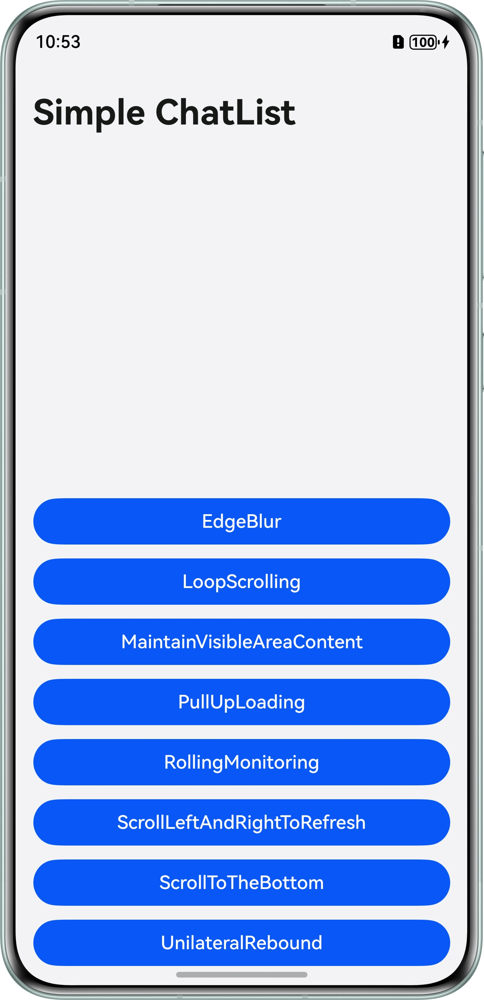

# 实现常见列表操作功能

### 介绍

本示例基于List组件实现常见列表操作功能，主要涉及循环滚动、上拉加载、滚动到底部、滚动到指定位置、左右滚动刷新、单边回弹效果、保持可见区域内容、边缘模糊效果等。


### 效果图预览


### 使用说明

1. 点击“EdgeBlur”按钮进入二级页面， 实现列表边缘模糊效果。
2. 点击“LoopScrolling”按钮进入二级页面， 左右滑动，实现循环滚动效果。
3. 点击“MaintainVisibleAreaContent”按钮进入二级页面， 点击“Insert Data”按钮，在显示区域上方插入数据时，实现保持可见内容位置不变的效果。
4. 点击“PullUpLoading”按钮进入二级页面， 滑动到底部后，实现上拉加载效果。
5. 点击“RollingMonitoring”按钮进入二级页面， 点击“scroll 200”按钮实现滚动到指定位置的效果，点击“Partial_Refresh”按钮实现局部数据刷新效果。
6. 点击“ScrollLeftAndRightToRefresh”按钮进入二级页面， 左右滑动，实现左右滚动刷新效果。
7. 点击“ScrollToTheBottom”按钮进入二级页面， 实现滚动到列表底部的效果。
8. 点击“UnilateralRebound”按钮进入二级页面， 滑动到底部或顶部后，实现单边回弹效果。

### 工程目录
```
├──entry/src/main/ets
│  ├──entryability
│  │  └──EntryAbility.ets                   // Ability的生命周期回调内容
│  ├──entrybackupability
│  │  └──EntryBackupAbility.ets             // 程序入口类
│  └──pages 
│     ├──EdgeBlur.ets                       // 视图层-边缘模糊效果
│     ├──Index.ets                          // 视图层-首页
│     ├──LoopScrolling.ets                  // 视图层-循环滚动
│     ├──MaintainVisibleAreaContent.ets     // 视图层-保持可见区域内容
│     ├──PullUpLoading.ets                  // 视图层-上拉加载
│     ├──RollingMonitoring.ets              // 视图层-滚动到指定位置
│     ├──ScrollLeftAndRightToRefresh.ets    // 视图层-左右滚动刷新
│     ├──ScrollToTheBottom.ets              // 视图层-滚动到底部
│     └──UnilateralRebound.ets              // 视图层-单边回弹效果
└──entry/src/main/resources                 // 应用静态资源目录
```

## 相关权限

不涉及。

## 约束与限制

* 本示例仅支持标准系统上运行，支持设备：华为手机。

* HarmonyOS系统：HarmonyOS 5.0.5 Release及以上。

* DevEco Studio版本：DevEco Studio 5.0.5 Release及以上。

* HarmonyOS SDK版本：HarmonyOS 5.0.5 Release SDK及以上。