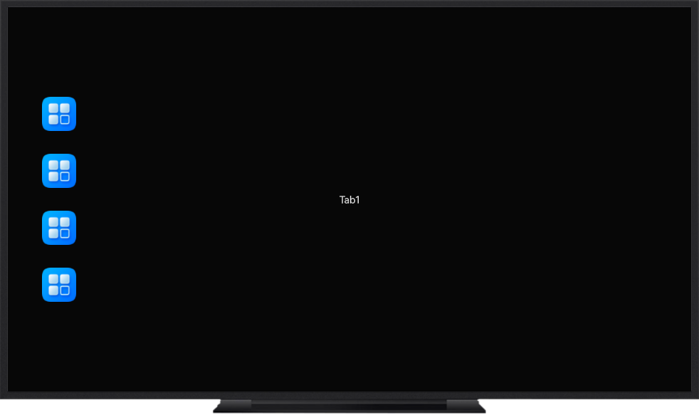

# 智慧屏开发实践

### 介绍
本示例实现了智慧屏响应式侧边导航、按键事件监听、视频类应用监听遥控器按键显示菜单选项等功能。

### 效果图预览

| 导航页                              | 菜单监听页面                              |
|----------------------------------|-------------------------------------|
|  |  |

### 使用说明
1. 首页有三个按钮分别为侧边导航、键盘按键、菜单监听。
2. 点击侧边导航进入到侧边导航展示页面，当遥控器指针移动到侧边栏，侧边栏变宽，当指针移动到导航项上时，导航项宽度变宽，背景颜色改变。
3. 点击键盘按键进入键盘按键页面，按下遥控器按键，会显示按键的信息。
4. 点击菜单监听进入菜单监听页面，按下遥控器菜单键，会显示菜单选项。

### 工程目录

```
├──entry/src/main/ets                                           // ArkTS代码区
│  ├──entryability
│  │  └──EntryAbility.ets                                       // 入口类
│  ├──entryability
│  │  └──EntryBackupAbility.ets                                 // 备份恢复框架
│  ├──pages
│  │  ├──Index.ets                                              // 首页
│  │  ├──KeyboardPage.ets                                       // 键盘按键页面
│  │  ├──TabsPage.ets                                           // 侧边导航页面
│  │  └──VideoPage.ets                                          // 菜单监听页面
│  └──view
│     ├──TabInfo.ets                                            // 导航栏信息实体类
│     └──TabViewModel.ets                                       // 导航数据生成实体类
└──entry/src/main/resources                                     // 应用资源文件

```

### 相关权限

不涉及。

### 依赖

不涉及。

### 约束与限制

1. 本示例仅支持标准系统上运行，支持设备：智慧屏。

2. HarmonyOS系统：HarmonyOS 5.1.0 Release及以上。

3. DevEco Studio版本：DevEco Studio 5.1.0 Release及以上。

4. HarmonyOS SDK版本：HarmonyOS 5.1.0 Release及以上。