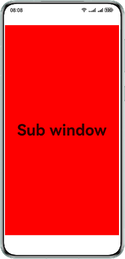

# 实现应用子窗旋转功能

### 简介

在应用旋转场景中，应用主窗的尺寸由系统控制，而应用子窗的尺寸和位置由应用控制。在应用存在子窗的场景下，应用发生旋转时若不调整子窗的尺寸和位置，可能会导致子窗显示截断的问题。本示例展示应用子窗旋转场景下正确的开发范式。

### 效果预览

| 旋转前竖屏显示                 | 旋转后横屏显示                |
|----------------------------|---------------------------|
|  |  |


### 使用说明
- 旋转手机，对应的页面页随旋转。

### 工程目录

```
├──entry/src/main/ets
|  ├──entryability                        
|  │  └──EntryAbility.ets                   // 程序入口类
|  ├──entrybackupability                  
|  │  └──EntryBackupAbility.ets             // 数据备份恢复类
|  └──pages                               
|     ├──Index.ets                          // 首页
|     └──Subwindow.ets                      // 子窗页
└──entry/src/main/resources                 // 应用资源目录
```

### 具体实现

不涉及

### 相关权限

- ohos.permission.SYSTEM_FLOAT_WINDOW

### 模块依赖

不涉及

### 约束与限制

1. 本示例仅支持标准系统上运行，支持设备：华为手机。
2. HarmonyOS系统：HarmonyOS 5.0.5 Release及以上。
3. DevEco Studio版本：DevEco Studio 5.0.5 Release及以上。
4. HarmonyOS SDK版本：HarmonyOS 5.0.5 Release SDK及以上。