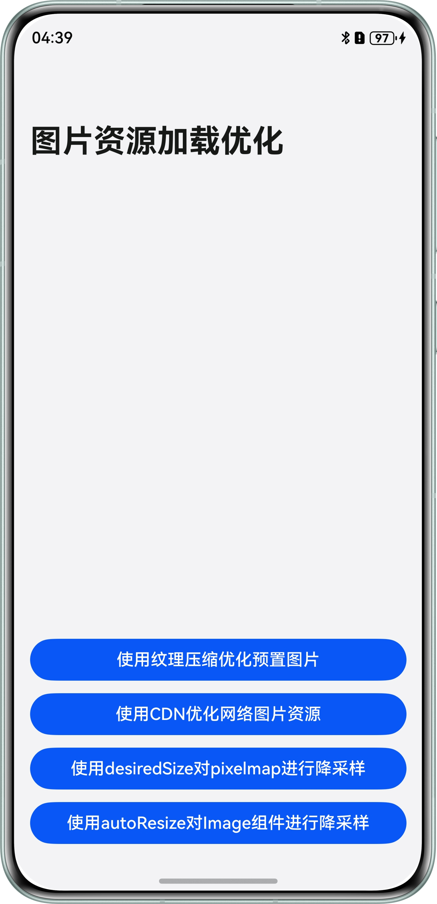

# 图片资源加载优化提高应用性能

### 介绍

本示例介绍了使用纹理压缩技术将预置图片在构建过程中进行转码和压缩，使用CDN优化网络图片资源、desiredSize对pixelmap进行降采样、autoResize对Image组件进行降采样，节省CPU的处理过程，减少占用内存，提升应用性能。

### 效果图预览


##### 使用说明

1. 点击首页“使用纹理压缩优化预置图片”按钮，进入二级页面，向右滑动切换tab1页面到tab2页面，展示tab2页面中的所有图片。
2. 点击首页“使用CDN优化网络图片资源”按钮，进入二级页面，替换使用CDN网络图片，查看CDN网络图片。
3. 点击首页“使用desiredSize对pixelmap进行降采样”按钮，进入二级页面，点击按钮选择相册图片并上传。
4. 点击首页“使用autoResize对Image组件进行降采样”按钮，进入二级页面，点击按钮选择相册图片并上传。

### 工程目录

```
├──entry/src/main/ets/
│  ├──entryability
│  │  └──EntryAbility.ets                                        // 程序入口类
│  └──pages    
│     ├──DownsampleThePixelmapUsingDesiredSize.ets               // 视图层-使用desiredSize对pixelmap进行降采样      
│     ├──Index.ets                                               // 首页
│     ├──OptimizeWebImagesUsingCDN.ets                           // 视图层-使用CDN优化网络图片资源 
│     ├──TextureCompression.ets                                  // 视图层-使用纹理压缩优化预置图片   
│     └──UseAutoResizeToDownsampleTheImageComponent.ets          // 视图层-使用autoResize对Image组件进行降采样
└──entry/src/main/resources          // 应用静态资源目录
```

### 具体实现

1. 使用纹理压缩优化预置图片：首先创建Tabs组件，使用TabContent创建tab1和tab2两个标签页。 然后使用@Builder创建tabBuilder自定义构建函数，将tabBuilder传入TabContent的tabBar属性中实现自定义tab栏样式，在tab2页面内使用Image组件加载80张内置图片。 最后，在build-profile.json5配置参数开启纹理压缩。
2. 使用CDN优化网络图片资源：选择一个CDN服务器，通过图片请求地址添加图片宽高等参数，例如"https://******.com/path/to/image.jpg?w=200&h=150&fit=cover&q=85&format=webp","******"替换为实际CDN服务器域名。
3. 使用desiredSize对pixelmap进行降采样：使用imageSource.createPixelMap接口，给图片添加DecodingOptions图像解码设置选项，设置期望输出大小desiredSize。
4. 使用autoResize对Image组件进行降采样：给Image组件设置autoResize，即图片解码过程中是否对图源自动缩放，设置为true时，组件会根据显示区域的尺寸决定用于绘制的图源尺寸，有利于减少内存占用。

### 相关权限

不涉及。

### 约束与限制

1. 本示例仅支持标准系统上运行，支持设备：华为手机。

2. HarmonyOS系统：HarmonyOS 5.0.5 Release及以上。

3. DevEco Studio版本：DevEco Studio 5.0.5 Release及以上。

4. HarmonyOS SDK版本：HarmonyOS 5.0.5 Release SDK及以上。

### 下载

如需单独下载本工程，执行如下命令：
```
git clone --filter=blob:none --no-checkout https://gitee.com/harmonyos_samples/BestPracticeSnippets.git
cd BestPracticeSnippets
git sparse-checkout init --cone
git sparse-checkout set TextureHypercompression
git checkout
```