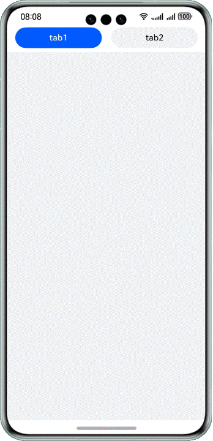

# 纹理压缩提高应用性能

### 介绍

本示例介绍了使用纹理压缩技术将预置图片在构建过程中进行转码和压缩，节省CPU的处理过程，减少占用内存，提升应用性能。

### 效果图预览



##### 使用说明

向右滑动切换tab1页面到tab2页面，展示tab2页面中的所有图片。

### 工程目录

```
├──entry/src/main/ets/
│  ├──entryability
│  │  └──EntryAbility.ets            // 程序入口类
│  └──pages                  
│     └──Index.ets                   // 首页
└──entry/src/main/resources          // 应用静态资源目录
```

### 具体实现

1. 创建Tabs组件，使用TabContent创建tab1和tab2两个标签页。

2. 使用@Builder创建tabBuilder自定义构建函数，将tabBuilder传入TabContent的tabBar属性中实现自定义tab栏样式。

3. 在tab2页面内使用Image组件加载80张内置图片。

4. 在build-profile.json5配置参数开启纹理压缩。

### 相关权限

不涉及。

### 约束与限制

1. 本示例仅支持标准系统上运行，支持设备：华为手机。

2. HarmonyOS系统：HarmonyOS 5.0.5 Release及以上。

3. DevEco Studio版本：DevEco Studio 5.0.5 Release及以上。

4. HarmonyOS SDK版本：HarmonyOS 5.0.5 Release SDK及以上。