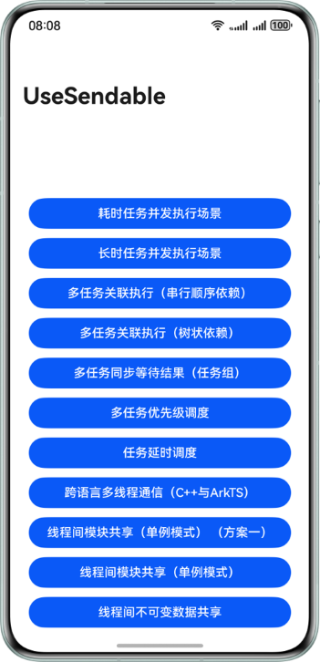

# 应用并发设计同源代码工程

## 介绍
本示例为应用并发设计同源代码工程，包含最佳实践文档中包含的推荐使用方法的样例代码。工程本身不具备实际功能，开发者请直接阅读文档结合源码来理解多设备功能开发。

## 效果预览



## 工程目录

```
├──entry/src/main/cpp                            
│  ├──types/libndkDrawing
│  │  ├──Index.d.ts
│  │  └──oh-package.json5
│  ├──CMakeLists.txt
│  └──native_bridge.cpp                             // Native侧暴露绘制接口nativeOnDraw供前端调用
├──entry/src/main/ets                               // 代码区
│  ├──entryability
│  │  └──EntryAbility.ets                           // 程序入口
│  ├──entrybackupability
│  │  └──EntryBackupAbility.ets   
│  ├──pages
│  │  ├──ConcurrencyCapabilitySelection1.ets        // 耗时任务并发执行场景
│  │  ├──ConcurrencyCapabilitySelection2.ets        // 长时任务并发执行场景
│  │  ├──ConcurrentTaskManagement1.ets              // 多任务关联执行（串行顺序依赖）
│  │  ├──ConcurrentTaskManagement2.ets              // 多任务关联执行（树状依赖）
│  │  ├──ConcurrentTaskManagement3.ets              // 多任务同步等待结果（任务组）
│  │  ├──ConcurrentTaskManagement4.ets              // 多任务优先级调度
│  │  ├──ConcurrentTaskManagement5.ets              // 任务延时调度
│  │  ├──Demo.ets
│  │  ├──freezeObj.ts
│  │  ├──InterThreadCommunication1.ets              // 跨语言多线程通信（C++与ArkTS）
│  │  ├──InterThreadCommunication2.ets              // 线程间模块共享（单例模式）（方案一）
│  │  ├──InterThreadCommunication3.ets              // 线程间模块共享（单例模式）
│  │  └──InterThreadCommunication4.ets              // 线程间不可变数据共享
│  └──workers
│     └──Worker.ets                                 // 线程间不可变数据共享
└──entry/src/main/resources                         // 应用资源目录
```

## 使用说明
1. 点击“耗时任务并发执行场景”按钮，控制台打印“Return:3”。
2. 点击“长时任务并发执行场景”按钮，控制台打印“execute success”。
3. 点击“多任务关联执行（串行顺序依赖）”按钮，控制台打印“result is abc”。
4. 点击“多任务关联执行（树状依赖）”按钮，控制台打印“taskpool:: execute task3 res: “100”、“taskpool:: execute task2 res: 200”、“taskpool:: execute task1 res: 300”。
5. 点击“多任务同步等待结果（任务组）”按钮，控制台打印“res:”加上打印结果。
6. 点击“多任务优先级调度”按钮，控制台打印“execColorInfo success”。
7. 点击“任务延时调度”按钮，控制台打印“taskpool result: 100”。
8. 点击“跨语言多线程通信（C++与ArkTS）”按钮，控制台打印“click nativeCall success”。
9. 点击“线程间模块共享（单例模式） （方案一）”按钮，控制台打印“host thread address is”加上打印结果。
10. 点击“线程间模块共享（单例模式）”按钮，控制台打印“executeTaskPool success”。
11. 点击“线程间不可变数据共享”按钮，控制台打印“executeTaskPool success”。

## 相关权限
不涉及。

## 依赖

不涉及。

## 约束与限制

1. 本示例仅支持标准系统上运行，支持设备：华为手机。
2. HarmonyOS系统：HarmonyOS 5.0.5 Release及以上。
3. DevEco Studio版本：DevEco Studio 5.0.5 Release及以上。
4. HarmonyOS SDK版本：HarmonyOS 5.0.5 Release SDK及以上。

## 下载

如需单独下载本工程，执行如下命令：
```
git clone --filter=blob:none --no-checkout https://gitee.com/harmonyos_samples/BestPracticeSnippets.git
cd BestPracticeSnippets
git sparse-checkout init --cone
git sparse-checkout set UseSendable
git checkout
```