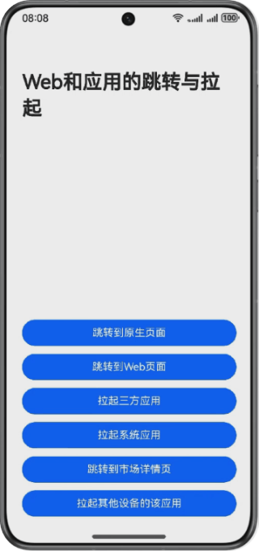

# 基于应用拉起相关能力实现Web跳转功能

## 介绍

本示例基于应用拉起相关能力，实现了Web页面与ArkTS页面的相互拉起、从Web页面拉起各类应用、以及拉起应用市场详情页等场景。

## 效果预览
手机运行效果图如下：




## 工程目录结构

```
├──entry/src/main/ets                                   // 代码区
│  ├──common
│  |  ├──Logger.ets                                     // 日志工具类
│  |  └──Constants.ets                                  // 常量
│  ├──entryability
│  |  └──EntryAbility.ets
│  ├──entrybackupability
│  |  └──EntryBackupAbility.ets
│  └──pages
│     ├──Index.ets                                      // 入口界面
│     └──OriginPage.ets                                 // 原生页面
└──entry/src/main/resources                             // 应用资源目录
```

## 具体实现

从Web页面拉起原生页面需要在Web组件的onLoadIntercept拦截器拦截页面加载，并使用Navigation提供的组件路由能力跳转到原生的页面。

从Web页面拉起另外的Web页面，只需要在前端侧使用a标签配置href属性，即可实现从Web页面跳转到其他的Web页面。

从Web页面拉起三方应用，首先同样需要在Web组件的onLoadIntercept中进行拦截，然后执行自定义的拉起逻辑，在拉起之前，需要首先对三方应用进行配置，配置三方应用的module.json5文件中的exported属性为true，同时需要在skills属性中配置entities与actions。最后在拉起方应用内使用隐式拉起的方式，配置Want类型的配置参数，其中action配置为之前在被拉起方中的actions，同时配置entities属性也为被拉起方中的entities，最后使用startAbility进行拉起。即可在不指定bundleName的情况下拉起应用。在本项目中，您需要先安装配套的dependence目录下的PulledUpApplication应用，避免拉起三方应用时拉起失败，也可以在下载本项目后自行配置拉起参数，从而拉起其他的三方应用。

从Web页面拉起系统应用，同样的要在onLoadIntercept中进行拦截，然后可以使用配置Want参数为对应系统应用的配置，然后使用startAbility进行拉起，也可以使用具体场景中系统提供的Picker与API接口。

从Web页面跳转到市场详情页，开发者需要首先在onLoadIntercept中进行拦截，然后使用Store Kit中的应用市场推荐功能，该功能提供了loadProduct接口可以加载应用市场详情页。

从Web页面拉起其他设备的该应用，首先需要在onLoadIntercept中进行拦截，然后使用getAvailableDeviceListSync获取到可信设备列表，最后通过设置want参数中的deviceId进行应用拉起，注意该场景需要开发者多端设备登录同一华为账号、连接同一Wi-Fi、打开蓝牙连接。

## 相关权限

* DISTRIBUTED_DATASYNC：允许不同设备间的数据交换。

## 约束与限制

1. 本示例仅支持标准系统上运行，支持设备：华为手机。
2. HarmonyOS系统：HarmonyOS 5.0.5 Release及以上。
3. DevEco Studio版本：DevEco Studio 5.0.5 Release及以上。
4. HarmonyOS SDK版本：HarmonyOS 5.0.5 Release SDK及以上。

## 下载

如需单独下载本工程，执行如下命令：
```
git init
git config core.sparsecheckout true
echo WebApplicationJump/ > .git/info/sparse-checkout
git remote add origin https://gitee.com/harmonyos_samples/BestPracticeSnippets.git
git pull origin master
```