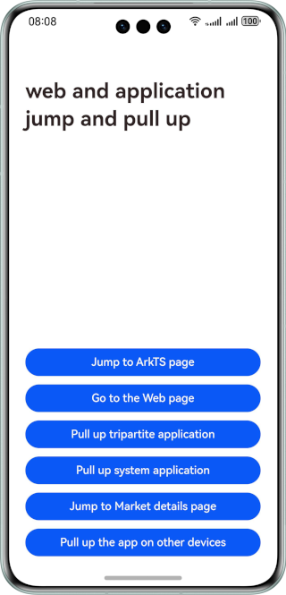

# Jumping Between Webs and Applications

## Overview

Based on the application startup capabilities, this sample implements scenarios such as jumping between the web page and ArkTS page, jumping to applications and details page in AppGallery from the web page.

## Preview
The following figure shows the running effect on a mobile phone.




## Project Directory

```
├──entry/src/main/ets                                   // Code area
│  ├──common
│  │ ├──Logger.ets                                      // Logger
│  |  └──Constants.ets                                  // Constants
│  ├──entryability
│  |  └──EntryAbility.ets
│  ├──entrybackupability
│  |  └──EntryBackupAbility.ets
│  └──pages
│     ├──Index.ets                                      // Entry page
│     └──OriginPage.ets                                 // Origin page
└──entry/src/main/resources                             // App resource directory
```

## How to Implement

To start a native page from a web page, you need to intercept page loading using the interceptor **onLoadIntercept** of the **Web** component and use the routing capability of the **Navigation** component.

To start another web page from a web page, you only need to configure the **a** tag with the **href** property on the frontend.

To start a third-party application from the web page, you need to intercept the page loading using **onLoadIntercept** of the **Web** component and then execute the custom startup logic. Before starting the third-party application, you need to set the **exported** property of the **module.json5** file of the third-party application to **true**. In addition, you need to configure **entities** and **actions** in the **skills** property. Use the implicit startup mode in the application and configure the parameters of the **Want** type. The **action** and **entities** parameters specify the actions and entities of the application to be started respectively. Then, use **startAbility** to start the application. In this way, the application can be started without specifying the bundle name. To start the third-party application successfully, you need to install **PulledUpApplication** in the **dependence** directory. You can also download this project and set the startup parameters to start a third-party application.

To start a system application from the web page, you need to intercept the page loading using **onLoadIntercept**. Then, you can set the parameters of **Want** to the configuration of the corresponding system application, and use **startAbility** to start the system application. In addition, the system application can also be started using the **Picker** and APIs provided by the system in a specific scenario.

To jump from a web page to the details page in AppGallery, you need to intercept the page loading using **onLoadIntercept** and then use the AppGallery recommendation function of Store Kit. This function provides the **loadProduct** API to load the details page on AppGallery.

To start an application on another device from the web page, you need to intercept the page loading using **onLoadIntercept**, use **getAvailableDeviceListSync** to obtain the list of trusted devices, and set the **deviceId** parameter of **want**. In this case, note that you need to log in to the same HUAWEI ID on multiple devices, connect to the same Wi-Fi network, and enable Bluetooth.

## Required Permissions

* **DISTRIBUTED_DATASYNC**, which allows data to be exchanged between devices.

## Constraints

1. The sample app is supported only on Huawei phones running the standard system.
2. The HarmonyOS version must be HarmonyOS 5.0.5 Release or later.
3. The DevEco Studio version must be DevEco Studio 5.0.5 Release or later.
4. The HarmonyOS SDK version must be HarmonyOS 5.0.5 Release SDK or later.

## Download

To download this project separately, execute the following command:
```
git init
git config core.sparsecheckout true
echo WebApplicationJump/ > .git/info/sparse-checkout
git remote add origin https://gitee.com/harmonyos_samples/BestPracticeSnippets.git
git pull origin master
```
