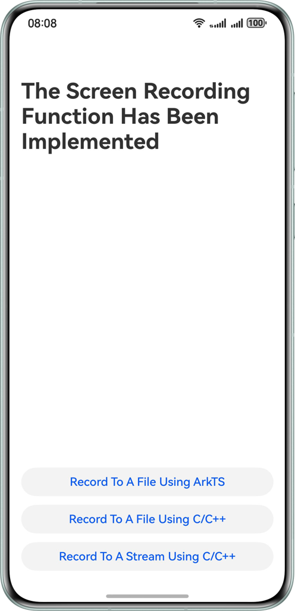

# Screen Recording Based on AVScreenCapture

### Overview

This sample demonstrates how to implement screen recording using AVScreenCapture, including recording to a file using ArkTS, recording to a file using C/C++, and recording and transcoding stream using C/C++. Based on this case, you can master the screen recording capabilities of AVScreenCapture.

### Preview



### How to Use

On the home page, the user taps the corresponding button to navigate to the page for a specific scenario. Each scenario page contains a video playback area and two buttons. Tapping **Record** will trigger a request for necessary permissions. After the user grants permissions, screen recording starts. During this period, recording can continue even if it exits to the background. The user taps **Stop**, or **Stop** in the screen capsule at the top left, to stop video recording. After recording is complete, the page refreshes to display the recorded file. With a tap on **Play**, it starts to play in the playback area.

### Project Structure**

```
├──entry/src/main/cpp                   // C++ code area. 
│  ├──CAVScreenCaptureToFile            // Recording the video to the file module using C/C++. 
│  │  ├──CAVScreenCaptureToFile.cpp 
│  │  └──CAVScreenCaptureToFile.h       
│  ├──CAVScreenCaptureToStream          // Recording and transcoding stream module using C/C++. 
│  │  ├──AudioCapturer.cpp              // Audio recording file. 
│  │  ├──AudioCapturer.h 
│  │  ├──AudioEncoder.cpp               // Audio encoder file. 
│  │  ├──AudioEncoder.h 
│  │  ├──CAVScreenCaptureToStream.cpp   // Recording and transcoding stream. 
│  │  ├──CAVScreenCaptureToStream.h 
│  │  ├──Muxer.cpp                      // Multiplexer file. 
│  │  ├──Muxer.h 
│  │  ├──SampleInfo.h                   // Custom data type. 
│  │  ├──VideoEncoder.cpp               // Video encoder file. 
│  │  └──VideoEncoder.h     
│  ├──types 
│  │  └──libentry                       // C++ APIs. 
│  │     ├──Index.d.ts                 
│  │     └──oh-package.json5            
│  ├──CMakeLists.txt                    // CMake configuration file. 
│  └──napi_init.cpp                     // Native-side code entry. 
├──entry/src/main/ets                   // ArkTS code area. 
│  ├──entryability         
│  │  └──EntryAbility.ets                                 
│  ├──entrybackupability  
│  │  └──EntryBackupAbility.ets    
│  ├──common 
│  │  ├──constants                      // Constant definitions. 
│  │  │  └──CommonConstants.ets         
│  │  └──utils                          // Video time conversion utilities. 
│  │     └──TimeUtils.ets          
│  ├──model                 
│  │  └──MyAVScreenCapture.ets          // Module for screen recording to files using ArkTS. 
│  └──pages                             // ArkTS side pages. 
│     ├──ArkTSAVScreenCapture.ets       // Page for screen recording to files using ArkTS. 
│     ├──CAVScreenCaptureToFile.ets     // Page for screen recording to files using C/C++. 
│     ├──CAVScreenCaptureToStream.ets   // Page for recording and transcoding streams using C/C++. 
│     └──Index.ets                      // Home page. 
└──entry/src/main/resources             // Application resource files.
```

### Required Permissions

1. **ohos.permission.KEEP_BACKGROUND_RUNNING**: required for background continuous task permission.

2. **ohos.permission.MICROPHONE**: required for microphone permission.

### References

N/A

### Restrictions

1. This sample is only supported on Huawei phones running standard systems.
2. The HarmonyOS version must be HarmonyOS 5.1.0 Release or later.
3. The DevEco Studio version must be DevEco Studio 5.1.0 Release or later.
4. The HarmonyOS SDK version must be HarmonyOS 5.1.0 Release SDK or later.

### Download

To download this project separately, execute the following command:
```
git clone --filter=blob:none --no-checkout https://gitee.com/harmonyos_samples/BestPracticeSnippets.git
cd BestPracticeSnippets
git sparse-checkout init --cone
git sparse-checkout set avscreen-capture-screen-record-master
git checkout
```