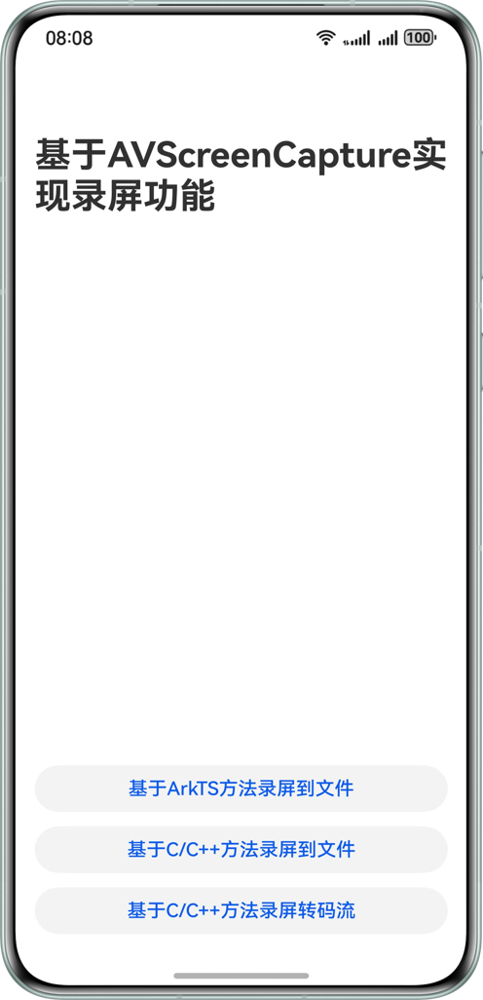

# 基于AVScreenCapture实现录屏功能

### 简介

本示例主要介绍如何基于AVScreenCapture实现屏幕录制，主要包括基于ArkTS方法录屏到文件、基于C/C++方法录屏到文件以及基于C/C++方法录屏转码流三种实现方案。基于该案例，开发者可以掌握AVScreenCapture录屏相关能力。

### 效果预览



### 使用说明

在主页面中点击对应按钮会分别跳转到不同场景的页面。在每个场景页面中都包含了一个视频播放区域和两个按钮。点击录制按钮，会向用户发起权限申请。用户同意后将会开启屏幕录制，期间可以退出到后台进行录制。然后点击停止按钮或者点击屏幕左上角胶囊的停止按钮会停止视频录制。录制完成后页面会进行刷新，显示录制完成的文件信息，点击播放按钮，会在播放区域播放录制好的视频文件。

### 工程结构

```
├──entry/src/main/cpp                   // C++代码区
│  ├──CAVScreenCaptureToFile            // 基于C/C++方法录屏到文件模块
│  │  ├──CAVScreenCaptureToFile.cpp
│  │  └──CAVScreenCaptureToFile.h      
│  ├──CAVScreenCaptureToStream          // 基于C/C++方法录屏转码流模块
│  │  ├──AudioCapturer.cpp              // 音频录制文件
│  │  ├──AudioCapturer.h
│  │  ├──AudioEncoder.cpp               // 音频编码器文件
│  │  ├──AudioEncoder.h
│  │  ├──CAVScreenCaptureToStream.cpp   // 录屏转码流
│  │  ├──CAVScreenCaptureToStream.h
│  │  ├──Muxer.cpp                      // 复用器文件
│  │  ├──Muxer.h
│  │  ├──SampleInfo.h                   // 自定义数据类型
│  │  ├──VideoEncoder.cpp               // 视频编码器文件
│  │  └──VideoEncoder.h    
│  ├──types
│  │  └──libentry                       // C++接口导出
│  │     ├──Index.d.ts                
│  │     └──oh-package.json5           
│  ├──CMakeLists.txt                    // Cmake配置文件
│  └──napi_init.cpp                     // Native侧代码入口
├──entry/src/main/ets                   // ArkTS代码区                  
│  ├──entryability        
│  │  └──EntryAbility.ets                                
│  ├──entrybackupability 
│  │  └──EntryBackupAbility.ets   
│  ├──common
│  │  ├──constants                      // 常量定义
│  │  │  └──CommonConstants.ets        
│  │  └──utils                          // 视频时间转换工具     
│  │     └──TimeUtils.ets         
│  ├──model                
│  │  └──MyAVScreenCapture.ets          // 基于ArkTS方法录屏到文件模块
│  └──pages                             // ArkTS侧页面
│     ├──ArkTSAVScreenCapture.ets       // 基于ArkTS方法录屏到文件页面 
│     ├──CAVScreenCaptureToFile.ets     // 基于C/C++方法录屏到文件页面
│     ├──CAVScreenCaptureToStream.ets   // 基于C/C++方法录屏转码流页面
│     └──Index.ets                      // 主页面               
└──entry/src/main/resources             // 应用资源文件
```

### 相关权限

1. 后台长时任务权限：ohos.permission.KEEP_BACKGROUND_RUNNING
2. 麦克风使用权限：ohos.permission.MICROPHONE

### 参考资料

**不涉及**

### 约束与限制

1. 本示例仅支持标准系统上运行，支持设备：华为手机。
2. HarmonyOS系统：HarmonyOS 5.1.0 Release及以上。
3. DevEco Studio版本：DevEco Studio 5.1.0 Release及以上。
4. HarmonyOS SDK版本：HarmonyOS 5.1.0 Release SDK及以上。