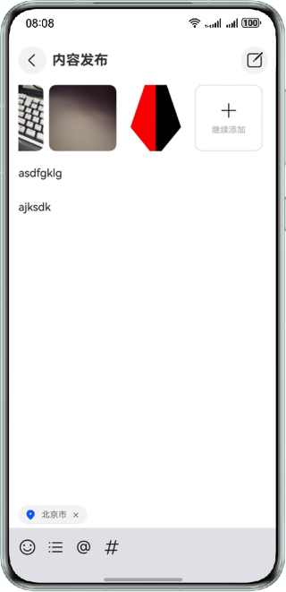
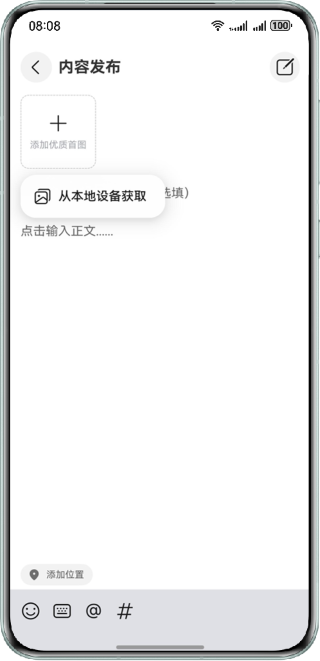
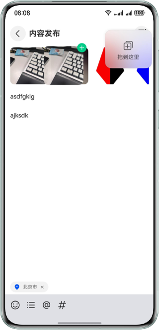
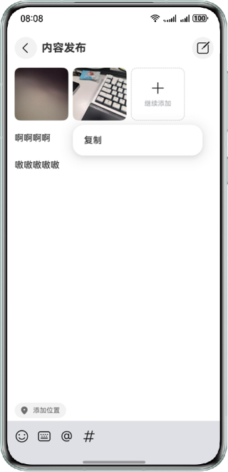
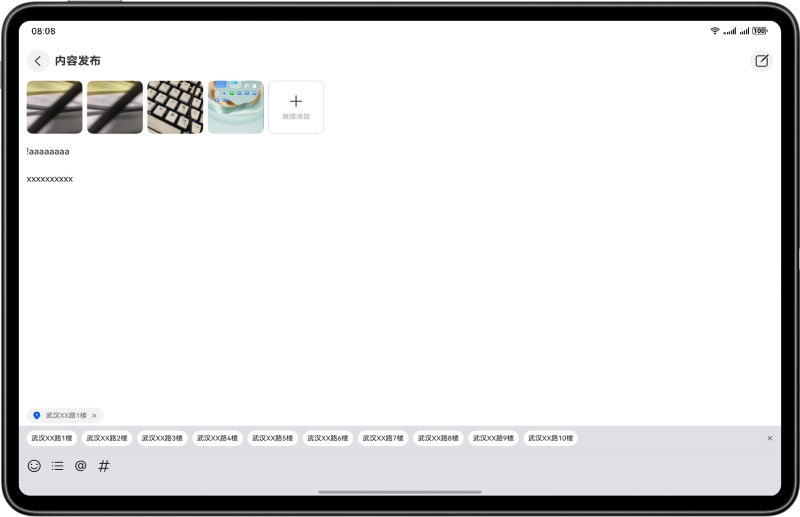
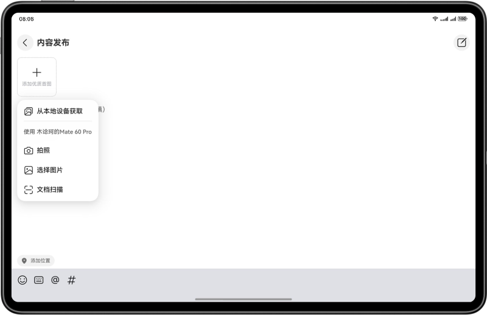
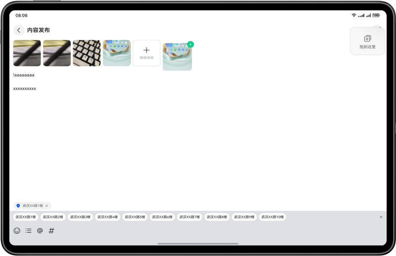
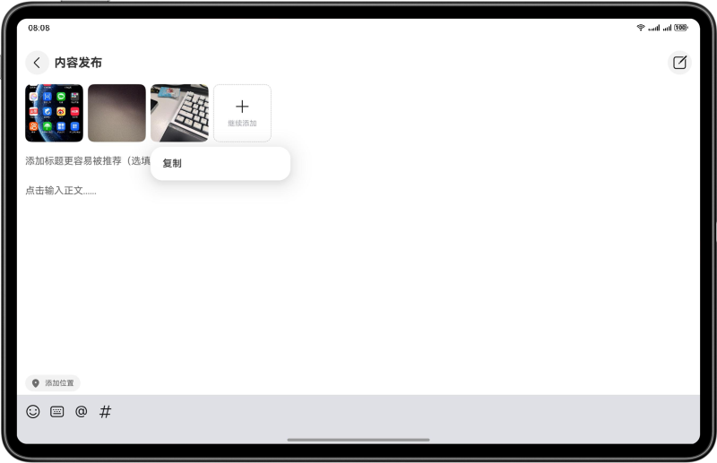

# 基于应用接续及跨设备互通功能实现内容发布功能

## 介绍

本示例基于应用接续、分布式数据对象、分布式文件系统、跨设备互通等功能，实现文本图片数据跨设备交互及接续。
通过分布式数据对象跨设备传输数据；点击系统Dock栏，使应用接续并进行数据传输，使用系统能力，使应用跨设备获取图片、拖拽图片文字、复制粘贴图片文字。开发者可学会应用接续、分布式数据使用、跨设备交互等能力。

## 效果图预览

|                    **主页**                     |                    **图片获取**                     |                     **拖拽**                      |                   **剪贴**                    |
|:---------------------------------------------:|:-----------------------------------------------:|:-----------------------------------------------:|:-------------------------------------------:|
|         |         |         |         |
|  |  |  |  |


## 使用说明

1. 进入应用首页，点击“添加优质首图”，弹出图片来源弹窗，选择拉取本地图库后，弹出本地图库弹窗，选择图片后，图片横向显示在列表中。
2. 选择拉取远端后，可选择同一华为账号下的其他设备的拍照、图库、文档扫描功能，可调用其他设备的相机、图库、文档扫描页面（注：PC/2in1可调用平板和手机，平板只能调用手机，手机无法调用其他设备且同设备无法调用），拍摄图片并保存，或选择图库图片后点击完成，回传图片至当前设备应用的列表中。
3. 在本端应用中点击列表中的图片，出现复制按钮，点击后可将图片复制到系统剪贴板，也可复制图库内的图片。在对端设备的图片列表上，点击空白区域，显示粘贴按钮，点击按钮可粘贴并显示系统剪贴板的图片。（复制数据只存在在跨设备剪贴板中2分钟）。
4. 在本端应用中长按列表中的图片，触发拖拽场景，可将本端图片拖拽至对端图片列表区域，松开鼠标，图片显示在列表中（注：需连接同一华为账号的设备打开键鼠共享，并且必须包含一台PC/2in1）。
5. 点击“标题”/“正文”输入框，可以输入相应内容。
6. 在本端应用中选择编辑区域的文字，触发系统菜单后，点击复制按钮可将文字复制到系统剪贴板，也可复制其他系统应用中的文字信息。在对端设备的编辑区域内，触发系统菜单，点击粘贴可输出并显示系统剪贴板的文字。（复制数据只存在在跨设备剪贴板中2分钟）。
7. 在本端应用中选择编辑区域的文字后长按触发拖拽场景，可将本端文字信息拖拽至对端编辑区域，松开鼠标，文字落入编辑区域内（注：需连接同一华为账号的设备打开键鼠共享，并且必须包含一台PC/2in1）。
8. 点击左下“添加位置”，“添加位置”下方区域会多出一行附近位置信息，选中后，“添加位置”会变成选中的位置信息。
9. 本端打开应用接续（内容发布）应用，对端设备的Dock栏中会新增应用接续（内容发布）应用图标，点击应用接续（内容发布）应用，本端应用会接续到对端设备上去。

## 工程目录

```
├──entry/src/main/ets                         // 代码区
│  ├──constants
│  │  ├──BreakpointConstants.ets              // 断点常量类
│  │  └──CommonConstants.ets                  // 公共常量
│  ├──entryability
│  │  └──EntryAbility.ets       
│  ├──model
│  │  └──CommonModel.ets                      // 公共实体类       
│  ├──pages
│  │  └──Home.ets                             // 主页面       
│  ├──utils
│  │  ├──BreakpointSystem.ets                 // 一多断点工具类
│  │  ├──FileUtil.ets                         // 选择图片工具类
│  │  └──LocationUtil.ets                     // 本地位置工具类
│  └──view
│     ├──AddPic.ets                           // 添加图片模块
│     ├──BottomToolbar.ets                    // 底部工具模块
│     ├──EditorComponent.ets                  // 编辑输入模块
│     └──TopArea.ets                          // 顶部区域模块
└──entry/src/main/resources                   // 应用资源目录
```

## 相关权限

- 申请获取设备位置信息权限:ohos.permission.APPROXIMATELY_LOCATION和ohos.permission.LOCATION。

## 依赖

不涉及

## 约束与限制

1. 本示例仅支持标准系统上运行，支持设备：phone，tablet，PC/2in1。

2. HarmonyOS系统：HarmonyOS 5.0.5 Release及以上。

3. DevEco Studio版本：DevEco Studio 5.0.5 Release及以上。

4. HarmonyOS SDK版本：HarmonyOS 5.0.5 Release SDK及以上。

5. 双端设备需要登录同一华为账号。

6. 双端设备需要打开Wi-Fi和蓝牙开关。条件允许时，建议双端设备接入同一个局域网，可提升数据传输的速度。 

7. 应用接续只能在同应用（UIAbility）之间触发，双端设备都需要有该应用。

8. 跨设备拖拽需要打开键鼠共享（必须包含一台PC/2in1）。