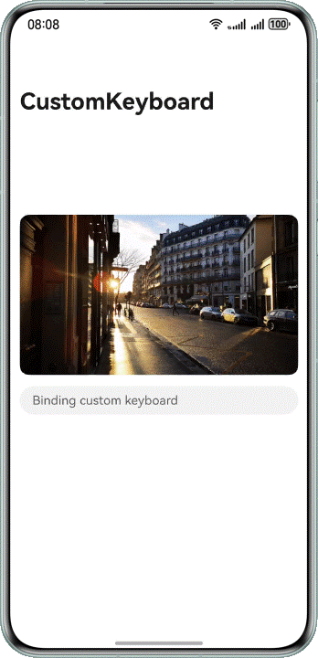

# Implementing a Custom Keyboard

### Overview

This sample introduces how to implement a custom keyboard. The custom keyboard can be bound to the system keyboard so that they can switch to each other. The **onAreaChange** function can be used to obtain the custom keyboard height and set layout avoidance. This sample also describes technical scenarios such as keyboard switching, custom keyboard cursor, and custom keyboard layout avoidance.

### Preview
|             Layout avoidance              |             Keyboard Switching             |            Common functions             |
|:-----------------------------------------:|:------------------------------------------:|:---------------------------------------:|
|  |  |  |


How to Use

1. On the home page, tap the text box for binding a custom keyboard. The custom keyboard is displayed, with layout avoidance upwards.

2. Tap the 123, ABC, and Chinese tabs on the keyboard to switch between the numeric keypad, English keyboard, and system keyboard. In this way, a text box can be bound to both the custom keyboard and system keyboard.

3. Common keyboard operations are supported, including text input, cursor setting, uppercase/lowercase change, copy, paste, and deletion.


### Project Directory

```
├──entry/src/main/ets	                 // Code area
│  ├──constants
│  │  └──Constants.ets                   // Common constants
│  ├──entryability
│  │  └──EntryAbility.ets                // Entry ability
│  ├──model
│  │  └──KeyboardController.ets          // Custom keyboard controller
│  ├──pages
│  │  └──MainPage.ets                    // Main page
│  ├──view
│  │  ├──CustomKeyboard.ets              // Custom keyboard
│  │  ├──EnglishKeyboard.ets             // English keyboard
│  │  ├──NumberKeyboard.ets              // Numeric keyboard
│  │  ├──TabButton.ets                   // Tab button on the top of the keyboard
│  │  ├──TabView.ets                     // Tab component on the top of the keyboard
│  │  └──TextInputComponent.ets          // TextInput component bound to the custom keyboard
│  └──viewmodel
│     └──MenuModel.ets                   // Keyboard button data
└──entry/src/main/resources              // App resource directory
```

### How to Implement

1. To implement a custom keyboard, the **customKeyboard** attribute of the **TextInput** component is bound to **builder**.
2. To switch between the custom keyboard and the system keyboard, the **customKeyboard** attribute of the **TextInput** component is set to **null** and is bound to the system keyboard.
3. To set the cursor position, the system listens for the **onTextSelectionChange** and **onChange** events of the **TextInput** component.
4. To implement the copy and paste functions, the system listens for the **onPaste** and **onCut** events of the **TextInput** component.
5. To implement layout avoidance, the **keyboardHeightChange** event of the window module is used to obtain the system keyboard height, and the **onAreaChange** event is used to obtain the custom keyboard height.

### Permissions
N/A

### Dependencies
N/A

### Constraints

1. The sample is only supported on Huawei phones with standard systems.

2. The HarmonyOS version must be HarmonyOS 5.0.5 Release or later.

3. The DevEco Studio version must be DevEco Studio 5.0.5 Release or later.

4. The HarmonyOS SDK version must be HarmonyOS 5.0.5 Release SDK or later.