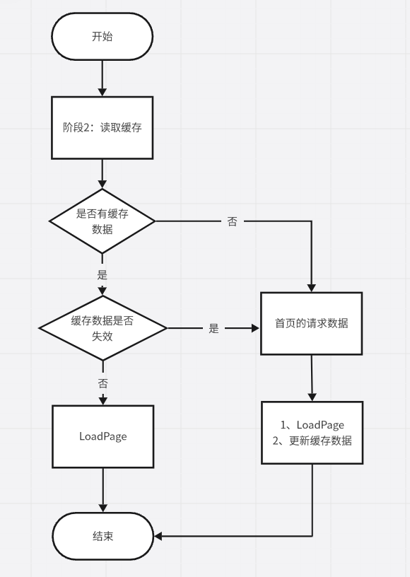

# 基于DataCache库提升应用冷启动速度

### 介绍

本示例展示了基于DataCache库的数据缓存能力，提升鸿蒙原生应用冷启动速度的功能，以优化应用使用体验。

### 效果预览


### 工程目录

```markdown
├──entry/src/main/ets/
│  ├──common
│  │  ├──constant                  
│  │  │  └──CommonConstants.ets               // 公共常量
│  │  ├──types  
│  │  │  └──CommonTypes.ets                   // 公共类型
│  │  └──utils 
│  │     └──Refresh.ets                       // 刷新工具类
│  ├──entryability
│  │  └──EntryAbility.ets                     // 程序入口类
│  ├──model
│  │  └──ListModel.ets                        // 模型文件
│  ├──pages                 
│  │  └──Index.ets                            // 首页
│  └──view     
│     ├──ListPage.ets                         // List列表页     
│     ├──NewsItem.ets                         // 列表item项         
│     └──TabBar.ets                           // TabBar
└──entry/src/main/resources                   // 应用资源目录
```

### 使用说明

本示例通过使用库`@hadss/datacache`的数据读取能力，在应用启动过程中的整体缓存读取流程如下：



### 具体实现

1. 点击应用进入主页面前，首先会获取本地缓存数据，如果没有缓存则请求网络数据，请求网络数据后，会将数据缓存起来，数据有效期设为2天。源码参考：[EntryAbility.ets](entry/src/main/ets/entryability/EntryAbility.ets)
   - 使用DataCache的get方法获取缓存，DataCache的put方法缓存数据，设置有效期，接口参考：[@hadss/datacache](https://ohpm.openharmony.cn/#/cn/detail/@hadss%2Fdatacache)
2. 页面展示新闻列表，点击页签或左右滑动页面，切换标签并展示对应新闻类型的数据。源码参考：[TabBar.ets](entry/src/main/ets/view/TabBar.ets)
   - 使用Tabs组件实现左右滑动页签
3. 新闻列表页面，滑动到新闻列表首项数据，接着往下滑动会触发下拉刷新操作，页面更新初始5条新闻数据，滑动到新闻列表最后一项数据，往上拉会触发上拉加载操作，新闻列表会在后面加载5条新闻数据。源码参考：[ListPage.ets](entry/src/main/ets/view/ListPage.ets)
   - 使用Refresh组件和List组件实现下拉刷新，上滑加载更多
4. 服务端总共有20条数据，当数据全部加载，下滑没有更多数据。源码参考：[Refresh.ets](entry/src/main/ets/common/utils/Refresh.ets)
5. 点击Clear按钮，清除本地缓存数据，下次冷启动会通过网络获取数据。源码参考：[TabBar.ets](entry/src/main/ets/view/TabBar.ets)
   - 使用DataCache的clear方法清空缓存，接口参考：[@hadss/datacache](https://ohpm.openharmony.cn/#/cn/detail/@hadss%2Fdatacache)

### 相关权限

1. ohos.permission.INTERNET
2. ohos.permission.GET_NETWORK_INFO

### 约束与限制

1. 本示例仅支持标准系统上运行，支持设备：华为手机。
2. HarmonyOS系统：HarmonyOS NEXT Developer Beta5及以上。
3. DevEco Studio版本：DevEco Studio NEXT Developer Beta5及以上。
4. HarmonyOS SDK版本：HarmonyOS NEXT Developer Beta5 SDK及以上。
