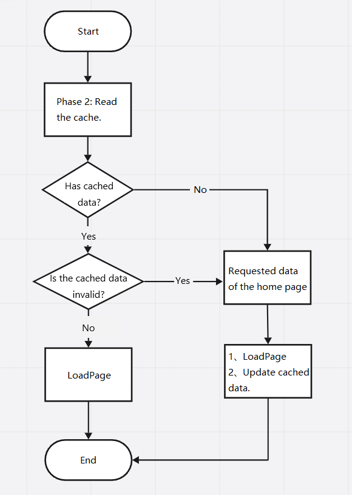

# Accelerating App Cold Start by Caching Home Page Data

### Overview

This sample shows how to accelerate app cold start by caching home page data.

### Preview


### Project Directory

```markdown
├──entry/src/main/ets/
│  ├──common
│  │  ├──constant                  
│  │  └──CommonConstants.ets                  // Common constants
│  │  ├──types  
│  │  │  └──CommonTypes.ets                   // Common types
│  │  └──utils 
│  │     └──Refresh.ets                       // Utility for refreshing
│  ├──entryability
│  │  └──EntryAbility.ets                     // Entry ability
│  ├──model
│  │  └──ListModel.ets                        // Model file
│  ├──pages                 
│  │  └──Index.ets                            // Home page
│  └──view     
│     ├──ListPage.ets                         // List page     
│     ├──NewsItem.ets                         // List items        
│     └──TabBar.ets                           // Tab bar
└──entry/src/main/resources                   // Static resources of the app
```

### How to Use

Use the APIs provided by `@hadss/datacache` to read and write data. The overall cache read process during the app startup is as follows:



### How to Implement

1. Tap an app to access the home screen. 

   The app first obtains the local cache data. If the local cache has no data, the app requests network data. The requested network data will be cached and retained for two days.

2. Tap a tab or swipe left or right on the page. 

   The data of the corresponding news type is displayed.

3. On the news list page, swipe down from the first item. 

   The pull-down refresh is triggered, and the first five pieces of news are updated. 

   Swipe up from the last item.

   The pull-up loading is triggered, and five pieces of news are loaded at the bottom.

4. There are 20 data records on the server. When all data records are loaded, no more data is displayed.

5. Tap **Clear**. 

   The local cache data will be cleared. In the next code startup, data will be obtained through the network.

### Required Permissions

- ohos.permission.INTERNET
- ohos.permission.GET_NETWORK_INFO

### Constraints

1. The sample app is supported only on Huawei phones running the standard system.
2. The HarmonyOS version must be HarmonyOS NEXT Developer Beta5 or later.
3. The DevEco Studio version must be DevEco Studio NEXT Developer Beta5 or later.
4. The HarmonyOS SDK version must be HarmonyOS NEXT Developer Beta5 or later.
