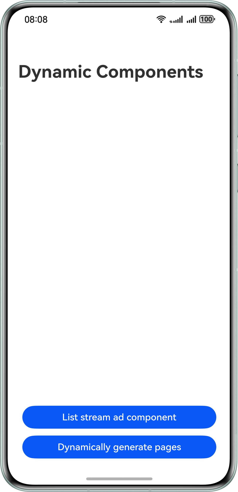

# Dynamic Component Creation

### Overview

This sample shows how to dynamically create a component in the declarative UI.

### Preview
| Home Page                                                    | Ad Closing Popup                                         |
|--------------------------------------------------------------|----------------------------------------------------------|
|  |  |

**How to Use**

1. Open the app. The advertisement (ad) component is dynamically created. There are two types of ads: picture ads and video ads.

### How to Implement

1. Build an ad component. 

   Source code: [AdBuilder.ets](./entry/src/main/ets/components/AdBuilder.ets)

2. Simulate the initialization of a card list from the cloud and generate a common card object and an ad card object based on the cloud data. 

   Source code: **aboutToAppear()** in [MainPage.ets](./entry/src/main/ets/pages/MainPage.ets)

3. In the layout, check whether the node is an ad node. If yes, embed the **NodeContainer** node. When a **NodeContainer** node needs to be rendered, call **getAdNodeController** to obtain the corresponding **NodeController**, and use **makeNode** in **NodeController** to add the component to the view tree.

   Source code: **build()** in [MainPage.ets](./entry/src/main/ets/pages/MainPage.ets)

4. Use **queryAdById(adId)** in **getAdNodeController** to obtain ad information and layout. After obtaining the information, create the corresponding **NodeController** and implement **makeNode()**. Inherited from **NodeController**, **AdNodeController** provides a controller for the ad module. In **initAd**, **this.adNode.build** adds the ad component to **rootNode**.
   When **NodeContainer** is rendered, call **makeNode** of **AdNodeController** to return the constructed **rootNode**. The component is added to the tree. 

   Source code: [AdController.ets](./entry/src/main/ets/components/AdController.ets)

5. When the close button is tapped in the ad component, call **node.remove()** to notify the controller that the ad needs to be removed, and then call **node.rebuild()** to trigger component redrawing. Then, the system executes **makeNode()** again. Return **null** in **makeNode** of **AdNodeController** to remove the component from the tree. As a result, the ad is hidden. 

   Source code: [AdBuilder.ets](./entry/src/main/ets/components/AdBuilder.ets) and [AdController.ets](./entry/src/main/ets/components/AdController.ets)

### Project Directory

   ```
    ├───entry/src/main/ets                             
    │   ├───common
    │   │   └───TypeCasting.ets                          // Type casting
    │   ├───components
    │   │   ├───AdBuilder.ets                            // Builder of the ad component
    │   │   ├───AdController.ets                         // Controller of the ad component
    │   │   └───CardComponent.ets                        // Card component
    │   ├───entryability
    │   │   └───EntryAbility.ets                         // Ability lifecycle callbacks
    │   ├───model
    │   │   ├───AdParams.ets                             // Ad component parameters
    │   │   └───CardData.ets                             // Card parameters
    │   ├───pages
    │   │   ├───Index.ets                                // App entry
    │   │   ├───MainPage.ets                             // Main page
    │   │   ├───TestCode.ets    
    │   │   └───TitleBar.ets                             // Title bar
    │   ├───segment
    │   │   ├───segment.ets     
    │   │   ├───segment2.ets     
    │   │   ├───segment3.ets     
    │   │   ├───segment4.ets     
    │   │   ├───segment5.ets     
    │   │   └───segment6.ets                                                      
    │   └───view
    │       └───ImperativeView.ets                      // Case of dynamically generated pages
    └──entry/src/main/resources                         // Static resources of the app
   ```

### Dependencies

N/A

### Constraints

1. The sample app is supported only on Huawei phones running the standard system.
2. The HarmonyOS version must be HarmonyOS 5.0.5 Release or later.
3. The DevEco Studio version must be DevEco Studio 5.0.5 Release or later.
4. The HarmonyOS SDK version must be HarmonyOS 5.0.5 Release SDK or later.
