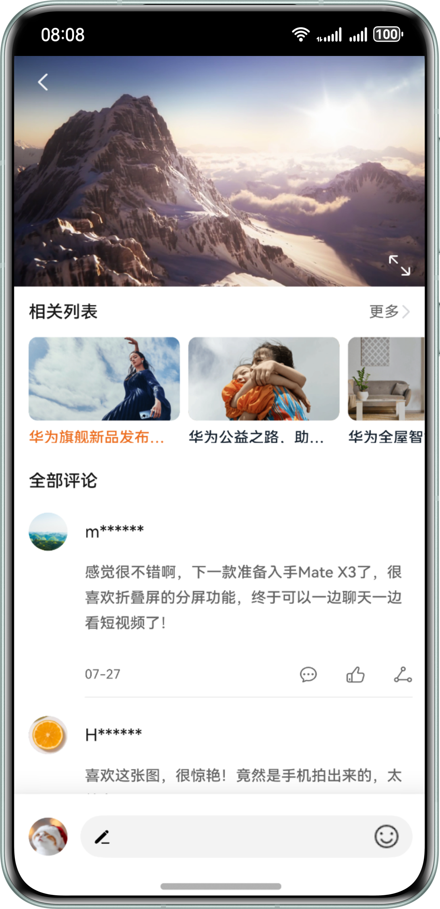

# 实现视频横竖屏切换功能

### 介绍

本示例基于AVPlayer实现了一个视频播放器，并通过调用window对象的setPreferredOrientation()方法，实现了横屏和竖屏之间的切换功能。这样用户可以根据需要轻松调整屏幕方向，获得更佳的观看体验。

### 效果预览

| 竖屏                                                | 横屏                                                  | 
|---------------------------------------------------|-----------------------------------------------------|
|  |  |

使用说明

1.下拉状态栏打开关闭“旋转锁定”开关，打开app进入视频播放详情页，旋转手机到横屏或者点击视频右下角的图标，视频会进行全屏播放。

2.全屏播放时，点击左上角“返回”图标或者将手机由横屏变为竖屏，视频退出全屏播放模式。

3.全屏播放时，点击左边中间的“锁定”图标，视频播放始终处于锁定状态，旋转屏幕视频不会旋转；点击“解锁”图标，如果状态栏中的“旋转锁定”开关是关闭状态，再次旋转屏幕视频会跟随旋转，否则不会旋转

### 目录结构

```
├──entry/src/main/ets/
│  ├──entryability
│  │  └──EntryAbility.ets          // Ability的生命周期回调内容
│  ├──pages
│  │  └──VideoDetail.ets           // 视频详情页
│  ├──util 
│  │  ├──AVPlayerUtil.ets          // 视频播放工具类     
│  │  └──Logger.ets                // 日志工具类
│  │──viewmodel                  
│  │  ├──CommentModel.ets          // 评论模型
│  │  └──RelatedModel.ets          // 相关列表模型
│  └──views                 
│     ├──BottomView.ets            // 底部操作栏组件
│     ├──CommentsView.ets          // 评论列表组件
│     ├──RelatedListView.ets       // 视频相关推荐组件
│     └──VideoPlayView.ets         // 视频播放组件
└──entry/src/main/resources        // 应用静态资源目录
```

### 具体实现

* 视频播放功能封装在AVPlayerUtil.ets，源码参考：[AVPlayerUtil.ets](entry/src/main/ets/utils/AVPlayerUtil.ets);

* 横竖屏源码参考：[VideoPlayView.ets](entry/src/main/ets/views/VideoPlayView.ets);
  横竖屏切换使用了window对象的[setPreferredOrientation](https://developer.huawei.com/consumer/cn/doc/harmonyos-references-V5/js-apis-window-V5#setpreferredorientation9-1)
  方法;

### 相关权限

不涉及

### 依赖

不涉及。

### 约束与限制

1.本示例仅支持标准系统上运行，支持设备：华为手机。

2.HarmonyOS系统：HarmonyOS NEXT Developer Beta5及以上。

3.DevEco Studio版本：DevEco Studio NEXT Developer Beta5及以上。

4.HarmonyOS SDK版本：HarmonyOS NEXT Developer Beta5 SDK及以上。


