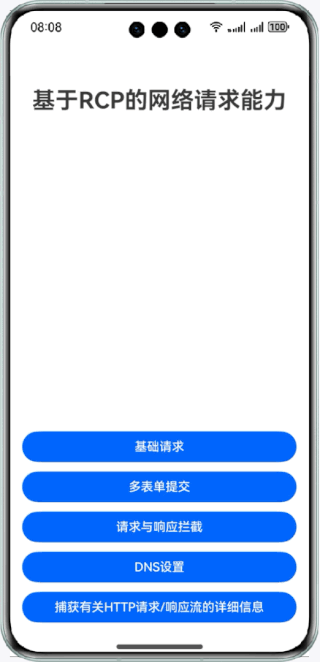

# 基于RCP的网络请求能力
## 介绍
RCP指的是远程通信平台（remote communication platform），RCP提供网络数据请求功能，相较于Network Kit中HTTP请求能力，RCP更具易用性，且拥有更多的功能。例如：
* 支持发送PATCH请求

* 支持设置BaseURL

* 支持取消请求，取消指定或正在进行的会话请求

* 支持自定义证书校验，可以根据自身业务需要，对证书进行校验

* 支持自定义DNS解析

* 支持自定义拦截器实现响应缓存

* 支持在会话中的HTTP请求期间捕获详细的跟踪信息
## 预览效果

## 工程目录
``` 
├──entry/src/main/ets                                   // 代码区
│  ├──common
│  |  ├──CommonConstants.ets                            // 日志工具类
│  |  └──Logger.ets                                     // 常量
│  ├──entryability
│  |  └──EntryAbility.ets                               // 程序入口类
│  ├──entrybackupability
│  |  └──EntryBackupAbility.ets
│  ├──pages
│  |  ├──BaseRequest.ets                                // 基础网络请求
│  |  ├──DNSSetting.ets                                 // DNS相关设置
│  |  ├──Index.ets                                      // 首页
│  |  ├──MultipartForm.ets                              // 多表单提交
│  |  ├──RequestAndResponse.ets                         // 请求与响应拦截示例
│  |  └──TracingPoint.ets                               // 捕获有关HTTP请求/响应流的详细信息
|  └──utils.ets                            
│     └──Interceptors.ets                               // 请求与响应拦截
└──entry/src/main/resources                             // 应用资源目录
``` 
## 相关权限
应用需要访问互联网，需要使用网络权限。

`ohos.permission.INTERNET`
## 约束与限制
* 本示例仅支持标准系统上运行，支持设备：华为手机。

* HarmonyOS系统：HarmonyOS 5.0.5 Release及以上。

* DevEco Studio版本：DevEco Studio 5.0.5 Release及以上。
  
* HarmonyOS SDK版本：HarmonyOS 5.0.5 Release SDK及以上。