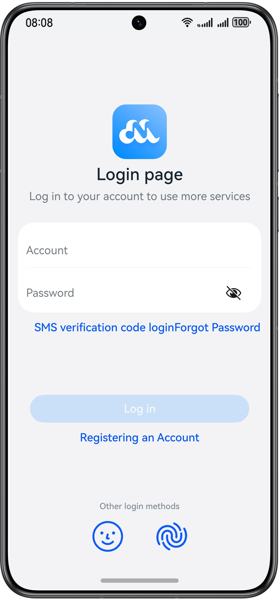

# User Authentication

## Overview

This sample shows how to perform facial authentication and fingerprint authentication, use the password vault for automatic password filling, and prevent screen capture or recording in the app UIs involving password input.


## Preview
| **Home Page**                                             |
|-----------------------------------------------------------|
|  |

## Project Directory
```
├──entry/src/main/ets 
│  ├──common/constant    
│  │  └──CommonConstants.ets                   // Common constants
│  ├──common/utils                             
│  │  ├──Logger.ets                            // Logging utility 
│  │  └──PromptUtil.ets                        // Utility for prompts 
│  ├──entryability
│  │  └──EntryAbility.ets                      // Entry ability
│  ├──entrybackupability
│  │  └──EntryBackupAbility.ets                // Entry ability that provides backup and restore capabilities for the app
│  ├──pages
│  │  ├──LoginPage.ets                         // Login page  
│  │  └──MainPage.ets                          // Main page
│  ├──model
│  │  ├──HuksModel.ets                         // Encryption/Decryption model file 
│  │  ├──ItemDataModel.ets                     // Data model file
│  │  ├──PreferenceModel.ets                   // Data storage model file  
│  │  └──userAuthModel.ets                     // User authentication model file
│  ├──view
│  │  ├──Home.ets                              // Home page
│  │  ├──RegisterPage.ets                      // Registration page  
│  │  └──Setting.ets                           // Setting page
│  └──viewmodel
│     └──MainViewModel.ets                     // Main view model
└──entry/src/main/resources                    // App resources
```

## How to Use

1. Facial recognition and fingerprint recognition icons are not displayed on the initial login page.

2. Enable facial recognition and fingerprint recognition in registration. The facial recognition and fingerprint recognition icons are displayed on the login page (not supported by the Emulator).

3. Take a screenshot on the login page (not supported by the Emulator). Screen capture or recording is not allowed.


## Required Permissions

Ensure that these permissions are added in the **module.json5** file.

- **ohos.permission.PRIVACY_WINDOW**: allows an app to set screens that cannot be captured or recorded.

- **ohos.permission.ACCESS_BIOMETRIC**: allows an app to use biometric recognition for identity authentication.

## Constraints

1. The sample app is supported only on Huawei phones running the standard system.

2. The HarmonyOS version must be HarmonyOS 5.0.4 Release or later.

3. The DevEco Studio version must be DevEco Studio 5.0.4 Release or later.

4. The HarmonyOS SDK version must be HarmonyOS 5.0.4 Release SDK or later.
