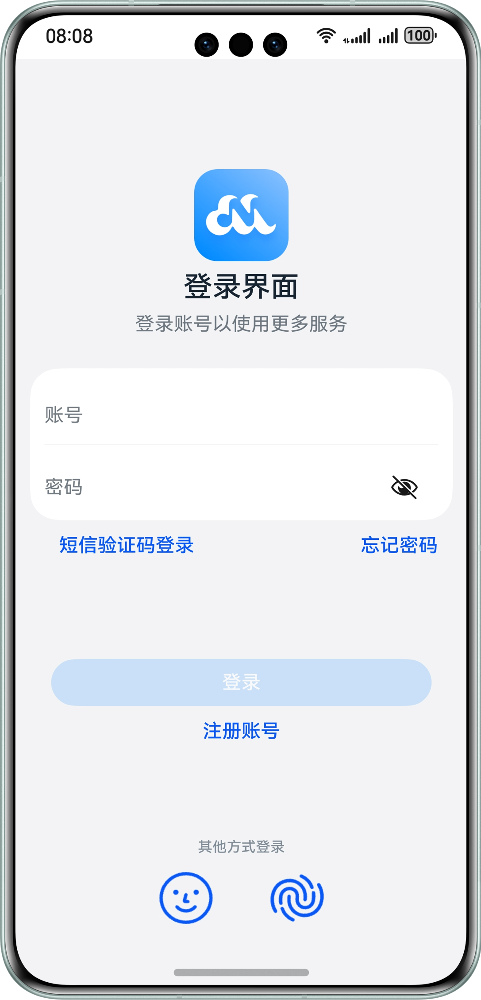

# 用户认证登录

## 介绍

本示例主要使用人脸和指纹认证用户身份、使用密码保险箱实现密码自动填充以及涉及口令输入的应用界面防截屏或录屏等功能的实现方式。


## 效果预览
| **主页**                                    |
|-------------------------------------------|
|  |

## 工程目录
```
├──entry/src/main/ets 
│  ├──common/constant    
│  │  └──CommonConstants.ets                   // 公共常量类 
│  ├──common/utils                             
│  │  ├──Logger.ets                            // 日志工具类 
│  │  └──PromptUtil.ets                        // 消息工具类 
│  ├──entryability
│  │  └──EntryAbility.ets                      // 程序入口类 
│  ├──entrybackupability
│  │  └──EntryBackupAbility.ets                // 程序出口类
│  ├──pages
│  │  ├──LoginPage.ets                         // 登录页面  
│  │  └──MainPage.ets                          // 首页页面
│  ├──model
│  │  ├──HuksModel.ets                         // 加解密模型文件  
│  │  ├──ItemDataModel.ets                     // 数据模型文件
│  │  ├──PreferenceModel.ets                   // 数据储存模型文件  
│  │  └──userAuthModel.ets                     // 用户认证模型文件
│  ├──view
│  │  ├──Home.ets                              // 首页页面
│  │  ├──RegisterPage.ets                      // 注册页面  
│  │  └──Setting.ets                           // 设置页面
│  └──viewmodel
│     └──MainViewModel.ets                     // 图片模型
└──entry/src/main/resources                    // 应用资源目录
```

## 使用说明

1. 初次登录界面没有人脸识别和指纹识别登录；

2. 注册时选择人脸识别和指纹识别按钮，再次返回登录界面就会提供人脸识别和指纹识别登录(模拟器不支持)；

3. 登录界面防截屏功能(模拟器不支持)；


## 相关权限

该sample应用在调用接口时需要

1. 允许应用将窗口设置为隐私窗口，禁止截屏录屏的权限，"ohos.permission.PRIVACY_WINDOW".

2. 允许应用使用生物特征识别能力进行身份认证的权限，"ohos.permission.ACCESS_BIOMETRIC".

已在module.json5文件中添加。

## 约束与限制

1. 本示例仅支持标准系统上运行，支持设备：华为手机。
2. HarmonyOS系统：HarmonyOS Next Developer Beta3及以上。
3. DevEco Studio版本：DevEco Studio Next Developer Beta3及以上。
4. HarmonyOS SDK版本：HarmonyOS Next  Developer Beta3及以上。