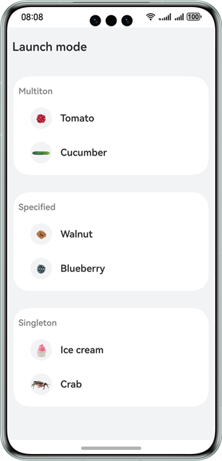
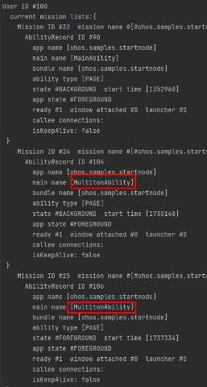
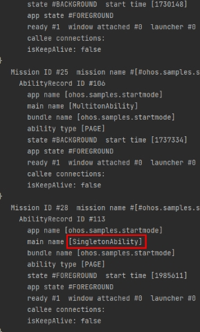
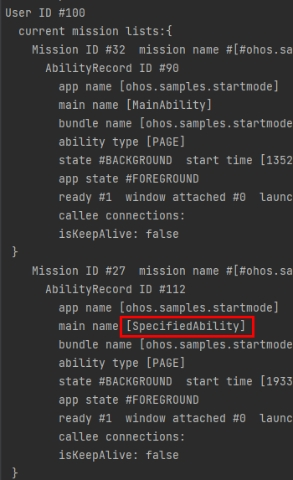

# UIAbility Launch Mode

### Overview

This sample demonstrates the implementation of the multiton, singleton, and specified ability launch modes in the stage model.

This sample is created by referring to the development guide.

In this sample, you need to use the Ability Assistant (AA) tool to view the ability launch mode. Specifically, you need to run **aa dump -a** command after the **hdc shell** is executed.

### Preview

| Home page                                | Multiton launch mode                                                |Singleton launch mode|Specified launch mode|
|------------------------------------------|----------------------------------------------------------------|--------------------------------|--------------------------------|
|  | |||

### How to Use

1. Multiton launch mode:

   (1) On the home page, touch the tomato icon. A tomato ability is created, and the tomato details are displayed.

   (2) On the tomato details page, touch the cucumber icon. A cucumber ability is created, and the cucumber details are displayed.

   (3) Use the AA tool to view the ability information. The following abilities are displayed: one tomato ability, one cucumber ability, and one home page ability.

2. Singleton launch mode:

   (1) On the home page, touch the ice cream icon. An ice cream ability is created, and the ice cream details are displayed.

   (2) On the ice cream details page, touch the crab icon. The ice cream ability is reused, and the data on the page is refreshed to show the crab details.

   (3) Use the AA tool to view the ability information. The following abilities are displayed: one ice cream ability and one home page ability.

3. Specified launch mode:

   (1) On the home page, touch the walnut icon. A walnut ability is created, and the walnut details are displayed.

   (2) On the walnut details page, touch the blueberry icon. A blueberry ability is created, and the blueberry details are displayed.

   (3) On the blueberry details page, touch the walnut icon. The walnut ability is reused, and the data on the page is refreshed to show the walnut details.

   (4) Use the AA tool to view the ability information. The following abilities are displayed: one walnut ability, one blueberry ability, and one home page ability.

### Project Directory
```
├──entry/src/main/ets/
│  ├──application
│  │  └──MyAbilityStage.ets 
│  ├──common
│  │  ├──Constants.ets                    // Constants
│  │  ├──Logger.ts                        // Log utility
│  │  └──Util.ets                         // Encapsulated common functions
│  ├──entryability
│  │  └──MainAbility.ets 
│  ├──model
│  │  ├──DataModels.ets                   // Encapsulated data type
│  │  ├──DataUtil.ets                     // Encapsulated data processing functions
│  │  └──MokeData.ets                     // Simulation data
│  ├──multitonability                  
│  │  └──MultitonAbility.ets              // Ability in multiton mode
│  ├──pages
│  │  ├──component
│  │  │  └──FoodListItem.ets              // Food list component
│  │  ├──FoodDetail.ets                   // Food details page
│  │  └──Home.ets                         // Home page
│  ├──singletonability                  
│  │  └──SingletonAbility.ets             // Ability in singleton mode
│  └──specifiedability                  
│     └──SpecifiedAbility.ets             // Ability in specified mode
└──entry/src/main/resources              // Static resources
```
### How to Implement

In this sample, the methods for starting the multiton, singleton, and specified modes are encapsulated in **Util**. For details about the source code, see [Util.ets](entry/src/main/ets/common/Util.ets).
* Creating an ability: Create three abilities in multiton, singleton, and specified modes, respectively, for example, SingletonAbility, SpecifiedAbility, and MultitonAbility in the project directory. Change **launchType** to the corresponding launch mode in the **module.json** file.
* Starting a specified ability: Use the **startMode** method in the **Util** class to start the corresponding ability based on **abilityName** passed by the page and display the details page.
* Implementation of the specified launch mode: In specified mode, an ability identifier is returned through the **onAcceptWant** function in **MyAbilityStage**. If an ability with the same identifier has already been started, no new instance is created and that ability is brought back to the top of the stack. If an ability with the same identifier has not been started, a new instance is created and started.

### Required Permissions

N/A

### Dependencies

N/A

### Constraints

1. The sample app is supported only on Huawei phones running the standard system.

2. The HarmonyOS version must be HarmonyOS NEXT Developer Beta1 or later.

3. The DevEco Studio version must be DevEco Studio NEXT Developer Beta1 or later.

4. The HarmonyOS SDK version must be HarmonyOS NEXT Developer Beta1 or later.
