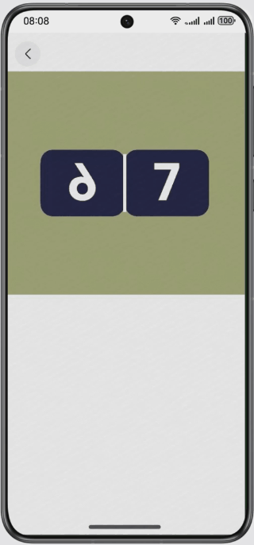
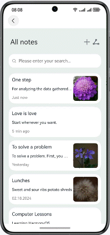
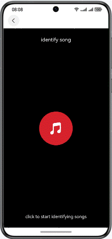
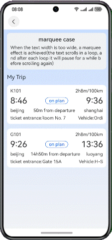
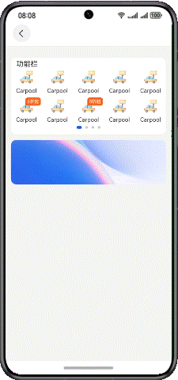
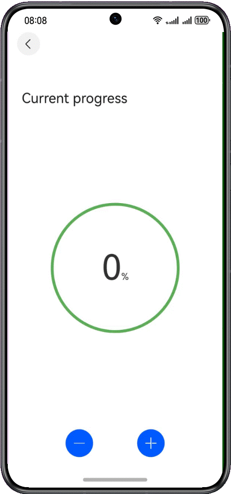
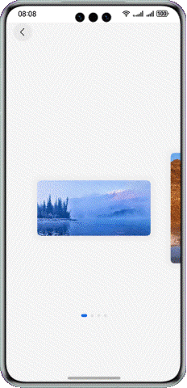
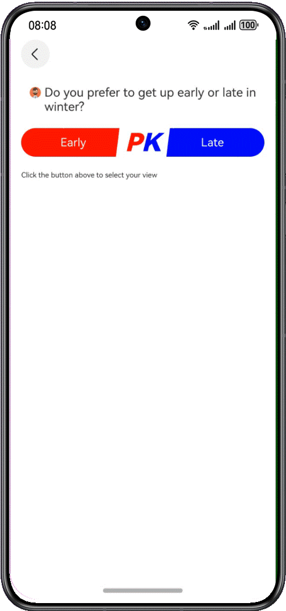
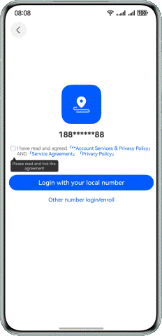
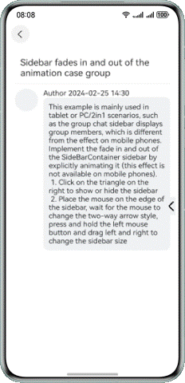

# Animation Collection

### Overview

This sample demonstrates typical animation effects that are implemented based on basic components, universal attributes, and explicit animations.

### Preview


| Flip effect                                                | Title pull-down effect                                   | Status bar visibility switch effect                      | Ripple effect                                    |
|------------------------------------------------------------|----------------------------------------------------------|----------------------------------------------------------|-------------------------------------------|
|       |                  |  |     |
| Slide to specified list effect                             | Marquee effect                                           | Swiper height change effect                              | Custom progress animation                                  |
|    |               |  |  |
| Number scrolling effect                                    | Card preview effect                                      | Vote effect                                              | Voice recording effect                                   |
|  |  |  |  |
| Vibration effect                                           | Sidebar fade in/out animation                            |
|           |               |

### Project Directory

```
├──entry/src/main/ets/
│  ├──common                         // Constants
│  ├──entryability                   // Application Entry
│  ├──feature
│  │  ├──digitalscrollanimation      // Digital Scroll Animation
│  │  ├──pageCardsSwiper             // Swiper Image Preview
│  │  ├──pageExpandTitle             // Title Drop-down Animation
│  │  ├──pagelistslidetohistory      // List Slide Animation
│  │  ├──pageMarqueeView             // Marquee
│  │  ├──pagePaintComponent          // Custom Progress
│  │  ├──pageStatusBarChange         // Status Bar Visibility Toggle
│  │  ├──pageturninganimation        // Page Turning Animation
│  │  ├──pageVibrateEffect           // Vibration Effect
│  │  ├──pageWaterRipples            // Music Recognition Water Ripple Effect
│  │  ├──searchComponent             // Search Function
│  │  ├──sidebarAnimation            // Sidebar Fade In/Out Animation
│  │  ├──swiperComponent             // Multi-layer Carousel
│  │  ├──swipersmoothvariation       // Swiper Height Variation Effect
│  │  ├──voiceRecordDynamicEffect    // Voice Recording and Sound Effect
│  │  └──votingcomponent             // Voting Animation
│  ├──pages                          // Home Page
│  └──viewmodel                      // Data Class Directory
└──entry/src/main/resources          // Application Static Resources Directory
```

### How to Use

1. Touch the search box to go to the search page.
2. Fuzzy search is supported. You can touch a search result or the touch history to go to the related functional page.
3. Swipe to the left or right to rotate the carousel images on the home page. You can touch an image to go to the related functional page.
4. Slide the **List** component, and touch a title to go to the related functional page.

### How to Implement

1. Use the **Navigation** component to implement the navigation feature.
2. Use the **List** component and routing redirection to arrange the titles of multiple functional modules and switch between functional pages.

### Required Permissions

- ohos.permission.VIBRATE: Allows an application to control vibration.
- ohos.permission.MICROPHONE: Allows an application to access the microphone.

### Constraints

1. The sample app is supported only on Huawei phones running the standard system.

2. The HarmonyOS version must be HarmonyOS 5.0.5 Release or later.

3. The DevEco Studio version must be DevEco Studio 5.0.5 Release or later.

4. The HarmonyOS SDK version must be HarmonyOS 5.0.5 Release SDK or later.
