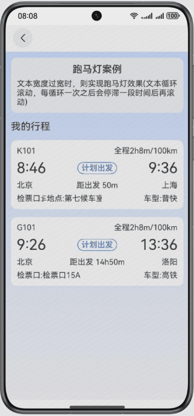
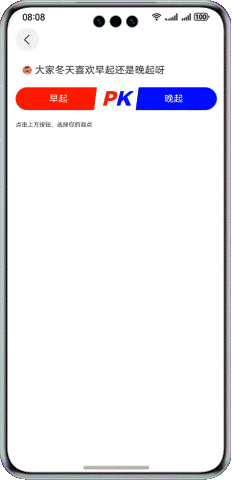

# 动效案例合集

### 介绍

本示例基于基础组件、通用属性、显式动效，实现多种常见动效案例。

### 效果预览

| 翻转动效                                    | 标题下拉缩放                                   | 状态栏显隐切换                                 | 水波纹动效                                     |
|-----------------------------------------|------------------------------------------|-----------------------------------------|-------------------------------------------|
|    |     |    |     |
| 滑动到指定列表                                 | 跑马灯                                      | swiper高度变化效果                            | 自定义进度动画                                   |
|    |  |  |  |
| 数字滚动动效                                  | 卡片预览效果                                   | 投票动效                                    | 语音录制动效                                    |
|  |  |    |     |

**使用说明**

1. 点击搜索框，跳转搜索页面
2. 搜索功能支持模糊查询，可点击搜索结果跳转相关功能页，也可点击搜索历史跳转相关功能页
3. 首页轮播图可手动左右滑动，点击图片跳转相关功能页
4. 滑动List组件，点击标题可跳转相应的功能页

### 具体实现

1. 通过Navigation组件实现导航功能
2. 通过List组件和路由跳转功能实现多个功能模块的标题排列及功能页面跳转。

### 相关权限

不涉及

### 约束与限制

1. 本示例仅支持标准系统上运行，支持设备：华为手机。

2. HarmonyOS系统：HarmonyOS NEXT Developer Beta1及以上。

3. DevEco Studio版本：DevEco Studio NEXT Developer Beta1及以上。

4. HarmonyOS SDK版本：HarmonyOS NEXT Developer Beta1 SDK及以上。