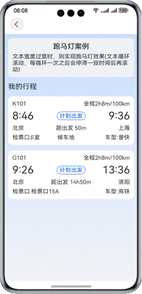
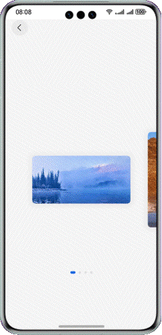

# 实现动效功能合集

### 介绍

本示例基于基础组件、通用属性、显式动效，实现多种常见动效案例，便于用户进行常见的动效场景开发。

### 效果预览


| 翻转动效                                           | 标题下拉缩放                                   | 状态栏显隐切换                                 | 水波纹动效                                                |
|------------------------------------------------|------------------------------------------|-----------------------------------------|------------------------------------------------------|
|           |     |    |                |
| 滑动到指定列表                                        | 跑马灯                                      | swiper高度变化效果                            | 自定义进度动画                                              |
|           |  |  |             |
| 数字滚动动效                                         | 卡片预览效果                                   | 投票动效                                    | 语音录制动效                                               |
|         |  |    |  |
| 弹簧曲线实现抖动效果                                     | 侧边栏淡入淡出动效                                |
|  |  |

### 工程目录
```
├──entry/src/main/ets/
│  ├──common                            // 常量
│  ├──entryability                      // 程序入口
│  ├──feature
│  │  ├──digitalscrollanimation         // 数字滚动动效
│  │  ├──pageCardsSwiper                // Swiper图片预览
│  │  ├──pageExpandTitle                // 标题下拉动效
│  │  ├──pagelistslidetohistory         // 列表滑动动效
│  │  ├──pageMarqueeView                // 跑马灯
│  │  ├──pagePaintComponent             // 自定义进度
│  │  ├──pageStatusBarChange            // 状态栏显隐切换
│  │  ├──pageturninganimation           // 翻页动效
│  │  ├──pageVibrateEffect              // 抖动动效
│  │  ├──pageWaterRipples               // 听歌识曲水波纹动效
│  │  ├──searchComponent                // 搜索功能
│  │  ├──sidebarAnimation               // 侧边栏淡入淡出动效
│  │  ├──swiperComponent                // 多层级轮播图
│  │  ├──swipersmoothvariation          // Swiper高度可变化效果
│  │  ├──voiceRecordDynamicEffect       // 语音录制和声音动效
│  │  └──votingcomponent                // 投票动效
│  ├──pages                             // 首页 
│  └──viewmodel                         // 数据类目录
└──entry/src/main/resources             // 应用静态资源目录
```

### 使用说明

1. 点击搜索框，跳转搜索页面
2. 搜索功能支持模糊查询，可点击搜索结果跳转相关功能页，也可点击搜索历史跳转相关功能页
3. 首页轮播图可手动左右滑动，点击图片跳转相关功能页
4. 滑动List组件，点击标题可跳转相应的功能页

### 具体实现

1. 通过Navigation组件实现导航功能
2. 通过List组件和路由跳转功能实现多个功能模块的标题排列及功能页面跳转。

### 相关权限

- ohos.permission.VIBRATE：允许应用控制马达振动。
- ohos.permission.MICROPHONE：允许应用使用麦克风。

### 约束与限制

1. 本示例仅支持标准系统上运行，支持设备：华为手机。

2. HarmonyOS系统：HarmonyOS 5.0.5 Release及以上。

3. DevEco Studio版本：DevEco Studio 5.0.5 Release及以上。

4. HarmonyOS SDK版本：HarmonyOS 5.0.5 Release SDK及以上。