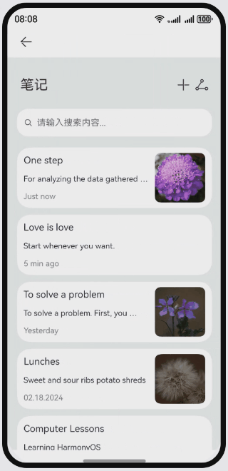

# 标题下拉缩放

### 介绍
本示例介绍如何实现标题展开时继续下拉的动效。

### 效果预览：

**使用说明**

1. 进入页面，起初标题并没有展开，与增加/分享的菜单在同一行；
2. 进行第一次下拉操作，此时标题展开至目标位置，并显示笔记数目信息，与菜单不在同一行；
3. 继续下拉，达到阈值距离后，标题与菜单都下拉一段距离，并放大；松手后回弹至第一次下拉后的状态；
4. 向上滑动，标题折叠，回到初始时的状态。

### 相关权限

不涉及。

### 约束与限制

1. 本示例仅支持标准系统上运行，支持设备：华为手机。

2. HarmonyOS系统：HarmonyOS 5.0.5 Release及以上。

3. DevEco Studio版本：DevEco Studio 5.0.5 Release及以上。

4. HarmonyOS SDK版本：HarmonyOS 5.0.5 Release SDK及以上。