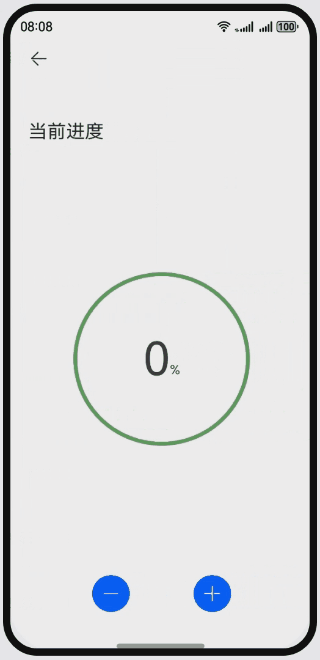

# 使用绘制组件实现自定义进度动画

### 介绍

本示例介绍使用绘制组件中的Circle组件以及Path组件实现实时进度效果。该场景多用于手机电池电量、汽车油量、水位变化等动态变化中。

### 效果预览图

**使用说明**

1. 加载完成后初始显示进度为0%，且有“+”、“-”两个按钮；
2. 点击“+”按钮，进度会持续增长，直到100%时绿色填充满整个圆形；
3. 点击“-”按钮，进度会持续下降，直到0%，恢复1中的初始效果。

### 具体实现

1. 使用Circle组件绘制外层的圆环。
2. 绘制中间的进度的填充。中间的填充有两个状态：1、在进度100%时是填充颜色的圆形；2、在进度不足100%时，使用Path组件绘制闭合曲线实现。
3. 计算封闭曲线。水位线的端点的纵坐标y与进度k的关系为：y=(1-k)*2r，而圆心坐标为(r,r)，以此确定水位线的坐标，然后拼接成绘制封闭曲线的commands。
4. 绘制最上层的百分比显示。

### 相关权限

不涉及。

### 约束与限制

1. 本示例仅支持标准系统上运行，支持设备：华为手机。

2. HarmonyOS系统：HarmonyOS 5.0.5 Release及以上。

3. DevEco Studio版本：DevEco Studio 5.0.5 Release及以上。

4. HarmonyOS SDK版本：HarmonyOS 5.0.5 Release SDK及以上。