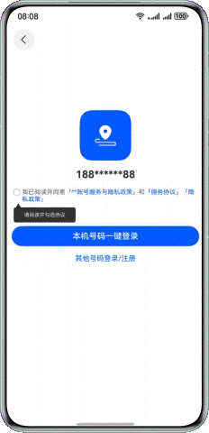

# 使用弹簧曲线实现抖动动画及手机振动效果

### 介绍

本示例介绍使用vibrator.startVibration方法实现手机振动效果，用keyframeAnimateTo关键帧动画实现点击后的抖动动画。

### 效果图预览

**使用说明**

1. 加载完成后显示登录界面，未勾选协议时点击一键登录按钮会触发手机振动效果和提示文本的抖动动画。

### 具体实现

1. 要实现存在两个连续的涟漪，需要两个层叠的Stack分别以一定延迟进行相同的动画；
2. 通过点击按钮来判断isListening变量的改变，如果为true则添加动画。涟漪动画实际上的效果为透明度0.8->0，半径扩大到6倍的动画，持续时间无限；
3. 如果isListening为false，则用持续时间为0的动画来打断持续时间无限的动画。

### 相关权限

马达振动权限：ohos.permission.VIBRATE。

### 约束与限制

1. 本示例仅支持标准系统上运行，支持设备：华为手机。

2. HarmonyOS系统：HarmonyOS NEXT Developer Beta1及以上。

3. DevEco Studio版本：DevEco Studio NEXT Developer Beta1及以上。

4. HarmonyOS SDK版本：HarmonyOS NEXT Developer Beta1 SDK及以上。