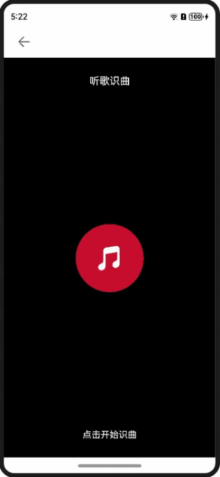

# 听歌识曲水波纹动效案例

### 介绍

本示例基于显示动画接口animateTo实现水波纹的特效。

### 效果预览

**使用说明**

1. 进入页面，点击按钮，触发水波纹动画。 
2. 再次点击按钮，停止水波纹动画。

### 具体实现

1. 要实现存在两个连续的涟漪，需要两个层叠的Stack分别以一定延迟进行相同的动画。
2. 通过点击按钮来判断isListening变量的改变，如果为true则添加动画。涟漪动画实际上的效果为透明度0.8->0，半径扩大到6倍的动画，持续时间无限。
3. 如果isListening为false，则用持续时间为0的动画来打断持续时间无限的动画。

### 相关权限

不涉及

### 约束与限制

1. 本示例仅支持标准系统上运行，支持设备：华为手机。

2. HarmonyOS系统：HarmonyOS 5.0.5 Release及以上。

3. DevEco Studio版本：DevEco Studio 5.0.5 Release及以上。

4. HarmonyOS SDK版本：HarmonyOS 5.0.5 Release SDK及以上。