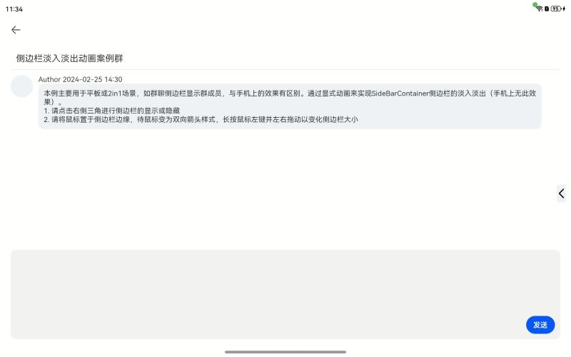

# SideBarContainer侧边栏淡入淡出动效实现案例

### 介绍

在PC/2in1或平板上，群聊侧边栏是一种较为常用的功能，虽然HarmonyOS已经具备了基本的动效，但是部分情况下开发者可能有定制侧边栏动效的需求，本例主要介绍了如何基于显式动画实现侧边栏的淡入淡出动效。

### 效果预览

**使用说明**

1. 点击右侧三角按钮进行侧边栏的显示与隐藏
2. 当前动效过渡时间较短，如果要更清晰地观察动画效果，可以将动效的持续时间“SIDEBAR_ANIMATION_DURATION”更改长一点，如1000
3. 注意，由于手机屏幕边缘较难响应事件，请用PC/2in1或平板进行测试

### 具体实现

1. 由于SideBarContainer的controlButton无法实现对其动效的自定义，所以需要禁用默认的button，通过自定义的Button来控制SideBar的显隐，并为SideBar添加了透明度的变化动效
2. 通过显式动画控制侧边栏的显隐，以便实现自定义动效

### 相关权限

不涉及

### 约束与限制

1. 本示例仅支持标准系统上运行，支持设备：华为手机。

2. HarmonyOS系统：HarmonyOS NEXT Developer Beta1及以上。

3. DevEco Studio版本：DevEco Studio NEXT Developer Beta1及以上。

4. HarmonyOS SDK版本：HarmonyOS NEXT Developer Beta1 SDK及以上。