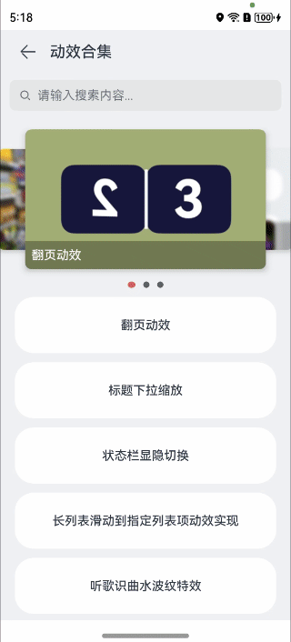

# 多层级轮播图方案

### 介绍

本示例介绍使用ArkUI的stack 组件实现多层级轮播图。该场景多用于购物、资讯类应用。

### 效果预览

**使用说明**

1. 显示轮播图，可自动滑动
2. 可以手动左右滑动
3. 点击图片跳转对应功能页面

### 具体实现

1. 通过Stack组件堆叠图片，实现多层级效果，配合手势滑动和显式动画实现切换的动画效果。
2. 通过改变数据中间值currentIndex来改变组件zIndex层级和高度来实现切换的效果。

### 相关权限

不涉及

### 约束与限制

1. 本示例仅支持标准系统上运行，支持设备：华为手机。

2. HarmonyOS系统：HarmonyOS NEXT Developer Beta1及以上。

3. DevEco Studio版本：DevEco Studio NEXT Developer Beta1及以上。

4. HarmonyOS SDK版本：HarmonyOS NEXT Developer Beta1 SDK及以上。