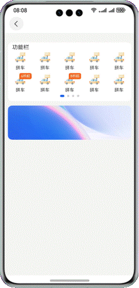

# Swiper高度可变化效果实现

### 介绍

本示例基于Swiper组件，实现高度可变化的效果。

### 效果图预览

##### 使用说明

滑动Swiper组件，Swiper组件高度变化，下方页面随着Swiper的变化而平滑的变化。

### 具体实现

1. 生成四个Swiper页面，来进行左右滑动，GridBuilderFunction是生成Swiper的page。

2. Swiper组件跟手滑动过程中，逐帧触发onGestureSwipe回调，通过左右滑动的距离来计算对应的上下位置的变化，swiperDistance发生变化。

3. Swiper组件切换动画开始时触发onAnimationStart回调,用来达到平滑变化的效果。

### 相关权限

不涉及

### 约束与限制

1. 本示例仅支持标准系统上运行，支持设备：华为手机。

2. HarmonyOS系统：HarmonyOS 5.0.5 Release及以上。

3. DevEco Studio版本：DevEco Studio 5.0.5 Release及以上。

4. HarmonyOS SDK版本：HarmonyOS 5.0.5 Release SDK及以上。