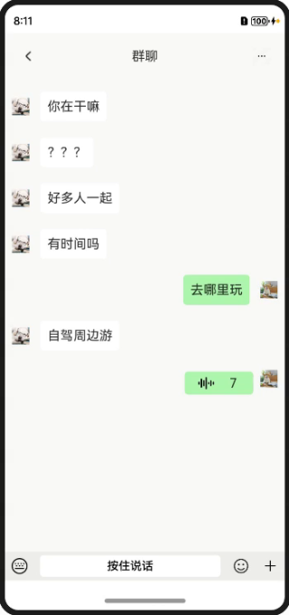

# 语音录制和声音动效实现

### 介绍

本示例使用AVRecord录制音频和AVRecord的getAudioCaptureMaxAmplitude接口获取振幅实现UI动效，并使用AVPlayer播放音频。

### 效果图预览

|                           获取权限                            |                            录制                             |                               主页                                |
|:---------------------------------------------------------:|:---------------------------------------------------------:|:---------------------------------------------------------------:|
|  |  |  |

**使用说明**

1. 获取麦克风权限。
2. 按住“按住说话”按钮开始录音，松开发送录音，上划取消录制。
3. 录制完成后点击消息框可播放录音。

### 实现思路

1. 利用组合手势来实现音频录制与取消录制。
2. 在音频录制的时候通过getAudioCaptureMaxAmplitude获取声音振幅使UI变化。
3. 使用AVPlayer播放已录制的音频。

### 相关权限

麦克风权限：ohos.permission.MICROPHONE

### 约束与限制

1. 本示例仅支持标准系统上运行，支持设备：华为手机。

2. HarmonyOS系统：HarmonyOS NEXT Developer Beta1及以上。

3. DevEco Studio版本：DevEco Studio NEXT Developer Beta1及以上。

4. HarmonyOS SDK版本：HarmonyOS NEXT Developer Beta1 SDK及以上。