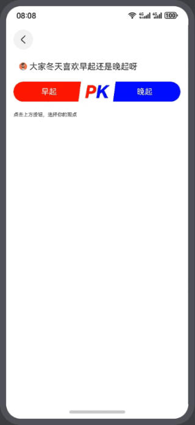

# 投票动效实现案例

### 介绍

本示例介绍使用绘制组件中的Polygon组件配合使用显式动画实现投票pk组件。

### 效果预览图

**使用说明**

1. 加载完成后会有一个胶囊块被切割成两个等大的图形来作为投票的两个选项，中间由PK两字分隔开。
2. 点击左边选项，两个图形会随着选择人数的比例同步变化，且有变化的动画效果，PK两字消失，图形间间隙变小，选项颜色变淡，分别在两个图形上显示选择对应选项的人数比例，下方提示文字也会同步改成已选择的选项，且显示总参与投票人数。

### 具体实现

使用显式动画animateTo及组件宽度属性实现投票动效。

### 相关权限

不涉及

### 约束与限制

1. 本示例仅支持标准系统上运行，支持设备：华为手机。

2. HarmonyOS系统：HarmonyOS 5.0.5 Release及以上。

3. DevEco Studio版本：DevEco Studio 5.0.5 Release及以上。

4. HarmonyOS SDK版本：HarmonyOS 5.0.5 Release SDK及以上。