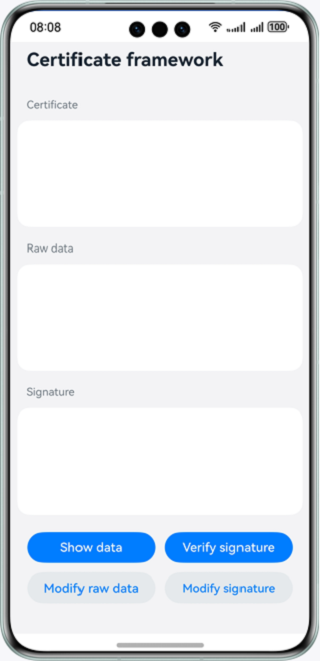

# Certificate Framework

### Overview

This sample shows how to use the APIs provided by the @ohos.security.cert module to verify signature data.

The scenarios are as follows:

Use correct raw data and signature data for signature verification: The server obtains the public key from the client certificate and uses the public key to verify the signature data.

Use incorrect raw data or signature data for signature verification: The raw data or signature data has been modified by an attacker. When the server verifies the signature using the public key, the verification fails.

### Preview

|   Home page   |                   Verification successful                  |             Verification failed            |
|:-------:|:------------------------------------------:|:---------------------------------------:|
|  |  |  |

### How to Use

1. Tap **Show data**. The correct certificate, raw data, and signature data are displayed.

2. Tap **Verify signature**. "Verification successful" is displayed.

3. Tap **Modify raw data**. The modified raw data and correct certificate and signature data are displayed. Tap **Verify signature**. "Verification failed" is displayed.

4. Tap **Modify signature**. The modified signature data and correct certificate and raw data are displayed. Tap **Verify signature**. "Verification failed" is displayed.

5. Click **Show data**. The correct certificate, raw data, and signature data are displayed. Tap **Verify signature**. "Verification successful" is displayed.

### Project Directory

```
├──entry/src/main/ets                                 // Code area
│  ├──entryability
│  │  └──EntryAbility.ets       
│  ├──model
│  │  ├──CertFrameworkModel.ets                        // Model file of the certificate framework
│  │  └──Logger.ets                                    // Log file
│  └──pages
│     └──Index.ets                                     // Main page
└──entry/src/main/resources                             // App resources
```

### How to Implement

* **CertFrameworkModel** provides the **Verify()** API, which is used to verify a signature using the public key.
    * Obtain the certificate public key: Call **cert.createX509Cert** to create a **certObject** instance, and call **getPublicKey** of the **certObject** object to obtain the public key **pubKey**. Call **cryptoFramework.createAsyKeyGenerator** to create a key generator and call **convertKey** of the key generator to convert the public key **pubKey** to the correct format.
    * Use the public key to verify the signature: Call **cryptoFramework.createVerify** to create a signature verification object **verifier**, call **verifier.init** to initialize the **verifier** with the public key, and call **Verify()** to verify the signature.

### Required Permissions

N/A

### Dependencies

* @ohos.security.cryptoFramework

### Constraints

1. The sample is only supported on Huawei phones with standard systems.

2. The HarmonyOS version must be HarmonyOS 5.0.4 Release or later.

3. The DevEco Studio version must be DevEco Studio 5.0.4 Release or later.

4. The HarmonyOS SDK version must be HarmonyOS 5.0.4 Release SDK or later.
