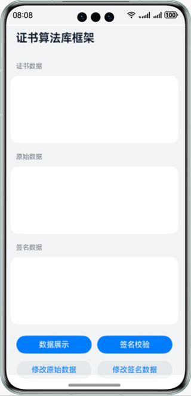
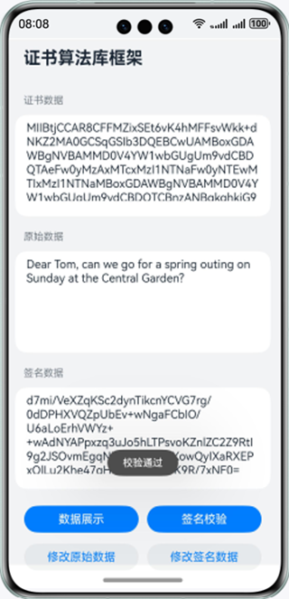
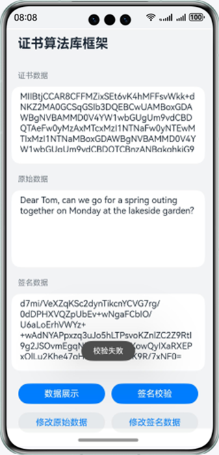

# 基于证书算法库接口实现签名数据校验

### 介绍

本示例使用证书算法库接口校验签名数据。场景包括：正确数据校验，服务端验证客户端证书和原始数据；错误数据校验，模拟攻击者篡改数据，服务端验证失败。确保数据完整性和身份可信，攻击者身份不可信或数据不完整则验证不通过。

### 效果预览

|   主页    |                   校验通过                   |             校验失败             |
|:-------:|:------------------------------------------:|:---------------------------------------:|
|  |  |  |

使用说明

1、点击**数据展示**按钮，页面文本框中分别显示正确的证书、原始和签名数据内容。

2、点击**签名校验**按钮，页面弹出弹窗，提示**校验通过**。

3、点击**修改原始数据**按钮，页面显示修改后的原始数据和正确的证书、签名数据；点击签名校验按钮，页面弹出弹窗，提示**校验失败**。

4、点击**修改签名数据**按钮，页面显示修改后的签名数据和正确的证书、原始数据；点击签名校验按钮，页面弹出弹窗，提示**校验失败**。

5、点击**数据展示**按钮，页面恢复正确证书、原始和签名数据的展示；点击**签名校验**按钮，页面弹出弹窗，提示**校验通过**。

### 工程目录

```
├──entry/src/main/ets                                  // 代码区
│  ├──entryability
│  │  └──EntryAbility.ets       
│  ├──model
│  │  ├──CertFrameworkModel.ets                        // 证书算法库框架模型文件
│  │  └──Logger.ets                                    // 日志文件
│  └──pages
│     └──Index.ets                                     // 主界面
└──entry/src/main/resources                            // 应用资源目录
```

### 具体实现

* 使用证书公钥实现签名校验的功能接口Verify封装在CertFrameworkModel中
    * 获取证书公钥：首先调用cert.createX509Cert接口生成证书对象certObject，使用certObject对象的getPublicKey能力获取公钥pubKey；然后调用cryptoFramework.createAsyKeyGenerator接口创建密钥生成器keyGenerator，使用keyGenerator的convertKey能力将公钥pubKey转换为正确的格式。
    * 使用公钥校验签名：首先调用cryptoFramework.createVerify接口创建验签对象verifier，使用公钥pubKey对验签对象verifier进行初始化verifier.init；然后使用验签对象verifier的verify能力对签名进行校验。

### 相关权限

不涉及。

### 依赖

* 加解密算法库框架@ohos.security.cryptoFramework

### 约束与限制

1. 本示例仅支持标准系统上运行，支持设备：华为手机。

2. HarmonyOS系统：HarmonyOS 5.0.5 Release及以上。

3. DevEco Studio版本：DevEco Studio 5.0.5 Release及以上。

4. HarmonyOS SDK版本：HarmonyOS 5.0.5 Release SDK及以上。