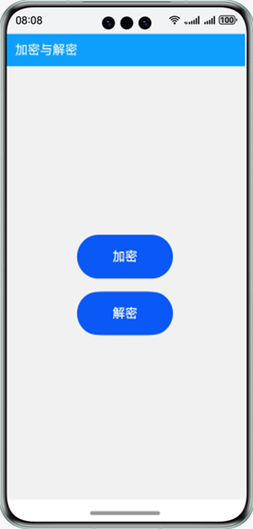
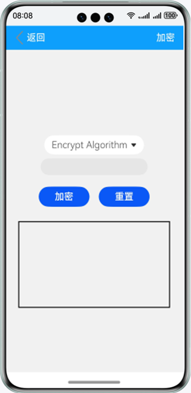
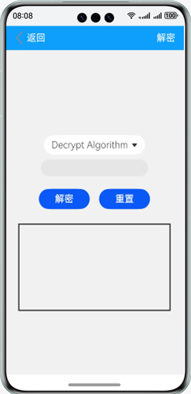

# 加解密

### 介绍

本示例使用cryptoFramework接口的Cipher对象相关方法实现了字符串加解密算法，包括RSA加密算法与AES加密算法。

RSA加密算法：RSA公开密钥密码体制是一种使用不同的加密密钥与解密密钥，由已知加密密钥推导出解密密钥在计算上是不可行的密码体制。

AES加密算法：AES密码学中的高级加密标准，又称Rijndael加密法，是美国联邦政府采用的一种区块加密标准。

### 效果预览

|主页|加密页面|解密页面|
|--------------------------------|--------------------------------|--------------------------------|
||  ||

使用说明

1.点击主页面的**加密**按钮，在加密界面中点击**Encryption Algorithm**下拉选择加密算法，在输入框中输入待加密的内容，点击**加密**
按钮，下方文本框中显示加密后内容。

2.点击**重置**按钮，清除文本框中内容。

3.点击主页面的**解密**按钮，在解密界面中点击**Decrypt Algorithm**下拉选择解密算法，在输入框中输入待解密的内容，点击**解密**
按钮，下方文本框中显示解密后内容。

4.点击**重置**按钮，清除文本框中内容。

### 工程目录
```
├──entry/src/main/ets                                  // 代码区
│  ├──common
│  │  ├──Decrypt.ets                                   // 解密页面
│  │  └──Encrypt.ets                                   // 加密页面
│  ├──entryAbility            
│  │  └──EntryAbility.ets            
│  ├──model            
│  │  ├──CipherModel.ts                                // 加密与解密方法
│  │  └──Logger.ts                                     // 日志工具
│  └──pages            
│     ├──Index.ets                                     // 首页
│     └──Second.ets                                    // 加密与解密页面
└──entry/src/main/resources                            // 应用资源目录
```

### 具体实现

* 本示例分成加密与解密两个模块
  * 加密模块
    * 使用到rsaEncrypt(RSA算法加密)与aesEncrypt(AES算法加密)两种加密方法进行加密操作。
    * 源码链接：[Encrypt.ets](entry/src/main/ets/common/Encrypt.ets)，[CipherModel.ts](entry/src/main/ets/model/CipherModel.ts)
    * 接口参考：@ohos.security.cryptoFramework，@ohos.promptAction，@ohos.router

  * 解密模块
    * 使用到rsaDecrypt(RSA算法解密)与aesDecrypt(AES算法解密)两种解密方法进行解密操作。
    * 源码链接：[Decrypt.ets](entry/src/main/ets/common/Decrypt.ets)，[CipherModel.ts](entry/src/main/ets/model/CipherModel.ts)
    * 接口参考：@ohos.security.cryptoFramework，@ohos.promptAction，@ohos.router
  
### 相关权限

不涉及。

### 依赖

不涉及。

### 约束与限制

1.本示例仅支持标准系统上运行，支持设备：华为手机。

2.HarmonyOS系统：HarmonyOS NEXT Developer Beta1及以上。

3.DevEco Studio版本：DevEco Studio NEXT Developer Beta1及以上。

4.HarmonyOS SDK版本：HarmonyOS NEXT Developer Beta1 SDK及以上。