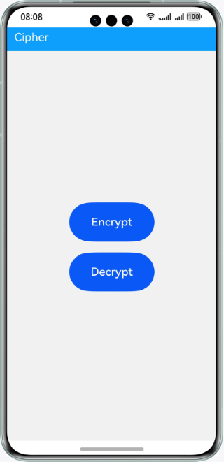

# Cipher

### Overview

This sample shows how to use the APIs provided by the **Cipher** object of **cryptoFramework** to implement encryption and decryption using the RSA and AES algorithms.

RSA: A public-key cryptosystem that works on two different keys: a public encryption key and a private decryption key.

AES: A block encryption standard established by the U.S. National Institute of Standards and technology (NIST). It is also called Rijndael.

### Preview

| Home page                            | Encryption page                        | Decryption page                        |
|--------------------------------------|----------------------------------------|----------------------------------------|
|  |  |  |

### How to Use

1. On the home screen, tap **Encrypt**. On the **Encrypt** screen, select an encryption algorithm from the **Encryption Algorithm** drop-down list box, enter the content to be encrypted in the text box, and tap the **Encrypt** button.
The encrypted content is displayed in the text box below.

2. Tap the **Reset** button to clear the content in the text box.

3. Tap the **Decrypt** button on the home screen. On the **Decrypt** screen, select a decryption algorithm from the **Decryption Algorithm** drop-down list box, enter the content to be decrypted in the text box, and tap the **Decrypt** button.
The decrypted content is displayed in the text box below.

4. Tap the **Reset** button to clear the content in the text box.

### Project Directory
```
├──entry/src/main/ets                                 // Code area
│  ├──common
│  │  ├──Decrypt.ets                                   // Page for the decryption operation
│  │  └──Encrypt.ets                                   // Page for the encryption operation
│  ├──entryAbility            
│  │  └──EntryAbility.ets            
│  ├──model            
│  │  ├──CipherModel.ts                                // APIs for encryption and decryption
│  │  └──Logger.ts                                     // Logging utility
│  └──pages            
│     ├──Index.ets                                     // Home page
│     └──Second.ets                                    // Encrypt and decrypt page
└──entry/src/main/resources                             // App resources
```

### How to Implement

* This sample includes two modules: encryption and decryption.
  * Encryption module
    * Encrypt data using **rsaEncrypt** (RSA algorithm) and **aesEncrypt** (AES algorithm).
    * Source code: [Encrypt.ets](entry/src/main/ets/common/Encrypt.ets) and [CipherModel.ts](entry/src/main/ets/model/CipherModel.ts)
    * APIs: @ohos.security.cryptoFramework, @ohos.promptAction, and @ohos.router

  * Decryption module
    * Decrypt data using **rsaEncrypt** (RSA algorithm) and **aesEncrypt** (AES algorithm).
    * Source code: [Decrypt.ets](entry/src/main/ets/common/Decrypt.ets) and [CipherModel.ts](entry/src/main/ets/model/CipherModel.ts)
    * APIs: @ohos.security.cryptoFramework, @ohos.promptAction, and @ohos.router
  
### Required Permissions

N/A

### Dependency

N/A

### Constraints

1. The sample app is supported only on Huawei phones running the standard system.

2. The HarmonyOS version must be HarmonyOS NEXT Developer Beta1 or later.

3. The DevEco Studio version must be DevEco Studio NEXT Developer Beta1 or later.

4. The HarmonyOS SDK version must be HarmonyOS NEXT Developer Beta1 or later.
