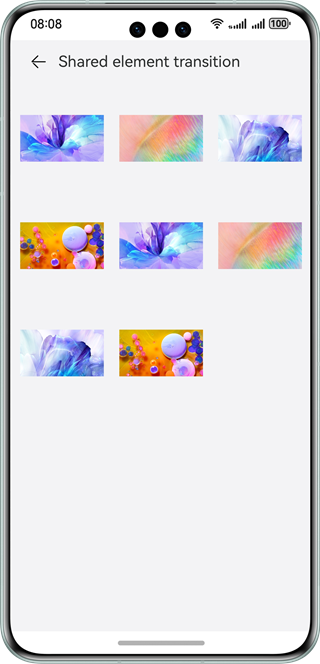

# Component Collection

### Overview

This sample shows the ArkUI component collection, which includes the **component**, **universal**, **animation**, and **global method** modules.

### Preview

| Component                                     | Universal                                            | Animation                                                           | Global Method                                              |
|-----------------------------------------------|------------------------------------------------|---------------------------------------------------------------|----------------------------------------------------|
|  |       |                    |            |
| <center>Button</center>                       | <center>onClick Event</center>                 | <center>Shared Element Transition</center>                                      | <center>Alert Dialog</center>                             |
|       |  |  |  |

### How to Use

1. Tap **Component**, **Universal**, **Animation**, and **Global Method**, or swipe left or right to switch between different views.

2. Tap the navigation (such as onClick and touch events) to go to the details page.

### Project Directory

```
├──entry/src/main/ets                                 // Code
│  ├──application
│  │  └──MyAbilityStage.ets      
│  ├──common
│  │  ├──AttributeModificationTool.ets                 // Components
│  │  ├──IntroductionTitle.ets                         // Introductory title component of on the home page
│  │  ├──TabContentNavigation.ets                      // Component for managing tabbed navigation.
│  │  └──TitleBar.ets                                  // Title bar component
│  ├──data
│  │  ├──CollectionCategory.ets                        // Data category
│  │  └──ResourceDataHandle.ets                        // Source data
│  ├──entryability
│  │  └──EntryAbility.ets              
│  ├──model
│  │  └──CategoricalDataType.ets                       // Data types                   
│  ├──pages
│  │  ├──animations                                    // Animations
│  │  │  ├──animateToSample    
│  │  │  │  └──AnimateToSample.ets 
│  │  │  ├──animationSample    
│  │  │  │  └──AnimationSample.ets 
│  │  │  ├──interpolationCalculationSample    
│  │  │  │  └──InterpolationCalculationSample.ets      // Interpolation calculation
│  │  │  ├──motionPathSample    
│  │  │  │  └──MotionPathSample.ets                    // Motion paths
│  │  │  ├──TransitionAnimations                       // Transition animations
│  │  │  │  ├──componentTransitionSample               // Intra-component transitions
│  │  │  │  │  └──ComponentTransitionSample.ets        
│  │  │  │  ├──floatingSample                          // Floating window
│  │  │  │  │  ├──FloatingWindowComponent.ets          
│  │  │  │  │  └──FloatingWindowSample.ets                 
│  │  │  │  ├──folderSample                            // Folder expansion
│  │  │  │  │  ├──Folder.ets                         
│  │  │  │  │  ├──FolderItem.ets                         
│  │  │  │  │  └──FolderSample.ets                         
│  │  │  │  ├──gallerySample                           // Gallery card expansion
│  │  │  │  │  └──GalleryCardSample.ets                    
│  │  │  │  ├──layoutAnimationSample                   // Layout animation
│  │  │  │  │  └──LayoutAnimationSample.ets                
│  │  │  │  ├──multiplexSample                         // Multiple tasks
│  │  │  │  │  ├──MultiplexModel.ets                      
│  │  │  │  │  ├──MultiplexSample.ets                      
│  │  │  │  │  └──ScrollItem.ets                       
│  │  │  │  ├──pageTransitionSample                    // Transition between pages
│  │  │  │  │  ├──PageTransitionSample.ets                      
│  │  │  │  │  └──PageTransitionSampleTo.ets                      
│  │  │  │  ├──shareElementTransitionSample            // Transition of shared elements
│  │  │  │  │  ├──ShareElementTransitionSample.ets                     
│  │  │  │  │  └──ShareElementTransitionSampleTo.ets                     
│  │  │  │  ├──shopSample                              // Shop card expansion
│  │  │  │  │  └──ShopCardSample.ets                      
│  │  │  │  ├──sideBarTransitionSample                 // Side bar transition
│  │  │  │  │  ├──ChangePanel.ets               
│  │  │  │  │  └──SideBarTransitionSample.ets              
│  │  │  │  ├──sizeTransitionSample                    // Size transition
│  │  │  │  │  └──SizeTransitionSample.ets                 
│  │  │  │  ├──systemIcon                              // System icons
│  │  │  │  │  └──SystemIcon.ets         
│  │  │  │  └──AnimationData.ets                  
│  │  ├──components                                       
│  │  │  ├──auxiliary                                  // Auxiliary components
│  │  │  │  ├──alphabetIndexerSample
│  │  │  │  │  └──AlphabetIndexerSample.ets            // Alphabet indexers
│  │  │  │  ├──badgeSample
│  │  │  │  │  └──BadgeSample.ets                      // Badge
│  │  │  │  ├──refreshSample
│  │  │  │  │  └──RefreshSample.ets                    // Pull-down refresh
│  │  │  │  ├──scrollbarSample 
│  │  │  │  │  └──ScrollBarSample.ets                  // Scroll bar
│  │  │  ├──blankAndDivider                            // Blank and divider
│  │  │  │  └──dividerSample
│  │  │  │     ├──ChangePanel.ets
│  │  │  │     └──DividerSample.ets
│  │  │  ├──buttonAndSelection                         // Button and selection
│  │  │  │  ├──buttonSample
│  │  │  │  │  └──ButtonSample.ets                     // Button
│  │  │  │  ├──checkboxSample
│  │  │  │  │  └──CheckboxSample.ets                   // Check box
│  │  │  │  ├──counterSample
│  │  │  │  │  └──CounterSample.ets                    // Counter
│  │  │  │  ├──datePickerSample
│  │  │  │  │  └──DatePickerSample.ets                 // Date picker
│  │  │  │  ├──radioSample
│  │  │  │  │  └──RadioSample.ets                      // Radio button
│  │  │  │  ├──ratingSample
│  │  │  │  │  └──RatingSample.ets                     // Rating bar
│  │  │  │  ├──selectSample
│  │  │  │  │  └──SelectSample.ets                     // Select menu
│  │  │  │  ├──sliderSample
│  │  │  │  │  ├──ChangePanel.ets
│  │  │  │  │  └──SliderSample.ets                     // Slider
│  │  │  │  ├──textPickerSample 
│  │  │  │  │  └──TextPickerSample.ets                 // Text picker
│  │  │  │  ├──timePickerSample
│  │  │  │  │  └──TimePickerSample.ets                 // Time picker
│  │  │  │  └──toggleSample
│  │  │  │     └──ToggleSample.ets                     // Toggle button
│  │  │  ├──canvas
│  │  │  │  ├──attributesSample
│  │  │  │  │  └──AttributesSample.ets                 // Attributes
│  │  │  │  ├──gradientSample
│  │  │  │  │  └──GradientSample.ets                   // Gradient object
│  │  │  │  ├──imageBitmapSample
│  │  │  │  │  └──ImageBitmapSample.ets                // Bitmap object
│  │  │  │  ├──methodsSample
│  │  │  │  │  └──MethodsSample.ets                    // Methods
│  │  │  │  ├──path2dSample
│  │  │  │  │  └──Path2dSample.ets                     // Path object
│  │  │  │  ├──sampleResources
│  │  │  │  │  ├──icon.png                     
│  │  │  │  │  └──smoothoff.png                  
│  │  │  │  ├──shadowsSample
│  │  │  │  │  └──ShadowsSample.ets                    // Shadow
│  │  │  │  └──transformSample
│  │  │  │     └──TransformSample.ets                  // Transform
│  │  │  ├──canvasAndGraphicDrawing                    // Canvas and graphic drawing
│  │  │  │  ├──canvasSample
│  │  │  │  │  └──CanvasSample.ets                     // Canvas sample
│  │  │  │  ├──circleSample
│  │  │  │  │  ├──ChangePanel.ets
│  │  │  │  │  └──CircleSample.ets                     // Circle
│  │  │  │  ├──ellipseSample
│  │  │  │  │  ├──ChangePanel.ets
│  │  │  │  │  └──EllipseSample.ets                    // Ellipse
│  │  │  │  ├──lineSample
│  │  │  │  │  ├──ChangePanel.ets
│  │  │  │  │  └──LineSample.ets                       // Lines
│  │  │  │  ├──pathSample
│  │  │  │  │  ├──ChangePanel.ets
│  │  │  │  │  └──PathSample.ets                       // Path
│  │  │  │  ├──polygonSample
│  │  │  │  │  ├──ChangePanel.ets
│  │  │  │  │  └──PolygonSample.ets                    // Polygon
│  │  │  │  ├──polylineSample
│  │  │  │  │  ├──ChangePanel.ets
│  │  │  │  │  └──PolylineSample.ets                   // Polyline
│  │  │  │  ├──rectSample
│  │  │  │  │  ├──ChangePanel.ets
│  │  │  │  │  └──RectSample.ets                       // Rectangle
│  │  │  │  └──shapeSample
│  │  │  │     ├──ChangePanel.ets
│  │  │  │     └──ShapeSample.ets                      // Shape
│  │  │  ├──imageVideoAndMedia
│  │  │  │  ├──imageAnimatorSample
│  │  │  │  │  └──ImageAnimatorSample.ets              // Component for creating animations by displaying a sequence of images in a specified order and duration.
│  │  │  │  ├──imageSample
│  │  │  │  │  ├──ImageControlPanel.ets
│  │  │  │  │  └──ImageSample.ets                      // Image
│  │  │  │  ├──pluginComponentSample
│  │  │  │  │  └──PluginComponentSample.ets            // Plugin component
│  │  │  │  ├──videoSample
│  │  │  │  │  ├──VideoControlPanel.ets
│  │  │  │  │  └──VideoSample.ets                      // Video component, used to embed and control video playback within your app
│  │  │  │  └──xcomponentSample
│  │  │  │     └──XComponentSample.ets                 // Component for advanced graphics rendering and media processing
│  │  │  ├──informationPresentationAndDynamicEffects     
│  │  │  │  ├──dataPanelSample
│  │  │  │  │  └──DataPanelSample.ets                  // Data panel
│  │  │  │  ├──gaugeSample
│  │  │  │  │  └──GaugeSample.ets                      // Gauge
│  │  │  │  ├──imageFitFullSample
│  │  │  │  │  └──ImageFitFullSample.ets               // Component used to display images with scaling and fitting options
│  │  │  │  ├──listSample                              // List
│  │  │  │  │  └──ListSample.ets
│  │  │  │  ├──loadingProgressSample
│  │  │  │  │  └──LoadingProgressSample.ets
│  │  │  │  ├──marqueeSample
│  │  │  │  │  └──MarqueeSample.ets                    // Marquee
│  │  │  │  ├──particleSample
│  │  │  │  │  └──ParticleSample.ets                   // Particle effect
│  │  │  │  ├──progressSample
│  │  │  │  │  └──ProgressSample.ets                   // Progress bar
│  │  │  │  ├──qrCodeSample
│  │  │  │  │  └──QRCodeSample.ets                     // QR code
│  │  │  │  ├──scrollToSample
│  │  │  │  │  └──ScrollToSample.ets                   // Scrolling to a specific position within a scrollable container.
│  │  │  │  ├──tapsSwitchSample
│  │  │  │  │  └──TapsSwitchSample.ets                 // Tap and swith interactions within UI components
│  │  │  │  ├──textclockSample
│  │  │  │  │  └──TextClockSample.ets                  // Text clock
│  │  │  │  └──textTimerSample
│  │  │  │     └──TextTimerSample.ets                  // Text timer
│  │  │  ├──listAndGrid
│  │  │  │  ├──gridItemSample
│  │  │  │  │  │──GridItemControlPanel.ets
│  │  │  │  │  └──GridItemSample.ets                   // Component for creating and managing grid layouts and items within the grids
│  │  │  │  ├──gridSample
│  │  │  │  │  │──GridControlPanel.ets
│  │  │  │  │  └──GridSample.ets                       // Grid container
│  │  │  │  ├──listItemSample
│  │  │  │  │  └──ListItemSample.ets                   // Component for creating and managing lists and list items
│  │  │  │  └──listSample
│  │  │  │     │──ListControlPanel.ets
│  │  │  │     └──ListSample.ets                       // List container
│  │  │  ├──navigation
│  │  │  │  ├──navigationSample
│  │  │  │  │  └──NavigationSample.ets                 // Navigation root container
│  │  │  │  ├──navigatorSample
│  │  │  │  │  ├──NavigatorSample.ets                  // Routing
│  │  │  │  │  ├──NavigatorSecondPage.ets
│  │  │  │  │  └──NavigatorThirdPage.ets
│  │  │  │  ├──navRouterSample
│  │  │  │  │  └──NavRouterSample.ets                  // Component for routing and navigation
│  │  │  │  ├──stepperAndStepperItemSample
│  │  │  │  │  └──StepperAndStepperItemSample.ets      // Component used to create step-by-step navigation
│  │  │  │  ├──tabContentSample
│  │  │  │  │  └──TabContentSample.ets                 // Tab content component
│  │  │  │  └──tabSample
│  │  │  │     ├──TabControlPanel.ets
│  │  │  │     └──TabSample.ets                        // Tab
│  │  │  ├──rowsAndColumns
│  │  │  │  ├──columnSample
│  │  │  │  │  ├──ColumnControlPanel.ets
│  │  │  │  │  └──ColumnSample.ets                     // Column container
│  │  │  │  ├──columnSplitSample
│  │  │  │  │  └──ColumnSplitSample.ets                // Column split container
│  │  │  │  ├──rowSample
│  │  │  │  │  ├──RowControlPanel.ets
│  │  │  │  │  └──RowSample.ets                        // Row container
│  │  │  │  ├──rowSplitSample
│  │  │  │  │  └──RowSplitSample.ets                   // Row split container
│  │  │  │  └──sideBarContainerSample
│  │  │  │     ├──SideBarContainerControlPanel.ets
│  │  │  │     └──SideBarContainerSample.ets           // Side bar container
│  │  │  ├──scrollAndSwipe
│  │  │  │  ├──scrollSample
│  │  │  │  │  └──ScrollSample.ets                     // Component used to implement scrolling functionality in your app
│  │  │  │  └──swiperSample
│  │  │  │     ├──SwiperControlPanel.ets
│  │  │  │     └──SwiperSample.ets                     // Swiper
│  │  │  ├──stackFlexAndGrid
│  │  │  │  ├──flexSample                               
│  │  │  │  │  ├──FlexControlPanel.ets
│  │  │  │  │  └──FlexSample.ets                       // Flexible layout
│  │  │  │  ├──gridRowSample
│  │  │  │  │  ├──GridRowControlPanel.ets
│  │  │  │  │  └──GridRowSample.ets                    // Grid
│  │  │  │  └──stackSample
│  │  │  │     ├──StackControlPanel.ets
│  │  │  │     └──StackSample.ets                      // Stack layout
│  │  │  ├──stackFlexAndGrid
│  │  │  │  ├──imageSpanSample
│  │  │  │  │  ├──ChangePanel.ets
│  │  │  │  │  └──ImageSpanSample.ets                  // Component used to display an image in text.
│  │  │  │  ├──patternLockSample
│  │  │  │  │  ├──ChangePanel.ets
│  │  │  │  │  └──PattternLockSample.ets               // Pattern lock
│  │  │  │  ├──richTextSample
│  │  │  │  │  └──RichTextSample.ets                   // Rich text
│  │  │  │  ├──searchSample
│  │  │  │  │  ├──ChangePanel.ets
│  │  │  │  │  └──SearchSample.ets                     // Search bar
│  │  │  │  ├──spanSample
│  │  │  │  │  ├──ChangePanel.ets
│  │  │  │  │  └──SpanSample.ets                       // Component used to display a segment of text as part of a larger Text component
│  │  │  │  ├──textAreaSample
│  │  │  │  │  ├──ChangePanel.ets
│  │  │  │  │  └──TextAreaSample.ets                   // Text area
│  │  │  │  ├──textInputSample
│  │  │  │  │  └──TextInputSample.ets                  // Text input
│  │  │  │  └──textSample
│  │  │  │     ├──ChangePanel.ets
│  │  │  │     └──TextSample.ets                       // Text
│  │  │  ├────web
│  │  │  │  └────webSample
│  │  │  │     └──WebSample.ets                        // Web page
│  │  │  └──ComponentData.ets
│  │  ├──globalMethods                                 // Details page
│  │  │  ├──dialogs
│  │  │  │  ├──actionSheetDialogSample
│  │  │  │  │  └──ActionSheetDialogSample.ets          // Action sheet dialog
│  │  │  │  ├──alertDialogSample
│  │  │  │  │  └──AlertDialogSample.ets                // Alert dialog
│  │  │  │  ├──customDialogSample
│  │  │  │  │  │──CustomDialog.ets
│  │  │  │  │  └──CustomDialogSample.ets               // Custom dialog
│  │  │  │  ├──dateDialogSample
│  │  │  │  │  └──DateDialogSample.ets                 // Date dialog
│  │  │  │  ├──menuSample
│  │  │  │  │  └──MenuSample.ets                       // Menu
│  │  │  │  ├──textPickerDialogSample
│  │  │  │  │  └──TextPickerDialogSample.ets           // Text picker dialog
│  │  │  │  └──timeDialogSample
│  │  │  │     └──TimeDialogSample.ets                 // Time dialog
│  │  │  └──GlobalMethodData.ets
│  │  ├──universal                                     // Universal events, gestures, and properties
│  │  │  ├──events
│  │  │  │  ├──areaChangeEventSample
│  │  │  │  │  └──AreaChangeEventSample.ets            // Area change event
│  │  │  │  ├──clickEventSample
│  │  │  │  │  └──ClickEventSample.ets                 // Click event
│  │  │  │  ├──dragEventSample
│  │  │  │  │  ├──component                            // Components related to the drag event
│  │  │  │  │  │  ├──GridItemDrag.ets
│  │  │  │  │  │  ├──HyperlinkDrag.ets
│  │  │  │  │  │  ├──ImageDrag.ets
│  │  │  │  │  │  ├──ListItemDrag.ets
│  │  │  │  │  │  ├──TextDrag.ets
│  │  │  │  │  │  └──VideoDrag.ets
│  │  │  │  │  └──DragEventSample.ets                  // Drag event
│  │  │  │  ├──focusEventSample
│  │  │  │  │  └──FocusEventSample.ets                 // Focus event
│  │  │  │  ├──keyPressEventSample
│  │  │  │  │  └──KeyPressEventSample.ets              // Key press event
│  │  │  │  ├──mountUnmountEventSample
│  │  │  │  │  └──MountUnmountEventSample.ets          // Mount/Unmount event
│  │  │  │  ├──mouseEventSample
│  │  │  │  │  └──MouseEventSample.ets                 // Mouse event
│  │  │  │  ├──scrollEventSample
│  │  │  │  │  └──ScrollEventSample.ets                // Scroll event
│  │  │  │  └──touchEventSample
│  │  │  │     └──TouchEventSample.ets                 // Touch event
│  │  │  ├──gesture
│  │  │  │  ├──bindGestureSample 
│  │  │  │  │  └──BindGestureSample.ets                // APIs for binding a gesture
│  │  │  │  ├──combinedSample
│  │  │  │  │  └──CombinedSample.ets                   // Combined gesture
│  │  │  │  ├──longPressSample
│  │  │  │  │  └──LongPressSample.ets                  // Long press gesture
│  │  │  │  ├──panSample
│  │  │  │  │  └──PanSample.ets                        // Pan gesture
│  │  │  │  ├──pinchSample
│  │  │  │  │  └──PinchSample.ets                      // Pinch gesture
│  │  │  │  ├──rotationSample
│  │  │  │  │  └──RotationSample.ets                   // Rotation gesture
│  │  │  │  ├──swipeSample
│  │  │  │  │  └──SwipeSample.ets                      // Swipe gesture
│  │  │  │  └──tapGestureSample
│  │  │  │     └──TapGestureSample.ets                 // Tap gesture
│  │  │  ├──properties
│  │  │  │  ├──backgroundSample
│  │  │  │  │  ├──BackgroundSample.ets                 // Background
│  │  │  │  │  └──ChangePanel.ets                 
│  │  │  │  ├──borderSample
│  │  │  │  │  └──BorderSample.ets                     // Border
│  │  │  │  ├──componentBlurredSample
│  │  │  │  │  └──ComponentBlurredSample.ets           // Blurred effect, indicating a component is inactive, disabled, or just a visual aesthetic
│  │  │  │  ├──componentIDSample
│  │  │  │  │  └──ComponentIDSample.ets                // Component ID
│  │  │  │  ├──displaySample
│  │  │  │  │  └──DisplaySample.ets                    // Display
│  │  │  │  ├──effectsSample
│  │  │  │  │  ├──ChangePanel.ets
│  │  │  │  │  └──EffectsSample.ets                    // Effects
│  │  │  │  ├──flexSample
│  │  │  │  │  └──FlexSample.ets                       // Flex layout
│  │  │  │  ├──focusControlSample
│  │  │  │  │  └──FocusControlSample.ets               // Focus control
│  │  │  │  ├──fontSample
│  │  │  │  │  └──FontSample.ets                       // Font
│  │  │  │  ├──foregroundSample
│  │  │  │  │  └──ForegroundSample.ets                 // Foreground
│  │  │  │  ├──gridSettingsSample
│  │  │  │  │  └──GridSettingsSample.ets               // Grid settings
│  │  │  │  ├──interactionSample
│  │  │  │  │  └──InteractionSample.ets                // Interaction
│  │  │  │  ├──layoutConstraintSample
│  │  │  │  │  └──LayoutConstraintSample.ets           // Layout constraint
│  │  │  │  ├──locationSample
│  │  │  │  │  └──LocationSample.ets                   // Location settings
│  │  │  │  ├──pictureBorderSample
│  │  │  │  │  └──PictureBorderSample.ets              // Picture border settings
│  │  │  │  ├──restoreIdSample
│  │  │  │  │  └──RestoreIdSample.ets                  // Use of a restore ID
│  │  │  │  ├──rotateSample
│  │  │  │  │  └──RotateSample.ets                     // Rotate
│  │  │  │  ├──safeAreaSample
│  │  │  │  │  ├──ChangePanel.ets
│  │  │  │  │  └──SafeAreaSample.ets                   // Safe area
│  │  │  │  ├──scaleSample
│  │  │  │  │  └──ScaleSample.ets                      // Scaling
│  │  │  │  ├──shapeCropSample
│  │  │  │  │  └──ShapeCropSample.ets                  // Shape crop
│  │  │  │  ├──sizeSample
│  │  │  │  │  └──SizeSample.ets                       // Size
│  │  │  │  ├──transformSample
│  │  │  │  │  └──TransformSample.ets                  // Transformations, including rotate, scale, skew or any bombination of these, to UI components
│  │  │  │  └──translateSample
│  │  │  │     └──TranslateSample.ets                  // Moving UI components from one position to another within a container
│  │  │  └──UniversialData.ets
│  │  └──Index.ets                                     // Home page
│  └──util
│     ├──Logger.ts                                     // Logging utility
│     └──ShowToast.ets                                 // Displaying a small, temporary notification to the user  
└──entry/src/main/resources                            // Resources
```

### How to Implement

In this sample, the **Tabs** container component is used to set up the app framework. Each **TabContent** view uses the **List** layout. In each **ListItem**, the navigation data of that category is loaded through cyclic rendering. The bottom navigation menu uses **tabBar** in **TabContent** to customize the style.

* The components are classified into four modules:

    * Component module:
        - Blank and divider
            * Encapsulated custom components: **CommonItemSlider**, **CommonItemSelect**, and **CommonItemColorSelect**.
            * APIs: @ohos.app.ability.common

        * Buttons and selections

            UI components including the button, date picker, radio button, select menu, slider, toggle, check box, text picker, time picker, counter, and rating bar.

        - Scroll and swiper

            Scroll and swiper.

        * Information display and effect

            QR code, progress bar, marquee, text timer, text clock, gauge, and data panel.

        - Text and input

            Span, image span, text input, text, and rich text.

        * Auxiliary

            Badge, scroll bar, pull-down refresh, pop-up panel, and alphabet indexer.

        * Canvas

            Attributes of graphic drawing, methods of graphic drawing, gradient object drawing, path object drawing, bitmap drawing, shadow drawing, and transformation drawing.

        * Row and column

            Horizontal layout, vertical layout, horizontal split layout, and vertical split layout.

        * Stack, Flex, and grid

            Stack, Flex, and grid containers.

        * List and grid

            List container and grid container.

        * Navigation

            List navigation, navigator, tabs, stepper, and navigation components.

        * Canvas and graphics drawing

            Drawing components such as canvas components, circles, ellipses, and straight lines.

        * Image, video, and media

            Image, image animation, video, XComponent, and external app components.

        * Web page

            Web component functionalities.

    * Universal module:
        * Universal events
            * Global components **TitleBar** and **IntroductionTitle** are used.
            * The **resetBallMotion**, **isSideReached**, **calculateReachedSide**, **decideMoveDirection** and **moveBall** APIs are used.

        - Universal properties
            * Global components **TitleBar** and **AttributeModificationTool** are used.
            * APIs: @ohos.promptAction

        - Gesture handling

            Global components **TitleBar** and **AttributeModificationTool** are used.

    * Animation module:
        - Transition animation
            * Global components **TitleBar** and **IntroductionTitle** are used.
            * APIs: @ohos.promptAction

        * Interpolation calculation
            * Global components **TitleBar** and **IntroductionTitle** are used.
            * APIs: @ohos.curves, @ohos.router

        * Explicit animation
            * Global components **TitleBar** and **IntroductionTitle** are used.
            * APIs: animateTo

        - Property animation
            * Global components **TitleBar** and **IntroductionTitle** are used.
            * APIs: animation

        * Path animation
            * Global components **TitleBar** and **IntroductionTitle** are used.
            * APIs: path

    * Global method module:
        - Dialog

            Global components **ShowToast**, **TitleBar**, and **IntroductionTitle** are used.

        - Menu

            Global components **ShowToast**, **TitleBar**, and **IntroductionTitle** are used.

### Required Permissions

ohos.permission.GET_BUNDLE_INFO

### Dependencies

N/A

### Constraints

1. The sample app is supported only on Huawei phones running the standard system.

2. The HarmonyOS version must be HarmonyOS NEXT Developer Beta1 or later.

3. The DevEco Studio version must be DevEco Studio NEXT Developer Beta1 or later.

4. The HarmonyOS SDK version must be HarmonyOS NEXT Developer Beta1 or later.
